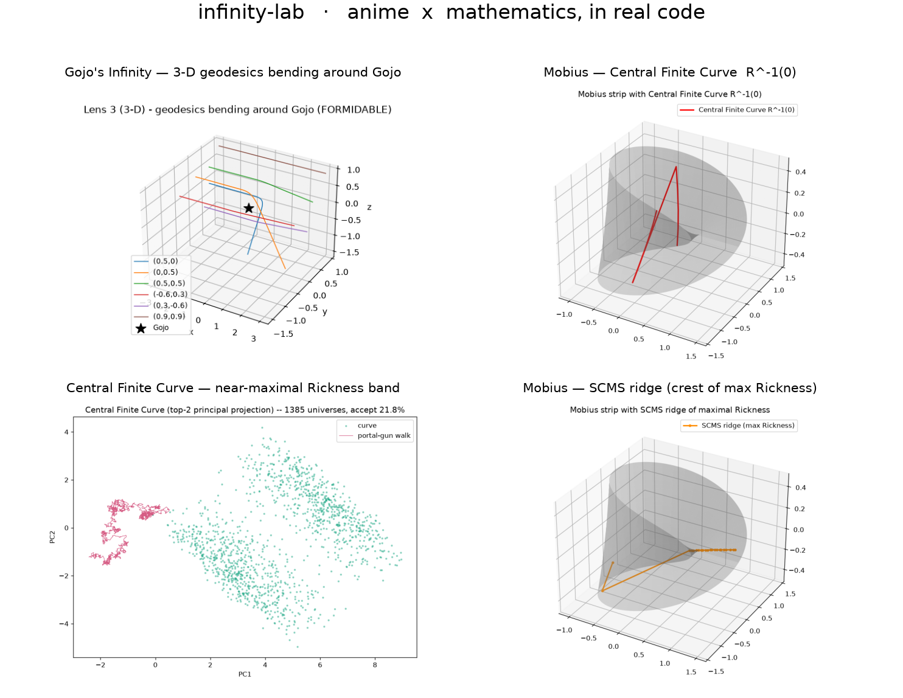
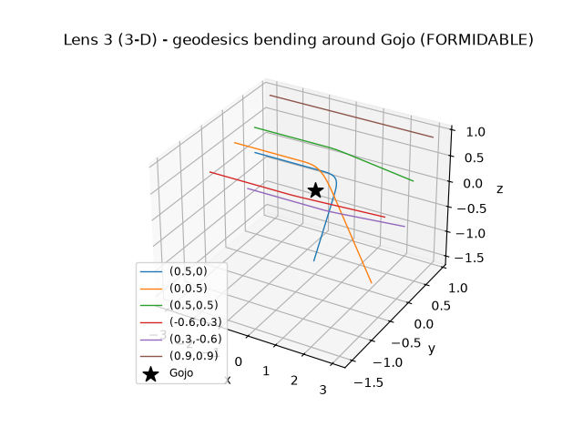
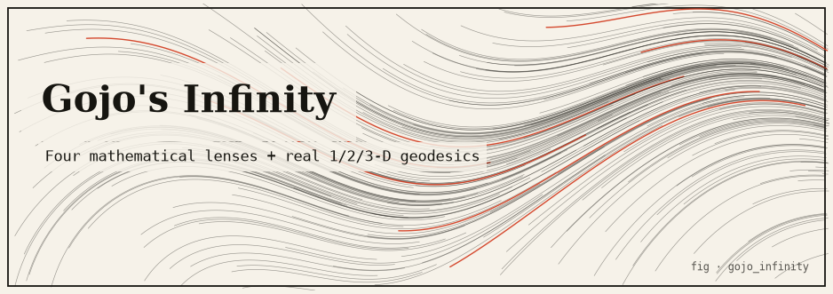
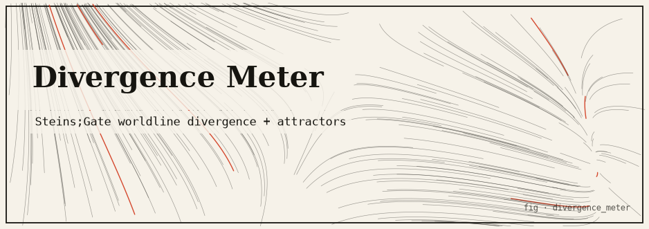
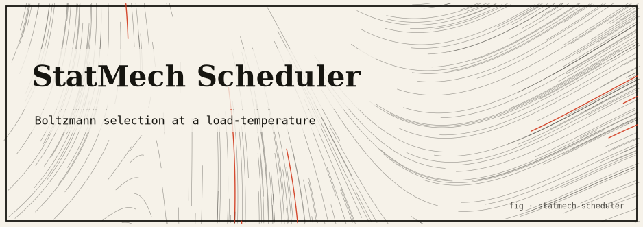
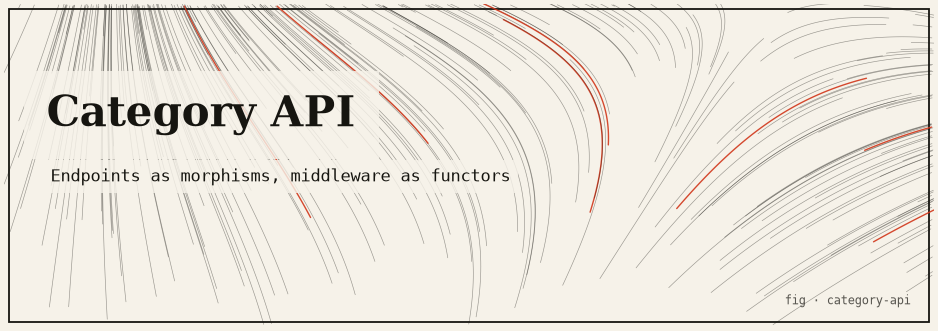
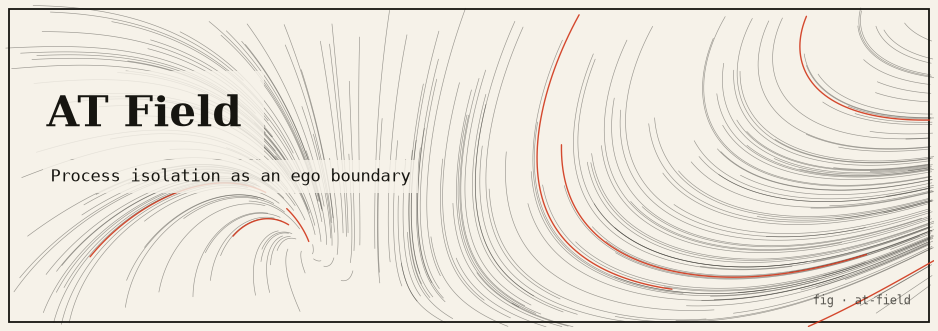
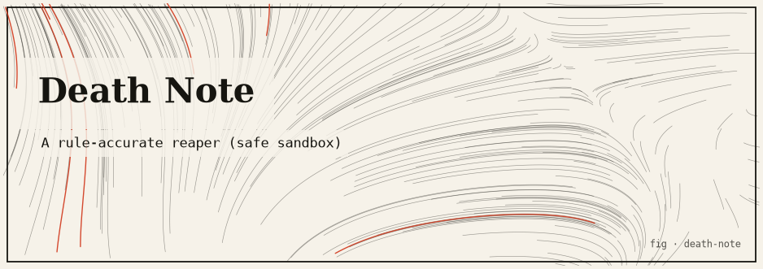

<div align="center">

# awesome-mad-projects

[](https://awesome.re)
[](./LICENSE)
[](./CONTRIBUTING.md)


[](https://mad-projects.com)

**A curated collection of absurd-but-real projects at the intersection of
anime / pop-culture / games and mathematics — turned into actual, runnable, tested code.**



🌐 **[mad-projects.com](https://mad-projects.com)** · 📬 **caelum0x42@gmail.com**

</div>

> **The one rule of this repo:** every project must have an *honest* mathematical or
> systems core. Where the real thing is impossible or unsafe — kernel-level process
> killing, Banach–Tarski duplication, "true" infinity — we build a clearly-labeled
> **safe simulation** and say so plainly. No hand-waving, no mock code.

---

## Contents

- [Why this exists](#why-this-exists)
- [Featured](#featured)
- [infinity-lab — the Python monorepo](#infinity-lab--the-python-monorepo)
- [Standalone prototypes](#standalone-prototypes)
- [Running everything](#running-everything)
- [Repository layout](#repository-layout)
- [Contributing](#contributing)
- [Safety](#safety)
- [Attribution](#attribution)
- [License](#license)

---

## Why this exists

Fiction is full of *almost*-mathematical claims. Gojo's *Infinity* says an attacker can
halve the remaining distance forever and never arrive. Rick and Morty's *Central Finite
Curve* is an infinite-but-finitely-varying slice of the multiverse. Zeno insisted motion
was impossible. Each of these is a real mathematical idea wearing a costume.

This repository takes those costumes seriously and asks: *what does the mathematics actually
say, and can we run it?* Some claims survive the translation (a convergent series really does
converge; the hairy-ball theorem really does force a singularity). Some collapse the moment
you write them down honestly (a ruled surface has non-positive curvature; "true" physical
infinity is fragile). **Both outcomes are interesting, and the code reports whichever is true.**

Everything here is original code and original renders. Where a project leans on published
mathematics, it cites the source rather than reproducing it.

---

## Featured

|  |  |
|---|---|
| **Gojo's Infinity, in 3-D** — a real Riemannian-manifold geodesic solver: geodesics bend toward the singularity, and the felt length to reach it diverges. | **The Central Finite Curve** — the honest zero-set `R⁻¹(0)` traced on a Möbius strip, since a ruled surface forces `K < 0`. |
|  |  |

More rendered figures and animations live in the [gallery](https://mad-projects.com/gallery.html)
and under [`infinity-lab/artifacts/`](./infinity-lab/artifacts).

---

## infinity-lab — the Python monorepo

The most-developed work lives in [`infinity-lab/`](./infinity-lab): a **stdlib-first Python
monorepo** where nine packages share an internal `commons` package. The pure core is
offline and zero-install; numpy/matplotlib are optional, import-guarded accelerators.

- **576 tests pass offline**, **600+ with the optional extras** — both interpreters green.
- A shared `commons` package (seeded RNG, numerics, exact arithmetic, ASCII/PNG rendering).
- A gallery of 35+ rendered figures/animations, a landing page, `make` glue, and per-package
  `docs/` (architecture, plan, resolved-math).

### [Gojo's Infinity](./infinity-lab/packages/gojo_infinity)

Gojo's Infinity through **four mathematical lenses** (geometric series, Lebesgue measure,
Riemannian geometry, topology → Fragile / Fragile / Formidable / Falls) plus a real **1/2/3-D
Riemannian geodesic solver**. `Python`
[Source ↗](https://github.com/caelum0x/awesome-mad-projects/tree/main/infinity-lab/packages/gojo_infinity) · [README](./infinity-lab/packages/gojo_infinity/README.md)

### [Möbius-Rickness](./infinity-lab/packages/mobius_rickness)

The Central Finite Curve as **two honest readings**: the zero-set `R⁻¹(0)` and the SCMS
ridge, with three cross-validating curvature paths and a torus counter-example. `Python`
[Source ↗](https://github.com/caelum0x/awesome-mad-projects/tree/main/infinity-lab/packages/mobius_rickness) · [README](./infinity-lab/packages/mobius_rickness/README.md)

### [Central Finite Curve](./infinity-lab/packages/central_finite_curve)

The Central Finite Curve as the **near-maximal Rickness band** over a simulated multiverse,
walked by a constrained-Metropolis "portal gun". `Python`
[Source ↗](https://github.com/caelum0x/awesome-mad-projects/tree/main/infinity-lab/packages/central_finite_curve) · [README](./infinity-lab/packages/central_finite_curve/README.md)

### [Calabi-Yau Latent](./infinity-lab/packages/calabi_yau_latent)

A toy compactified `R^k × T^m` latent space whose wrap-aware metric recovers structure a
naive Euclidean view misses. `Python`
[Source ↗](https://github.com/caelum0x/awesome-mad-projects/tree/main/infinity-lab/packages/calabi_yau_latent) · [README](./infinity-lab/packages/calabi_yau_latent/README.md)

### [Domain Expansion](./infinity-lab/packages/domain_expansion)

A Domain Expansion as a coupled boundary-value constraint solver; two domains clash and the
more-refined one wins. `Python`
[Source ↗](https://github.com/caelum0x/awesome-mad-projects/tree/main/infinity-lab/packages/domain_expansion) · [README](./infinity-lab/packages/domain_expansion/README.md)

### [Divergence Meter](./infinity-lab/packages/divergence_meter)

A Steins;Gate worldline divergence meter with attractor fields and a "Reading Steiner"
store. `Python`
[Source ↗](https://github.com/caelum0x/awesome-mad-projects/tree/main/infinity-lab/packages/divergence_meter) · [README](./infinity-lab/packages/divergence_meter/README.md)

### [p-adic Embeddings](./infinity-lab/packages/padic_embeddings)

An ultrametric embedding space where distance is the p-adic metric — verified strong triangle
inequality and residue-class clustering. `Python`
[Source ↗](https://github.com/caelum0x/awesome-mad-projects/tree/main/infinity-lab/packages/padic_embeddings) · [README](./infinity-lab/packages/padic_embeddings/README.md)

### [Madoka Entropy](./infinity-lab/packages/madoka_entropy)

Wishes as local entropy decrease at a strictly larger global karmic cost; a machine-checked
second-law-like invariant. `Python`
[Source ↗](https://github.com/caelum0x/awesome-mad-projects/tree/main/infinity-lab/packages/madoka_entropy) · [README](./infinity-lab/packages/madoka_entropy/README.md)

---

## Standalone prototypes

Self-contained Rust / Go / TypeScript projects, each with its own README, concept, math,
tests, and run instructions.

### [Surreal Priority](./surreal-priority) · `Rust`

Conway surreal numbers (ω, 1/ω) as process priority — an ω task starves finite tasks; a 1/ω
task runs only when nothing else can.
[Source ↗](https://github.com/caelum0x/awesome-mad-projects/tree/main/surreal-priority) · [README](./surreal-priority/README.md)

### [StatMech Scheduler](./statmech-scheduler) · `Go`

Processes as particles, load as temperature; the next task is sampled from a Boltzmann
distribution `p_i ∝ exp(-E_i/kT)`.
[Source ↗](https://github.com/caelum0x/awesome-mad-projects/tree/main/statmech-scheduler) · [README](./statmech-scheduler/README.md)

### [Reading Steiner Git](./reading-steiner-git) · `TypeScript`

A content-addressable toy VCS where branches are world lines, each commit carries a divergence
reading, and `jump` restores a line with escalating "history is destabilizing" warnings.
[Source ↗](https://github.com/caelum0x/awesome-mad-projects/tree/main/reading-steiner-git) · [README](./reading-steiner-git/README.md)

### [Infinite Hotel Scheduler](./infinite-hotel-scheduler) · `Go`

Hilbert's Hotel as a resource allocator that is never full — lazy bijection transforms
(`n→n+k`, `n→2n`, Cantor pairing) admit new guests without eviction.
[Source ↗](https://github.com/caelum0x/awesome-mad-projects/tree/main/infinite-hotel-scheduler) · [README](./infinite-hotel-scheduler/README.md)

### [Category API](./category-api) · `TypeScript`

Endpoints as morphisms, middleware as functors — with the category, functor, and naturality
**laws property-tested** and an honest exact-vs-metaphorical note.
[Source ↗](https://github.com/caelum0x/awesome-mad-projects/tree/main/category-api) · [README](./category-api/README.md)

### [Zeno Protocol](./zeno-protocol) · `Go`

A transport where each tick covers half the remaining distance — progress `1 − (1/2)^k`,
delivered within ε in exactly `k = ⌈log₂(1/ε)⌉` ticks.
[Source ↗](https://github.com/caelum0x/awesome-mad-projects/tree/main/zeno-protocol) · [README](./zeno-protocol/README.md)

### [Equivalent Exchange FS](./equivalent-exchange-fs) · `Rust`

Fullmetal Alchemist's law as a store: no object is created without sacrificing equal-or-greater
mass — enforced before any byte is written, inside a sandbox vault.
[Source ↗](https://github.com/caelum0x/awesome-mad-projects/tree/main/equivalent-exchange-fs) · [README](./equivalent-exchange-fs/README.md)

### [AT Field](./at-field) · `Rust`

Evangelion's Absolute Terror Field as process/message isolation — a penetration predicate,
field corrosion under barrage, and a capability-gated side plane.
[Source ↗](https://github.com/caelum0x/awesome-mad-projects/tree/main/at-field) · [README](./at-field/README.md)

### [Unlimited Void](./unlimited-void) · `Go`

JJK's Unlimited Void as a bounded information-flood: victims' useful throughput flatlines to
zero while the caster proceeds — a simulation in integer accounting, not a real DoS.
[Source ↗](https://github.com/caelum0x/awesome-mad-projects/tree/main/unlimited-void) · [README](./unlimited-void/README.md)

### [Hairy Ball Router](./hairy-ball-router) · `Go`

Routing along a continuous tangent field on the sphere — the hairy-ball theorem forces at
least one singularity where packets are dropped, and moving the field never removes it.
[Source ↗](https://github.com/caelum0x/awesome-mad-projects/tree/main/hairy-ball-router) · [README](./hairy-ball-router/README.md)

### [Banach-Tarski Duplicator](./banach-tarski-dup) · `Rust`

The paradoxical decomposition of the free group `F₂` into pieces that reassemble into two
copies — the real, constructive core, with an honest note on where the Axiom of Choice enters.
[Source ↗](https://github.com/caelum0x/awesome-mad-projects/tree/main/banach-tarski-dup) · [README](./banach-tarski-dup/README.md)

### [Death Note](./death-note) · `Rust`

A rule-accurate process reaper that kills **only the harmless processes it spawns itself** —
refuses raw PIDs, refuses to run as root, with a PID-reuse guard. Safe by construction.
[Source ↗](https://github.com/caelum0x/awesome-mad-projects/tree/main/death-note) · [README](./death-note/README.md)

### [JoJo Stands](./jojo-stands) · `Rust`

Stands as abilities over a simulated process table — The World (time stop), Killer Queen
(detonate on signal), King Crimson (rollback), Sticky Fingers (relocate). Pure in-memory sim.
[Source ↗](https://github.com/caelum0x/awesome-mad-projects/tree/main/jojo-stands) · [README](./jojo-stands/README.md)

### [Vanguard Anti-Cheat](./vanguard-anticheat) · `Rust`

The **defensive, userspace** subset of an anti-cheat: a signed integrity manifest, attestation
of a self-spawned child, and a rolling-HMAC heartbeat that rejects replay and forgery.
[Source ↗](https://github.com/caelum0x/awesome-mad-projects/tree/main/vanguard-anticheat) · [README](./vanguard-anticheat/README.md)

> `gojo-infinity/`, `mobius-rickness/`, and `central-finite-curve/` at the repo root are
> pointer READMEs — those projects now live as packages inside [`infinity-lab/`](./infinity-lab).

---

## Running everything

The `infinity-lab` monorepo has `make` glue:

```bash
cd infinity-lab
make test        # offline core across all 9 packages (stdlib only)
make verify      # both interpreters (offline core + optional numpy/matplotlib)
make artifacts   # regenerate every figure + animation + the gallery
make poster      # rebuild the montage poster
open index.html  # the landing page
```

Each standalone project runs with its native toolchain — `cargo run` / `go run .` /
`npm run demo` — see its README for exact commands and sample output.

The showcase website is in [`site/`](./site) and deploys on Cloudflare (Worker + static
assets); see [`site/README.md`](./site/README.md) and `wrangler.toml`.

## Repository layout

```
awesome-mad-projects/
├── infinity-lab/          # Python monorepo: commons + 8 packages, tests, gallery, docs
├── site/                  # showcase website (Cloudflare Worker + static assets)
├── worker/                # Worker entry (serves site/ + /api/projects)
├── <14 standalone Rust/Go/TypeScript projects>/
├── wrangler.toml          # Cloudflare deploy config
├── CONTRIBUTING.md · CODE_OF_CONDUCT.md · LICENSE
└── README.md
```

## Contributing

Contributions welcome — this is meant to grow. See **[CONTRIBUTING.md](./CONTRIBUTING.md)**
for how to add a project (a folder with an honest core, a README, tests, and a `projects.json`
entry), the quality bar, and the PR flow. Be kind: see [CODE_OF_CONDUCT.md](./CODE_OF_CONDUCT.md).

## Safety

`death-note`, `jojo-stands`, and `vanguard-anticheat` are inspired by kernel-level ideas but
implemented entirely in **userspace against an opt-in sandbox of processes the tool spawns
itself**. They never load kernel modules and never target arbitrary system PIDs.

## Attribution

The `gojo_infinity` package is a faithful code implementation of the mathematics in
*Mathematics Behind Jujutsu Kaisen: Gojo Satoru's Infinity* by **Achmad Roykhan Sabiq**
(Oxford University Mathematics Essay Competition 2026) —
[essay PDF](https://tomrocksmaths.com/wp-content/uploads/2026/06/achmad-roykhan-sabiq_essay_competition_2026-achmad-roykhan-sabiq.pdf).
We implement and cite the mathematics; the essay text itself is not redistributed here.
Anime, manga, and game references are © their respective creators; this repository contains
only original code and original renders.

## License

Original code is released under the [MIT License](./LICENSE).

<div align="center">

**If you like this, ⭐ the repo.** · [mad-projects.com](https://mad-projects.com) · caelum0x42@gmail.com

</div>
