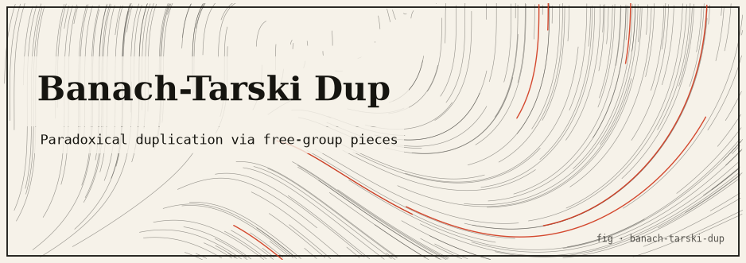

# Banach-Tarski "Duplicator"

> The combinatorial heart of the Banach-Tarski paradox, made real and runnable: cut the free
> group `F2 = ⟨a, b⟩` into five pieces, rigidly translate two of them, and rebuild the *entire*
> group — twice — with exact integer word arithmetic and no Axiom of Choice.

The famous 1924 Banach-Tarski theorem ("a ball can be cut into finitely many pieces and
reassembled into two identical balls") sounds like magic and is usually presented as
non-constructive folklore. This project strips away the mystique and implements the part that is
*genuinely constructive*: the paradoxical decomposition of the free group on two generators. Every
claim is verified by direct computation on concrete reduced words — nothing sampled, nothing
approximated.

---

## TL;DR

- `F2` is partitioned into **five** pieces: `{e}`, `W(a)`, `W(a⁻¹)`, `W(b)`, `W(b⁻¹)`, where
  `W(x)` = reduced words starting with letter `x`.
- Translating two of them gives two copies of the whole group:
  `a·W(a⁻¹) ∪ W(a) = F2` and `b·W(b⁻¹) ∪ W(b) = F2`.
- The CLI `bt-dup` verifies this on finite balls of the Cayley graph, enumerates/classifies words,
  and literally rebuilds both copies set-for-set. Exact, deterministic, **no floating point, no
  Axiom of Choice**.
- Pure Rust, **zero dependencies**, no `unsafe`, **11 passing integration tests**.
- A separate `theatrical` file mode is **openly-labelled stagecraft** — it hard-links a file and
  says loudly that it duplicates no real bytes.

```bash
cargo test            # 11 tests: reduction, partition, the paradox, reconstruction
cargo run -- verify 6 # verify two-copies reconstruction on the ball of radius 6
```

---

## The idea: the Banach-Tarski paradox

The **Banach-Tarski paradox** (Stefan Banach and Alfred Tarski, 1924) states that a solid ball in
`ℝ³` can be partitioned into finitely many pieces and reassembled, using only rotations and
translations, into **two** solid balls each congruent to the original. It appears to violate
conservation of volume — and it would, if the pieces were measurable. They are not: the pieces are
**non-measurable** sets, and constructing them requires the **Axiom of Choice**. That is precisely
why the 3D theorem is non-constructive: you can prove the pieces exist but you can never exhibit
them.

But the *engine* of the paradox is pure group theory, and that part is completely constructive.
The whole trick already happens inside the free group `F2` before any geometry or Choice appears.
This project implements that engine and stops exactly where honesty requires.

---

## The honest core

### The real mathematics

The free group on two generators is the set of **reduced words** — finite strings over
`{a, a⁻¹, b, b⁻¹}` with no adjacent inverse pair (no `x x⁻¹` and no `x⁻¹ x`):

```text
F2 = ⟨a, b⟩
```

Partition every element by the letter it starts with:

```text
F2 = {e} ⊔ W(a) ⊔ W(a⁻¹) ⊔ W(b) ⊔ W(b⁻¹)
```

where `W(x)` = reduced words whose first letter is `x`. These five sets are pairwise disjoint and
cover the group — a genuine partition. The paradox is the pair of identities:

```text
a·W(a⁻¹) ∪ W(a) = F2
b·W(b⁻¹) ∪ W(b) = F2
```

**Why they hold.** Take any reduced word `w`:

- If `w` starts with `a`, then `w ∈ W(a)`.
- If `w` does *not* start with `a`, then `a⁻¹·w` is already reduced and starts with `a⁻¹`, so
  `w = a·(a⁻¹w) ∈ a·W(a⁻¹)`.

Either way `w` is covered — using only **two** of the five pieces, each rigidly shifted by one
generator. The identical argument with `b` covers all of `F2` a *second* time using the other two
pieces. So one copy of `F2`, cut into finitely many pieces and translated, yields **two full
copies of `F2`**. That is the group-theoretic heart of Banach-Tarski, and it needs no Choice.

The equivalent membership predicate the code actually uses is the punch line: `w ∈ g·W(g⁻¹)` iff
`w` does **not** start with `g`.

### Where the Axiom of Choice would enter (and why we stop)

To promote this group paradox to the ball, one lets `F2` act on the sphere by rotations, then uses
the **Axiom of Choice** to pick one representative point from each rotation orbit, and transports
the `F2` decomposition along the orbits. That orbit-representative choice is the *only*
non-constructive step, it produces non-measurable pieces, and it cannot be exhibited. This project
deliberately does **not** perform it — it stops at the honest, fully constructive part.

### What is real vs. simulated vs. theatrical

| Layer | Status | Notes |
| --- | --- | --- |
| `F2` decomposition + paradoxical identities | **Real, constructive** | Verified on every reduced word up to a chosen length — exact integer/word computation, no sampling, no Choice. |
| The jump to the 3D ball | **Real math, NOT performed here** | Needs the Axiom of Choice; the pieces are non-measurable and cannot be constructed. Intentionally omitted. |
| The `theatrical` file mode | **Theatre, clearly labelled** | Makes a hard link (a second name for the *same* inode/bytes) or a text pointer file. Duplicates **no** real bytes and says so in its own output. |

Compact notation used throughout: uppercase letters mean inverses, so `A = a⁻¹` and `B = b⁻¹`, and
a word renders like `"abAB"`.

---

## How it works

### Crate map

Ships a library (`banach_tarski_dup`) and a binary (`bt-dup`).

| File | Role | Highlights |
| --- | --- | --- |
| `src/lib.rs` | Module wiring + re-exports | Exposes `word`, `decomp`, `theatrical`; re-exports `Word`, `Piece`, `verify`, etc. |
| `src/word.rs` | Reduced words in `F2` — the exact core | `Gen`, `Letter` (4 constants), `Word`; free reduction, `parse`, `mul`, `left_mul_letter`, `to_compact`. |
| `src/decomp.rs` | The paradoxical decomposition | `Piece`, `classify`, `in_piece`, `in_translated_piece`, `enumerate_ball`, `reconstruct_copy`, `verify` + `VerificationReport`. |
| `src/theatrical.rs` | Openly-labelled fake "file duplication" | `theatrical_duplicate` — hard link (shared inode) or text-pointer fallback; loud disclaimer. |
| `src/main.rs` | CLI dispatch (`bt-dup`) | Subcommands `verify` / `words` / `reconstruct` / `theatrical` / `help`; exit codes reflect success. |
| `tests/paradox.rs` | 11 integration tests | Reduction, partition, the paradoxical identities, and set-for-set reconstruction. |

No third-party dependencies (`Cargo.lock` contains only this crate). The code uses **no `unsafe`**;
note it does not carry an explicit `#![forbid(unsafe_code)]` attribute (unlike its sibling
`surreal-priority`), but there is no unsafe code to forbid.

### Key types & algorithms

- **`Word`** — a `Vec<Letter>` maintained in *reduced* form by every constructor. `Word::reduced`
  performs free reduction with a single stack pass: push each letter unless it cancels the current
  top, in which case pop. `left_mul_letter` and `mul` prepend/concatenate then re-reduce. All
  operations return new values; inputs are never mutated.
- **`Piece`** — `Identity` or `StartsWith(Letter)`. `classify(w)` is a total function mapping each
  word to exactly one of the five pieces (that totality is what makes the five sets a genuine
  partition).
- **`in_translated_piece(w, g)`** — tests `w ∈ g·W(g⁻¹)` by left-multiplying `w` by `g⁻¹` and
  checking the reduced result starts with `g⁻¹`.
- **`enumerate_ball(L)`** — breadth-first growth of the closed ball of radius `L` in the Cayley
  graph. Level 0 is `{e}`; each later word spawns the 3 continuations that keep it reduced (4 from
  the identity). This yields `|ball(L)| = 1 + Σ_{n=1..L} 4·3^(n-1)` distinct words
  (e.g. 485 at `L=5`, 1457 at `L=6`).
- **`reconstruct_copy(L, g)`** — actually *builds* the set `(W(g) ∩ ball) ∪ (g·(W(g⁻¹)))`, drawing
  sources from the ball of radius `L+1` (because translation shortens words by one letter) so the
  result exactly covers the target ball of radius `L`.
- **`verify(L)`** — one pass over the ball computing piece counts, disjointness, coverage, and both
  paradoxical reconstructions, returning a `VerificationReport` whose `all_ok()` gates the CLI exit
  code.

---

## Install & run

Requires a Rust toolchain (`cargo`). Developed and verified with **Rust 1.94.0**.

```bash
# from the repository
cd banach-tarski-dup

cargo build            # compile (add --release for the opt-level=2 profile)
cargo test             # run the 11 verification tests
cargo run -- help      # CLI help
```

### CLI commands

```bash
cargo run -- verify 6                       # verify the paradox on the ball of radius L (default 6)
cargo run -- words 2                         # enumerate + classify reduced words up to length L (default 4)
cargo run -- reconstruct 5                   # rebuild two copies from a partition of one (default 5)
cargo run -- theatrical original.txt copy.txt  # THEATRE ONLY: hard-link "duplication", no real bytes copied
```

### `cargo test` (captured output)

```text
running 11 tests
test left_multiplication_reduces ... ok
test parse_and_display_roundtrip ... ok
test reduction_cancels_inverse_pairs ... ok
test ball_has_expected_cardinality ... ok
test five_pieces_partition_the_ball ... ok
test b_reconstruction_covers_whole_group ... ok
test a_reconstruction_covers_whole_group ... ok
test no_duplicate_words_in_ball ... ok
test translated_piece_predicate_matches_definition ... ok
test verify_report_all_ok ... ok
test constructive_reconstruction_equals_full_ball ... ok

test result: ok. 11 passed; 0 failed; 0 ignored; 0 measured; 0 filtered out; finished in 0.01s
```

(Test order varies run-to-run because tests execute in parallel.)

### `cargo run -- verify 6` (captured output)

```text
== Banach-Tarski paradox on F2, ball radius 6 ==

Reduced words in ball: 1457

Partition into 5 pieces (counts within the ball):
  {e}                   1
  W(a)                364
  W(A)                364
  W(b)                364
  W(B)                364

Partition is disjoint : YES
Partition covers ball : YES

Paradoxical reconstructions:
  a . W(a^-1)  U  W(a)  ==  F2  : YES
  b . W(b^-1)  U  W(b)  ==  F2  : YES

Two full copies of F2 rebuilt from a partition of one : YES
```

The four non-identity pieces have **equal** counts (364 each at radius 6) because `F2` is
symmetric under permuting/inverting generators — any two of them, translated, reproduce the whole
group.

### `cargo run -- words 2` (captured output)

```text
Reduced words up to length 2 (17 total):

  e              len=0  piece={e}
  a              len=1  piece=W(a)
  A              len=1  piece=W(A)
  b              len=1  piece=W(b)
  B              len=1  piece=W(B)
  aa             len=2  piece=W(a)
  ab             len=2  piece=W(a)
  aB             len=2  piece=W(a)
  AA             len=2  piece=W(A)
  Ab             len=2  piece=W(A)
  AB             len=2  piece=W(A)
  ba             len=2  piece=W(b)
  bA             len=2  piece=W(b)
  bb             len=2  piece=W(b)
  Ba             len=2  piece=W(B)
  BA             len=2  piece=W(B)
  BB             len=2  piece=W(B)
```

### `cargo run -- reconstruct 5` (captured output)

```text
== Two-copies reconstruction on ball radius 5 ==

Target ball (one copy of F2, truncated): 485 words
Copy A = (W(a) U a.W(a^-1)) rebuilt         : 485 words  -> equals target? YES
Copy B = (W(b) U b.W(b^-1)) rebuilt         : 485 words  -> equals target? YES

Both copies each equal the whole ball, from a partition of ONE : YES

(Note: W(a) + W(A) + ... pieces of a single F2 produced TWO full copies.)
```

### `cargo run -- theatrical …` (captured output — clearly labelled theatre)

```text
!! THEATRICAL MODE --- this does NOT duplicate real bytes. !!

original : /tmp/bt_orig.txt
'copy'   : /tmp/bt_copy.txt
method   : hard link (same inode, same bytes)
shares bytes with original : true

THEATRE ONLY: no bytes were duplicated. The 'copy' is a hard link sharing the SAME inode / the
SAME bytes as the original, mirroring how the two translated pieces of F2 share one underlying
group. Banach-Tarski cannot duplicate real matter; only the free-group combinatorics are real here.
```

`ls -li` confirms both names share one inode with link count 2 — no bytes were duplicated:

```text
221042460 -rw-r--r--@ 2 arhansubasi  wheel  12 ... /tmp/bt_copy.txt
221042460 -rw-r--r--@ 2 arhansubasi  wheel  12 ... /tmp/bt_orig.txt
```

---

## Testing

The 11 tests live in `tests/paradox.rs` (integration tests against the public API). What they
actually verify:

**Word reduction**
- `reduction_cancels_inverse_pairs` — `a a⁻¹ → e`, `a b b⁻¹ a⁻¹ → e`, and `a b a⁻¹` stays `"abA"`.
- `parse_and_display_roundtrip` — `"abAB"` round-trips, `"aA"` and `"e"` render as `"e"`, and an
  unknown character makes `parse` return `None`.
- `left_multiplication_reduces` — `a·(a⁻¹b) = b`.

**Partition property**
- `five_pieces_partition_the_ball` — every word of the ball (radius 7) lands in exactly one piece,
  and `{e}` contains only the identity.
- `ball_has_expected_cardinality` — enumeration matches `1 + Σ 4·3^(n-1)` for radii 0..6.
- `no_duplicate_words_in_ball` — enumeration is duplicate-free (set size equals vector length).

**The paradox itself**
- `translated_piece_predicate_matches_definition` — `w ∈ a·W(a⁻¹)` iff `w` does not start with
  `a`, checked against `classify` on the radius-6 ball.
- `a_reconstruction_covers_whole_group` / `b_reconstruction_covers_whole_group` — the two
  identities cover every word of the radius-7 ball.
- `constructive_reconstruction_equals_full_ball` — for radii 0..5, the *built* copies A and B each
  equal the full ball, set-for-set.
- `verify_report_all_ok` — `verify(L)` reports success (disjoint, covering, both copies) for radii
  0..6.

Run subsets with cargo filters, e.g. `cargo test verify_report_all_ok` or
`cargo test --test paradox`.

---

## Limitations & honest caveats

- **No 3D ball, ever.** This is only the free-group combinatorics. The geometric doubling of a
  solid ball requires the Axiom of Choice and non-measurable sets, which are impossible to
  construct and are intentionally not attempted here.
- **Nothing physical is duplicated.** Banach-Tarski does not create matter, energy, disk blocks,
  or bytes. The `theatrical` mode is stagecraft: a hard link (or text pointer) that shares the
  original's bytes and says so loudly.
- **Everything is checked on finite balls.** The identities are theorems for all of `F2`; the
  program confirms them exactly on the closed ball of a chosen radius (growth is `~3ⁿ`, so large
  radii cost memory and time).
- **No `#![forbid(unsafe_code)]` attribute.** The crate happens to contain no `unsafe`, but unlike
  its sibling it does not assert the forbid lint.
- **`theatrical` touches the filesystem.** It refuses to clobber an existing target and errors if
  the source is missing, but it does create a real directory entry.

---

## References / attribution

- S. Banach and A. Tarski, *Sur la décomposition des ensembles de points en parties respectivement
  congruentes*, Fundamenta Mathematicae 6 (1924) — the original paper.
- S. Wagon, *The Banach-Tarski Paradox* (1985) — the standard modern reference, including the free-
  group decomposition implemented here.
- T. Tao, *The Banach-Tarski paradox* (expository notes) — a clear account of where the Axiom of
  Choice enters.

License: MIT (see `Cargo.toml`).
