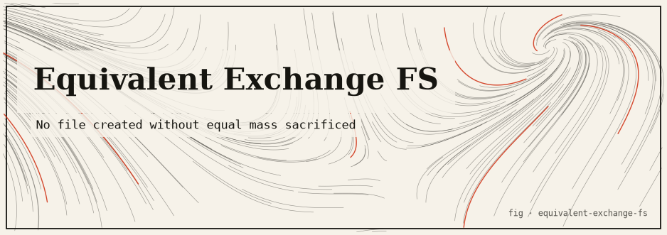

# Equivalent-Exchange Filesystem (`eqx`)

> A userspace, sandbox-only object store where bytes obey **conservation of mass**: nothing is created unless something of equal-or-greater size is destroyed.
>
> Inspired by the **Law of Equivalent Exchange** from *Fullmetal Alchemist*:
> "Humankind cannot gain anything without first giving something in return. To obtain, something of equal value must be lost."

---

## TL;DR

- A **library + CLI** (`eqx`) written in Rust with **zero external dependencies** (std only — confirmed by `Cargo.lock`).
- Stores each "object" as a **real file** of the requested byte length under one managed directory (the *vault*, default `./vault`).
- Enforces one invariant on every mutating operation except an explicit grant: `created_mass <= sacrificed_mass`. Violations are **rejected before any file is touched**.
- Every operation appends one line to an **append-only ledger** (`vault/ledger.log`), so the whole history is auditable and replayable.
- Strictly **sandboxed**: object names are allow-listed and all paths are re-checked to stay inside `vault/objects/`. It can never read, write, or delete anything outside its vault.
- Not a FUSE mount, needs **no root**, builds fully offline.

Build and try it:

```bash
cargo build
cargo run -- help
cargo test
```

---

## The idea

In *Fullmetal Alchemist*, alchemy can **reshape** matter but never conjure it from nothing. Every transmutation is a trade: to create, an alchemist must surrender material of equal value. The dramatic engine of the story is what happens when someone tries to cheat that law.

This project turns that fictional rule into a **real runtime invariant** for a byte store. "Mass" is literally file length in bytes. Creating an object requires **sacrificing** (deleting) existing objects whose combined size is at least as large. The only sanctioned way to introduce new mass is an explicit, logged `grant` — the show's *"Truth's toll"*, the price paid at the Gate.

| Alchemy in the show                          | This filesystem                                                    |
| -------------------------------------------- | ------------------------------------------------------------------ |
| Matter is reshaped, never created from void  | Bytes move between objects; total mass is bounded                  |
| To make something you must give up as much   | `created_mass <= sacrificed_mass` on every operation               |
| The Gate / Truth demands a toll              | `grant` is the only lawful, always-logged source of new mass       |
| A transmutation circle fuses raw materials   | `transmute <src...> -> <dst>` fuses objects into one               |
| A failed transmutation rebounds catastrophically | An unbalanced request is rejected atomically; disk is untouched |

---

## The honest core

This is a real, runnable program. Here is exactly what is real, what is simulated, and what is theatrical.

### The mathematics (real)

Two invariants are enforced.

**1. Per-operation conservation.** For every `alchemize` and `transmute` (grants are the sole exception):

```
created_mass <= sacrificed_mass
```

where `sacrificed_mass` is the sum of the on-disk sizes of the objects offered up. `transmute` defaults `created_mass` to the *entire* combined source mass (a perfectly conserving circle); an optional `--size N` may request **less** (mass may be lost, never gained).

**2. Whole-vault conservation.** Replaying the ledger, the store guarantees:

```
current_mass_on_disk <= total_mass_ever_granted
```

That is, nothing can exist in the vault that was not, ultimately, paid for by a grant. This is the property the integration tests assert after long mixed sessions. In `store.rs`:

```
law_holds()  ==  all_balanced  &&  current_mass <= total_granted
```

The attenuation between "created" and "current" is real too: because `transmute` can discard mass, `total_created >= current_mass` and `total_sacrificed` accumulates monotonically — visible in the `status` report's counters.

### What is real vs. simulated vs. theatrical

| Aspect | Status | Detail |
| ------ | ------ | ------ |
| Objects are real files | **Real** | Each object is a file of exactly `bytes` length under `vault/objects/`, filled with deterministic printable content (not sparse holes), so `ls -l` / `du` agree with the ledger. |
| Mass = byte length | **Real** | `size_of` reads `fs::metadata(...).len()`. Conservation is checked against actual disk sizes. |
| The law is enforced in code | **Real** | `alchemize`/`transmute` compute sacrificed mass and return `UnbalancedExchange` *before* mutating the filesystem. |
| Append-only ledger | **Real** | One pipe-delimited line per op in `vault/ledger.log`, parseable back into typed transactions. |
| Sandbox confinement | **Real** | Allow-listed names + path re-check; no API accepts an arbitrary path (see Safety below). |
| "Alchemy", "Truth's toll", "the circle closes" | **Theatrical** | Flavor naming and CLI copy. The mechanism underneath is plain file accounting. |
| POSIX filesystem semantics | **Simulated / absent** | There is no FUSE, no mount, no `open()/read()/write()` interception. You go through the `eqx` CLI or the library API. |
| Crash atomicity across a process kill | **Not provided** | Operations are ordered (delete sacrifices, then create) but there is no journaling/rollback if killed mid-op. |

### Safety: the sandbox is the whole point

The store operates **only** on its own vault directory:

- Object names pass a strict allow-list — `[A-Za-z0-9._-]`, non-empty, ≤128 chars, never `.` or `..`, never a path separator (`src/name.rs`).
- The one filesystem type, `Vault` (`src/vault.rs`), joins a validated name under `vault/objects/` and then **re-checks** that the resulting path's parent is exactly the objects directory — defence in depth against traversal.
- There is **no** API that accepts an arbitrary path, so the crate cannot read, write, or delete anything outside the vault it manages.

> **Honesty note on `unsafe`:** this crate contains no `unsafe` code, but — unlike its sibling `at-field` — it does **not** carry a crate-level `#![forbid(unsafe_code)]` attribute. The guarantee is by construction and review, not by compiler lint.

---

## How it works

### Module map

| File | Role |
| ---- | ---- |
| `src/lib.rs` | Crate root, docs, and public re-exports (`ExchangeStore`, `Vault`, `Ledger`, `ExchangeError`, ...). |
| `src/error.rs` | `ExchangeError` enum. The key variant is `UnbalancedExchange { created, sacrificed }` — the runtime embodiment of the law. |
| `src/name.rs` | **Safety-critical** object-name validation (allow-list). Unit-tested for traversal rejection. |
| `src/vault.rs` | **Safety-critical** sandbox directory. All file I/O: `create`, `remove`, `size_of`, `list`, ledger append/read. Path confinement lives here. |
| `src/ledger.rs` | Append-only audit trail. `Transaction`, `TxKind` (`Grant`/`Alchemize`/`Transmute`), `MassRef`, line (de)serialization, and conservation math (`total_granted`, `total_sacrificed`, `total_created`, `all_balanced`). |
| `src/store.rs` | `ExchangeStore` — the law-enforcing layer that ties `Vault` + `Ledger` together and exposes `grant`/`alchemize`/`transmute`/`status`. |
| `src/main.rs` | The `eqx` CLI: hand-rolled, dependency-free argument parsing and rendering. |
| `tests/law_of_equivalent_exchange.rs` | Integration tests proving the invariants and rejections. |

Binary target: `eqx` (`src/main.rs`). Library target: `equivalent_exchange_fs` (`src/lib.rs`).

### Key types & algorithms

- **`ExchangeStore::grant(name, bytes)`** — the only lawful source of new mass. Creates the object and logs a `GRANT`. No sacrifice.
- **`ExchangeStore::alchemize(name, bytes, sacrifices)`** — resolves the sacrifice list (must be non-empty, no duplicates, none equal to the target, all existing), sums their sizes, checks the law, then deletes the sacrifices and creates the new object. Logs an `ALCHEMIZE`.
- **`ExchangeStore::transmute(sources, dst, dst_bytes)`** — like alchemize but `dst_bytes` defaults to the full combined source mass; requesting more is rejected, requesting less is allowed (lossy). Logs a `TRANSMUTE`.
- **Rejection is atomic:** the law check happens *before* any `remove`/`create`, so a rejected exchange leaves the vault byte-for-byte unchanged.
- **Ledger records are immutable:** parsing always builds a fresh `Vec<Transaction>`; nothing is mutated in place. Ledger grammar: `TAG|<ts>|<name>:<bytes>|<src_name>:<src_bytes>,<...>`.

---

## Install & run

The vault defaults to `./vault` (override with `--vault <dir>` or `$EQX_VAULT`).

```bash
cargo build            # compile the eqx binary + library
cargo run -- help      # print CLI usage
cargo test             # unit + integration tests, incl. the invariant proofs
```

### Commands

```
eqx [--vault <dir>] <command> [args]

grant <name> <bytes>                       Seed new mass (Truth's toll; logged).
alchemize <name> <bytes> --sacrifice a,b   Create <name> by deleting a,b.
                                           Rejected unless size(a)+size(b) >= bytes.
transmute <src...> -> <dst> [--size N]     Reshape sources into one dst object.
                                           dst mass defaults to combined source mass.
list                                       List objects and their masses.
ledger                                     Print the full audit trail + status.
status                                     Print the conservation summary.
help                                       Show this message.
```

> **Shell note:** quote the arrow — `transmute a b '->' dst` — because a bare `->` is parsed by the shell as the `>` redirection operator.

### Captured session

The following is **verbatim** output from a real run (`--vault` pointed at a fresh temp directory). Ledger timestamps are Unix seconds, so they repeat when operations land in the same second.

```text
$ eqx grant ore 500
Truth's toll paid. Granted 500 bytes as 'ore'.
  ledger <- [t=1787085732] GRANT      +500 bytes -> 'ore'  (Truth's toll; no sacrifice) [OK]
  current mass: 500 bytes across 1 object(s)

$ eqx alchemize sword 300 --sacrifice ore
Transmutation complete: 'sword' (300 bytes) formed.
  ledger <- [t=1787085732] ALCHEMIZE  created 300b 'sword'  <=  sacrificed 500b [OK] sacrificed: [ore(500b)]
  current mass: 300 bytes across 1 object(s)

# --- the forbidden free lunch: 1000 bytes out of a 300-byte sword ---
$ eqx alchemize gold_mountain 1000 --sacrifice sword
error: LAW OF EQUIVALENT EXCHANGE VIOLATED: cannot create 1000 bytes from a sacrifice of only 300 bytes. To obtain, something of equal value must be lost.
# exit code 1 — nothing on disk changed; sword is untouched

$ eqx grant gems 250
Truth's toll paid. Granted 250 bytes as 'gems'.
  ledger <- [t=1787085732] GRANT      +250 bytes -> 'gems'  (Truth's toll; no sacrifice) [OK]
  current mass: 550 bytes across 2 object(s)

# --- the transmutation circle: fuse sword + gems into one object ---
$ eqx transmute sword gems '->' alloy
The circle closes: sources reshaped into 'alloy'.
  ledger <- [t=1787085732] TRANSMUTE  created 550b 'alloy'  <=  sacrificed 550b [OK] sacrificed: [sword(300b), gems(250b)]
  current mass: 550 bytes across 1 object(s)

$ eqx list
OBJECT                          BYTES
-------------------------------------
alloy                             550
-------------------------------------
TOTAL MASS                        550

$ eqx ledger
=== ALCHEMIST'S LEDGER ===
#1   [t=1787085732] GRANT      +500 bytes -> 'ore'  (Truth's toll; no sacrifice) [OK]
#2   [t=1787085732] ALCHEMIZE  created 300b 'sword'  <=  sacrificed 500b [OK] sacrificed: [ore(500b)]
#3   [t=1787085732] GRANT      +250 bytes -> 'gems'  (Truth's toll; no sacrifice) [OK]
#4   [t=1787085732] TRANSMUTE  created 550b 'alloy'  <=  sacrificed 550b [OK] sacrificed: [sword(300b), gems(250b)]

=== CONSERVATION STATUS ===
current mass on disk : 550 bytes
objects in vault     : 1
total ever granted   : 750 bytes  (lawful mass source)
total ever created   : 1600 bytes
total ever sacrificed: 1050 bytes
every op balanced    : yes
mass <= granted      : yes
>>> LAW OF EQUIVALENT EXCHANGE UPHELD
```

Note the accounting in the final `status`: `current mass` (550) never exceeds `total granted` (750); `total created` (1600) exceeds `current mass` because transmutation and alchemy re-created mass that was later consumed again; `total sacrificed` (1050) is the running sum of everything ever destroyed.

### Library API

```rust
use equivalent_exchange_fs::ExchangeStore;

let store = ExchangeStore::open("./vault")?;
store.grant("ore", 500)?;                              // seed mass (logged)
store.alchemize("sword", 300, &["ore".into()])?;       // 300 <= 500  -> ok
store.transmute(&["sword".into()], "ring", Some(100))?;// may lose mass, never gain

// This returns Err(ExchangeError::UnbalancedExchange { .. }):
// store.alchemize("free_gold", 9999, &["ring".into()]);
```

---

## Testing

Run everything with `cargo test`. The suite has **three layers**, all green:

- **Unit tests — name validation (`src/name.rs`):** `accepts_simple_names` and `rejects_path_traversal_and_separators` confirm the allow-list accepts ordinary names and rejects `..`, `.`, empty, `a/b`, `a\b`, `../etc/passwd`, `/abs`, spaces, and `*`.
- **Unit tests — vault I/O (`src/vault.rs`):** `create_size_remove_roundtrip` checks create → exists → size → total mass → remove; `rejects_unsafe_names_without_touching_disk` confirms `../escape` is refused without any disk write.
- **Integration tests — the law (`tests/law_of_equivalent_exchange.rs`):**
  - `grant_then_balanced_alchemy_conserves_mass` — a balanced alchemy keeps `current_mass <= total_granted`.
  - `unbalanced_alchemy_is_rejected_and_disk_unchanged` — a free-lunch request errors with `UnbalancedExchange { created: 1000, sacrificed: 50 }` and leaves the pebble and mass intact.
  - `creating_from_nothing_is_rejected` — an empty sacrifice yields `EmptySacrifice`.
  - `transmute_default_conserves_all_mass` — no `--size` fuses `a`+`b` into one object conserving all 200 bytes; sources are consumed.
  - `transmute_may_lose_mass_but_never_gain` — `--size` below available succeeds; a request to gain mass is rejected.
  - `law_holds_across_a_long_random_session` — a mixed grant/alchemize/transmute session ends with every op balanced, `current_mass (500) <= total_granted (1600)`, and ledger replay agreeing with disk.
  - `sandbox_refuses_path_traversal_names` — `../escape`, `..`, `a/b`, `/etc/passwd` are all refused and the vault stays empty.

Observed result: **4 unit + 7 integration + 1 doc-test = all passing.**

```text
running 4 tests   (lib unit tests)      ... ok
running 7 tests   (law_of_equivalent_exchange) ... ok
running 1 test    (doc-tests)           ... ok
```

---

## Limitations & honest caveats

- **Not a POSIX filesystem.** No FUSE, no mount, no syscall interception. It is a managed store you drive via the CLI/API. This is a deliberate choice: it needs no root and keeps the blast radius to one directory.
- **Not crash-atomic.** Operations delete sacrifices then create the result; there is no journaling or rollback if the process is killed mid-operation. A crash between the two steps can lose mass (never gain it), so the safety-direction invariant still holds, but the vault may be left short.
- **Single process, no locking.** Concurrent `eqx` invocations on the same vault are not synchronized.
- **No `unsafe`, but no `#![forbid(unsafe_code)]`.** Confinement is guaranteed by construction and tests, not by a compiler lint.
- **Timestamps are coarse.** Wall-clock Unix *seconds*; ordering within a second relies on ledger append order, not the timestamp.
- **Object content is synthetic.** Files are filled with a deterministic printable pattern derived from the name — the point is byte *count*, not payload fidelity.
- A prototype, not a production database.

---

## References / attribution

- **Concept:** the Law of Equivalent Exchange, *Fullmetal Alchemist* (Hiromu Arakawa). Naming and flavor text are homage; no copyrighted assets are bundled (the banner is an original illustration).
- **Real-world analogues:** conservation laws / accounting invariants, append-only ledgers, and capability-confined ("sandboxed") filesystem access.
- **Dependencies:** none — Rust standard library only (`Cargo.lock` lists a single package). Developed against `rustc 1.94.0`.
- **License:** MIT.
