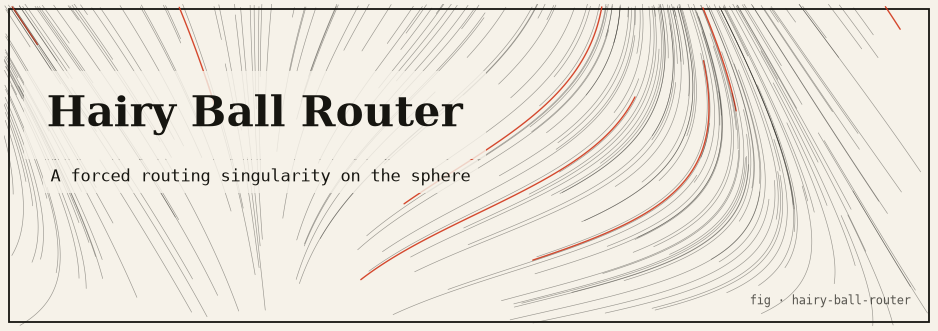

# Hairy Ball Theorem Router

**A network laid out on the unit sphere S² that routes packets by following a continuous tangent vector field — where the Hairy Ball Theorem mathematically forces at least one "black hole" node at which routing cannot proceed.**

Concept & reference: the [Hairy Ball Theorem](https://en.wikipedia.org/wiki/Hairy_ball_theorem) — *there is no non-vanishing continuous tangent vector field on the 2-sphere.* Any such field must vanish somewhere, so a routing rule built from one is guaranteed to have nodes where there is no forwarding direction. Packets that reach them stall and must be dropped or handed to a fallback. This is a **simulation only** — no packets, sockets, or destructive operations.

---

## TL;DR

- Nodes are placed on S² with a **Fibonacci lattice** (golden-angle spiral) for near-even spacing.
- Routing = follow a **continuous tangent vector field**. Each node greedily forwards to the neighbor whose tangent-plane step best aligns with the field.
- The field is a global direction **G** projected onto each tangent plane: `t(p) = G − (G·p)p`. Its magnitude is `|G|·sin θ`, which is **zero exactly at the two poles** `±G/|G|`.
- The Hairy Ball Theorem *forbids* a field with no zeros — so those two poles are **mandatory singularities**: nodes with no forwarding direction. Packets swept into them stall.
- The demo (300 nodes, 6 neighbors, `G = (0,1,0)`) finds the two forced zeros at nodes 0 and 299 (`|field| = 0`) and shows packets getting delivered, handed to a fallback, or force-dropped exactly at those black holes.
- No dependencies.

---

## The idea

Distance-vector and geometric routing schemes love a clean forwarding rule: "always step in the direction the field points." On a plane or a torus you can define such a rule with no dead spots. On a sphere you cannot — and this is not an engineering shortcoming, it is a topological theorem. The Hairy Ball Theorem says any continuous tangent field on S² must have at least one zero, and at a zero the forwarding rule has no direction to offer. This project builds exactly that: a sphere network with a field-following router, then locates the singularities the theorem promises and watches packets die there.

The lesson generalizes: any purely local, continuous, direction-based routing policy on a spherical topology has forced failure points. You can move them (change the field) but you cannot delete them.

---

## The honest core

### The theorem

> There is no non-vanishing continuous tangent vector field on the 2-sphere S².

Equivalently: *you cannot comb a hairy ball flat without a cowlick.* Any continuous tangent field on S² has **≥ 1 zero**. More precisely, the sum of the indices of its zeros equals the [Euler characteristic](https://en.wikipedia.org/wiki/Euler_characteristic) of S², which is **2** — so a generic field has two simple zeros (e.g. a source and a sink).

### The field this project uses

Comb the sphere with a single global ambient direction **G** (here `G = (0, 1, 0)`, "north"). At a surface point **p** (a unit vector) project **G** onto the tangent plane by removing its normal component (`field.go`):

```
t(p) = G − (G · p) p
```

Because `t(p) · p = 0` by construction, `t(p)` always lies in the tangent plane of S² at `p` — a genuine, continuous tangent vector field. Its magnitude is:

```
|t(p)| = |G| · sin(θ)      where θ = angle between G and p
```

This is **zero exactly when p is parallel to G**, i.e. at the two antipodal poles:

```
p = +G/|G|   (the sink   — flow lines converge here)
p = −G/|G|   (the source — flow lines diverge here)
```

These two points are the **mandatory singularities**. The theorem does not merely *permit* them — it *forbids their absence*. The simulation confirms this empirically: it scans every node and reports the minimum field magnitude, which lands on the pole nodes at ~0.

### What is real vs. simulated

| Aspect | Status |
|--------|--------|
| Hairy Ball Theorem, `t(p) = G − (G·p)p`, `|t| = |G|sin θ`, zeros at `±G/|G|` | **Real** mathematics; the field is a genuine continuous tangent field and its zeros are exact |
| Euler characteristic / index-sum = 2 | **Real** — the generic field here has exactly two zeros (source + sink) |
| Fibonacci-lattice node placement, k-NN topology | **Real** geometry; a standard even-sphere-sampling method |
| The "router" | **Simulated** — greedy, local, field-following; no real packets, sockets, or network |
| A node landing *exactly* on a pole | An artifact of `N = 300`: node 0 sits on `(0,1,0)` and node 299 on `(0,-1,0)`. In general the nearest node to a pole is flagged singular via `|field| ≤ singularityEps = 0.05` |

### Reproduced numbers (from `go run .`, 300 nodes, `G = (0,1,0)`)

- **Analytic zeros:** `(0.000, 1.000, 0.000)` and `(-0.000, -1.000, -0.000)`.
- **Empirical minimum field magnitude:** `0.000000` at node 0 `(0.000, 1.000, 0.000)`.
- **Singular nodes** (`|field| ≤ 0.050`): `[0, 299]` — node 0 (north sink) and node 299 (south source), both `|field| = 0.000000`. **Theorem confirmed empirically: 2 forced singularities.**
- **Fallback node:** 144 `(0.999, 0.037, 0.019)`, chosen near the equator far from both poles.

---

## How it works

### File map (single `main` package)

| File | Responsibility |
|------|----------------|
| `vec.go` | Immutable 3D vector math (`Add`, `Sub`, `Scale`, `Dot`, `Cross`, `Len`, `Normalize`) |
| `sphere.go` | `FibonacciSphere` placement, `Neighbors` (k-nearest by angular distance), `AngularDist` |
| `field.go` | The tangent field `TangentAt`, `IsSingular`, exact `Zeros`, `singularityEps` |
| `router.go` | Greedy field-following `Router`, `Route`, `bestNeighbor`, drop/fallback (`trap`), `RouteResult` |
| `main.go` | Builds the network, locates singularities, routes packets, prints results |

### Key algorithms

- **`FibonacciSphere(n)`** — golden-angle spiral: `y` sweeps from ~1 to ~-1, `theta = φ·i` with `φ = π(3−√5)`, giving near-uniform coverage that avoids the pole-clustering of lat/long grids.
- **`Neighbors(nodes, k)`** — for each node, a partial selection-sort picks the `k` nearest by great-circle angle (`AngularDist = acos(clamp(a·b))`). This defines the hop topology.
- **`Field.TangentAt(p)`** — `G − p·(G·p)`, guaranteed orthogonal to `p`. `IsSingular(p)` is `|TangentAt(p)| ≤ 0.05`.
- **`Router.bestNeighbor(cur)`** — normalize the field at `cur`; for each neighbor, project the hop onto the tangent plane at `cur` and score it by dot product with the field; pick the highest-scoring neighbor (greedy alignment).
- **`Router.Route(src, dst)`** — walk hop by hop (bounded by `maxHops = 512` to break cycles). Delivery if `dst` is reached (landed on or offered as a neighbor). Reaching a **singular node**, hitting a dead end, or revisiting a node (loop) ends the walk; the packet is then handed to the fallback (`trap`) or, if no valid fallback, **dropped**.

---

## Install & run

Requires **Go** (developed against `go1.24.4`). No third-party dependencies.

```bash
cd hairy-ball-router
go build ./...      # compile everything
go vet ./...        # static checks (clean)
go run .            # run the simulation
```

To move the singularities, change the combing direction `G` in `main.go` (`NewField(Vec3{...})`); the poles — and therefore the black-hole nodes — move, but never disappear.

### Captured sample output

```
=== Hairy Ball Theorem Router (S^2 routing simulation) ===
nodes=300  neighbors/node=6  combing-direction=( 0.000, 1.000, 0.000)
Hairy Ball Theorem: any continuous tangent vector field on S^2
has at least one zero -> at least one forced singularity.
fallback node = 144 @ ( 0.999, 0.037, 0.019)

--- Mandatory singularities (field zeros) ---
Analytic field zeros (poles of the combing): ( 0.000, 1.000, 0.000) and (-0.000,-1.000,-0.000)
min field magnitude over nodes = 0.000000 at node 0 ( 0.000, 1.000, 0.000)
Nodes on singularities (|field| <= 0.050): [0 299]
    node 0 @ ( 0.000, 1.000, 0.000)  |field|=0.000000  <- BLACK HOLE
    node 299 @ ( 0.000,-1.000, 0.000)  |field|=0.000000  <- BLACK HOLE
=> theorem confirmed empirically: 2 forced singularity(ies).

--- Routing packets (greedy field-following) ---
packet 299 -> 0 : FALLBACK (handed to designated node)
    trace: [299 144] (trapped-at=299)
packet 144 -> 0 : DELIVERED
    trace: [144 110 76 42 21 8 3 0] (trapped-at=-1)
packet 144 -> 161 : FALLBACK (handed to designated node)
    trace: [144 110 76 42 21 8 3 0 144] (trapped-at=0)
packet 299 -> 142 : FALLBACK (handed to designated node)
    trace: [299 144] (trapped-at=299)
packet 142 -> 299 : FALLBACK (handed to designated node)
    trace: [142 108 74 40 19 6 1 0 144] (trapped-at=0)

summary: delivered=1 dropped=0 fallback=4

with fallback disabled (fallback=-1):
packet 144 -> 161 : DROPPED (forced singularity)
    trace: [144 110 76 42 21 8 3 0] (trapped-at=0)

Packets trapped at a black-hole node are exactly the routing
failures forced by the Hairy Ball Theorem.
```

### Reading the results

- **Singularity locations.** With 300 nodes, node **0** lands on the north pole `(0, 1, 0)` and node **299** on the south pole `(0, −1, 0)`. Both report `|field| = 0` — the two forced zeros the theorem promises.
- **A delivered packet.** `144 → 0`: `[144 110 76 42 21 8 3 0]`. Node 144 sits near the equator; following the field "uphill" along a meridian sweeps the packet straight into the north-pole sink, which *is* the destination. Delivered.
- **A trapped packet.** `144 → 161`: `[144 110 76 42 21 8 3 0 144]`. The field carries the packet to node 0 (the black hole). Node 0 has no forwarding direction, so the packet is handed to fallback node 144. Its true destination (161) is off the flow line and is never reached by pure field-following.
- **Source-pole stall.** `299 → 0`: node 299 sits on the *source* pole; the field vanishes there too, so the packet stalls immediately and goes to fallback.
- **Forced drop.** With `fallback = -1`, the same `144 → 161` packet has nowhere to go and is **DROPPED (forced singularity)** at node 0.

Every routing failure in this run is caused by a packet flowing into one of the two zeros that the Hairy Ball Theorem *forces* to exist.

---

## Testing

**There are no automated tests** (`go test ./...` reports `[no test files]`). The project is validated by:

- `go build ./...` — compiles clean.
- `go vet ./...` — static analysis, clean.
- `go run .` — the run itself is a live empirical proof: it scans all nodes, confirms the minimum field magnitude is 0 at the pole nodes, and reports exactly the number of forced singularities the theorem predicts.

Natural unit-test targets if extended: `Vec3` operations and `Normalize`'s zero-vector guard, `AngularDist` clamping, `Field.TangentAt` orthogonality (`t(p)·p == 0`) and its zeros, and `Router.Route` outcomes (delivered / fallback / dropped, loop termination via `maxHops`).

---

## Limitations & honest caveats

- **Greedy, local, field-following only.** This is deliberately *not* a shortest-path router. A destination off the flow line is unreachable by pure field-following even though a path exists in the topology — that is the point being illustrated, not a bug.
- **A node landing exactly on a pole is an `N = 300` artifact.** For other node counts no node sits exactly on `±G`, but the nearest node still falls within `singularityEps = 0.05` and is flagged as the effective black hole. The theorem guarantees a zero exists; discretization just picks the closest node to it.
- **`singularityEps = 0.05` is a threshold, not the theorem.** The zeros are exact and continuous; the epsilon is only how "on a singularity" is decided for discrete nodes.
- **No real networking.** Nodes, neighbors, and packets are in-memory structs. There are no sockets, no latency, no loss model, and no destructive operations.
- **Fallback is a single designated node**, not a routing recovery scheme; it exists to make the "trapped" outcome observable versus the force-drop outcome.

---

## References

- Hairy Ball Theorem — https://en.wikipedia.org/wiki/Hairy_ball_theorem
- Euler characteristic — https://en.wikipedia.org/wiki/Euler_characteristic
- Poincaré–Hopf theorem (index sum = Euler characteristic) — https://en.wikipedia.org/wiki/Poincar%C3%A9%E2%80%93Hopf_theorem
- Fibonacci lattice / even sphere sampling — https://en.wikipedia.org/wiki/Geodesic_grid#Spiral_points
- Tangent space — https://en.wikipedia.org/wiki/Tangent_space
