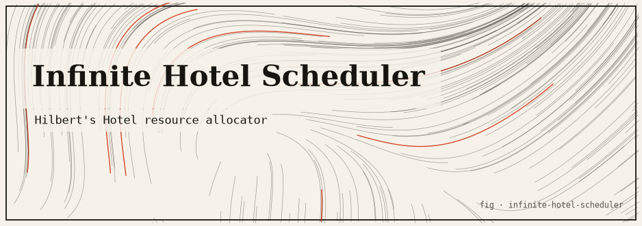

# Hilbert's Infinite Hotel — Cloud Scheduler

**A resource allocator that is never full: rooms are the natural numbers, guests are VM/container requests, and no matter how many are already checked in — even infinitely many — it can always admit more without evicting anyone.**

Concept & reference: [Hilbert's paradox of the Grand Hotel](https://en.wikipedia.org/wiki/Hilbert%27s_paradox_of_the_Grand_Hotel), David Hilbert's thought experiment about a hotel with countably infinitely many rooms. This project turns the four classic "make room" moves into real allocator methods, backed by injective functions on the naturals and the [Cantor pairing function](https://en.wikipedia.org/wiki/Pairing_function#Cantor_pairing_function). It is a **simulation**, not a real cluster — it exists to make the thought experiment concrete, runnable, and honest about the math that makes it work.

---

## TL;DR

- Rooms are indexed `0, 1, 2, 3, …`; every guest is a VM or container request.
- The hotel starts **completely full** (founding residents occupy every room) and *still* admits new guests by relocating existing ones forward.
- Four moves, each an injective map `ℕ → ℕ` whose image is a proper subset, so it frees rooms:

  | Method | Move | Frees |
  |--------|------|-------|
  | `AddGuest()` | shift `n → n+1` | room `0` (one guest) |
  | `AddBus(k)` | shift `n → n+k` | rooms `0..k-1` (k guests) |
  | `AddInfiniteBus()` | double `n → 2n` | all odd rooms (∞ guests) |
  | `AddInfiniteBuses()` | double + Cantor pairing | all odd rooms hold ∞ buses × ∞ seats |

- Infinity is never materialised: the hotel stores only a **finite list of arrivals** and a **finite stack of transforms**. Every room lookup is computed on demand.
- `IsOccupied(room)` is `true` for every room after opening — that is the whole point. A full infinite hotel stays full while still saying yes.
- No dependencies. Tests run clean under `-race`.

---

## The idea

Imagine a cloud scheduler whose capacity is the set of natural numbers: it can never return "no free slots." That is impossible with finite hardware, but it is exactly what Hilbert's Grand Hotel describes for a *countably infinite* hotel. The paradox: even when the hotel is 100% occupied, it can accommodate one more guest, a busload, or infinitely many busloads of infinitely many guests — all without throwing anyone out.

The trick is that you never store one record per room (there are infinitely many). You store the *rules* that relocate residents, and you evaluate them on demand. Ask "where does guest X live now?" or "who is in physical room R?" and the answer is computed by composing (or inverting) a short stack of functions. Infinity stays lazy behind a handful of injective maps.

---

## The honest core

Every arrival is admitted by first applying an **injective transform** `t: ℕ → ℕ` to every current resident's room. Injectivity guarantees no two residents ever collide; a proper-subset image guarantees some rooms are freed for the newcomers. Because residents are only ever *relocated forward*, nobody is evicted.

Each transform exposes two operations (`transform.go`):

- `Apply(room)` pushes an existing resident **forward** (relocation).
- `Invert(room)` pushes **backward**; it returns `ok == false` exactly when the room is **not** in the image of `Apply` — i.e. the room this transform *freed*, now home to the arrival admitted alongside it.

### `AddGuest` — shift `n → n+1`

Every resident in room `n` moves to `n+1`. The map is a bijection from `ℕ` onto `{1, 2, 3, …}`, so **room `0` is freed** for one new guest. Nobody evicted; everybody still has a unique room.

### `AddBus(k)` — shift `n → n+k`

Resident `n` moves to `n+k`; the image is `{k, k+1, …}`, freeing rooms `0..k-1` for the bus's `k` passengers. Passenger `m` takes room `m`.

### `AddInfiniteBus` — double `n → 2n`

Resident `n` moves to the even room `2n`. The evens are a proper subset of `ℕ` with the *same cardinality* (`n ↔ 2n` is a bijection `ℕ → evens`), so **all odd rooms** `1, 3, 5, …` are freed at once. Seat `j` of the infinite bus takes room `2j + 1`. A countably infinite arrival absorbed in one move.

### `AddInfiniteBuses` — double + Cantor pairing

Countably many buses (`bus = 0, 1, 2, …`), each with countably many seats (`seat = 0, 1, 2, …`). The key fact is that `ℕ × ℕ` is countable, witnessed by the **Cantor pairing function**, a bijection `ℕ × ℕ → ℕ`:

```
cantor(a, b) = (a + b)(a + b + 1)/2 + b
```

So the whole fleet collapses into a single stream of member indices `j`, which then lands in the countably infinite set of odd rooms via the same doubling move:

```
(bus b, seat s)  --cantor-->  member j  -->  room 2j + 1
```

That is why `AddInfiniteBus` and `AddInfiniteBuses` reuse the *same* `n → 2n` transform: freeing the odds once is enough, because the countably many odd rooms can hold `ℕ × ℕ` passengers.

### Why no eviction is possible

Every transform is injective, so no two residents ever collide. The hotel starts full and only ever relocates forward, so `WhoIsInRoom(R)` is a **total** function — every room always has exactly one occupant. `IsOccupied(R)` is therefore always `true` after opening. A full infinite hotel stays full while still admitting new guests.

### Reverse lookup: who is in room `R`?

To find a physical room's occupant, invert the transform stack **newest to oldest**. The first transform whose inverse *rejects* `R` is exactly the one that freed it, so `R` belongs to that transform's arrival; the placer decodes `R` back to a member index. If every inverse succeeds, `R` traces all the way back to a founding resident. This is `Hotel.WhoIsInRoom`.

### What is real vs. simulated

| Aspect | Status |
|--------|--------|
| The four bijections/injections, Cantor pairing, no-eviction invariant | **Real** mathematics, implemented and tested (round-trip, injectivity, pairing bijection) |
| "Infinite" arrivals | **Lazy** — only the seats you actually query are ever computed; nothing iterates to infinity |
| A real cluster/VMs | **None** — `Request` is a struct; no scheduling, networking, or hypervisor is involved |
| Room arithmetic | Native `uint64`, not `math/big` — see Limitations |

---

## How it works

### File map (single `main` package)

```
infinite-hotel-scheduler/
├── go.mod              # module infinite-hotel-scheduler, Go 1.24.4, no deps
├── transform.go        # injective room transforms: identity, shift{k}, doubling
├── placer.go           # how each arrival lays members into the rooms it freed
├── pairing.go          # Cantor pairing ℕ×ℕ → ℕ (cantor) and inverse (uncantor)
├── hotel.go            # the lazy allocator: arrivals, transform stack, RoomOf, WhoIsInRoom, IsOccupied
├── request.go          # VM/container request model
├── main.go             # the demo trace
├── hotel_test.go       # no-eviction / round-trip / pairing tests
├── helpers_test.go     # founding residents, accessors, placer inverses
└── pairing_test.go     # Cantor bijection + transform inverse tests
```

### Key types and algorithms

- **`Transformer` interface** (`transform.go`): `Apply`, `Invert`, `Name`. Implementations: `identity` (`n → n`, for the founding residents' slot), `shift{k}` (`n → n+k`, frees `0..k-1`), `doubling` (`n → 2n`, frees the odds).
- **`Placer` interface** (`placer.go`): a bijection between an arrival's member indices and the rooms it just freed. `originalPlacer` (`m → m`, fills everything), `contiguousPlacer{k}` (`m → m` for `m < k`), `oddPlacer` (`j → 2j+1`).
- **`Hotel`** (`hotel.go`): holds `arrivals []*Arrival` and `transforms []Transformer` in lockstep (`transforms[i]` was applied when `arrivals[i]` checked in). `admit` is the single mutation point and *appends* rather than editing prior entries, so past arrivals keep their meaning.
- **`Arrival.RoomOf(member)`**: start from the placer's freed room, then push forward through every *later* transform.
- **`Hotel.WhoIsInRoom(room)`**: invert the stack newest→oldest until an inverse rejects the room.
- **`cantor` / `uncantor`** (`pairing.go`): the pairing function and its inverse (via the triangular-root, with a float-drift correction loop).

---

## Install & run

Requires **Go 1.24+** (developed on `go1.24.4`). No third-party dependencies.

```bash
cd infinite-hotel-scheduler
go build ./...              # compile
go run .                   # run the demo trace
go test ./...              # run the test suite
go test -race -cover ./... # race detector + coverage
```

### Captured sample output

```
Hilbert's Infinite Hotel -- Cloud Scheduler
A resource allocator that is NEVER full.
============================================================

Opening state: the hotel is already FULL.
  founding residents occupy every room 0, 1, 2, 3, ...

------------------------------------------------------------
1) AddGuest -- one VM shows up; shift n -> n+1 frees room 0
------------------------------------------------------------
  alice (vm)             -> room 0      (WhoIsInRoom(0) = guest:alice#0)
  physical room 0 currently holds: guest:alice#0
  IsOccupied(0)=true  IsOccupied(1)=true  IsOccupied(1000000)=true

------------------------------------------------------------
2) AddBus(3) -- a bus of 3 containers; shift n -> n+3 frees rooms 0..2
------------------------------------------------------------
  alice (vm)             -> room 3      (WhoIsInRoom(3) = guest:alice#0)
  bus.blue seat0         -> room 0      (WhoIsInRoom(0) = bus:blue#0)
  bus.blue seat2         -> room 2      (WhoIsInRoom(2) = bus:blue#2)
  physical room 0 currently holds: bus:blue#0
  IsOccupied(0)=true  IsOccupied(1)=true  IsOccupied(1000000)=true

------------------------------------------------------------
3) AddInfiniteBus -- residents n -> 2n; the infinite bus takes the odds
------------------------------------------------------------
  alice (vm)             -> room 6      (WhoIsInRoom(6) = guest:alice#0)
  bus.blue seat0         -> room 0      (WhoIsInRoom(0) = bus:blue#0)
  bus.blue seat2         -> room 4      (WhoIsInRoom(4) = bus:blue#2)
  inf-bus.ghost seat0    -> room 1      (WhoIsInRoom(1) = inf-bus:ghost#0)
  inf-bus.ghost seat5    -> room 11     (WhoIsInRoom(11) = inf-bus:ghost#5)
  physical room 0 currently holds: bus:blue#0
  IsOccupied(0)=true  IsOccupied(1)=true  IsOccupied(1000000)=true

------------------------------------------------------------
4) AddInfiniteBuses -- countably many infinite buses via Cantor pairing
------------------------------------------------------------
  Cantor pairing (bus, seat) -> member -> odd room:
    bus 0 seat 0 -> member 0 -> room 1
    bus 0 seat 1 -> member 2 -> room 5
    bus 1 seat 0 -> member 1 -> room 3
    bus 2 seat 3 -> member 18 -> room 37
  alice (vm)             -> room 12     (WhoIsInRoom(12) = guest:alice#0)
  bus.blue seat0         -> room 0      (WhoIsInRoom(0) = bus:blue#0)
  bus.blue seat2         -> room 8      (WhoIsInRoom(8) = bus:blue#2)
  inf-bus.ghost seat0    -> room 2      (WhoIsInRoom(2) = inf-bus:ghost#0)
  inf-bus.ghost seat5    -> room 22     (WhoIsInRoom(22) = inf-bus:ghost#5)
  physical room 0 currently holds: bus:blue#0
  IsOccupied(0)=true  IsOccupied(1)=true  IsOccupied(1000000)=true

------------------------------------------------------------
Transform stack (composed, newest last)
------------------------------------------------------------
  [0] identity  (n -> n)      founding residents
  [1] shift     (n -> n+1)    admitted guest:alice
  [2] shift     (n -> n+3)    admitted bus:blue
  [3] doubling  (n -> 2n)     admitted inf-bus:ghost
  [4] doubling  (n -> 2n)     admitted inf-buses:fleet

------------------------------------------------------------
Proof: no eviction, no collision, still full
------------------------------------------------------------
  5 tracked guests occupy 5 distinct rooms -> injective, no collisions
  sampled rooms [0 1 2 3 7 42 123 10000 999999] -> all occupied: true

Every room is occupied, every guest has a unique room, and the
hotel still accepted an infinite fleet of infinite buses. Never full.
```

### Reading the trace

Watch `alice`: she enters room `0`, is pushed to `3` by the bus, then `n → 2n` sends her to `6`, then the second doubling to `12`. She is relocated four times and **never evicted** — her room is always recomputed from the composed transform, never stored. Meanwhile every sampled physical room, up to `999999`, still resolves to a unique occupant: the hotel is provably still full.

---

## Testing

```bash
go test ./...
go test -race -cover ./...
```

Coverage (from `go test -race -cover`): **48.4% of statements**. Coverage is moderate because a large share of the code is `fmt.Printf`-heavy demo/reporting (`main.go`), which the tests do not exercise; the mathematical core (transforms, placers, pairing, hotel lookups) is directly tested.

The tests verify:

- **`AddGuest` frees room 0** and pushes the former occupant to room 1 (`TestAddGuestFreesRoomZero`).
- **`AddBus(3)` frees rooms `0..2`** and pushes founding resident 0 to room 3 (`TestAddBusFreesKRooms`).
- **`AddInfiniteBus` takes the odds**: seat `j` → room `2j+1` for 100 seats, founding residents land on even rooms (`TestAddInfiniteBusTakesOdds`).
- **`AddInfiniteBuses` pairing**: over a 30×30 grid of (bus, seat) every room is odd, no room is assigned twice, and reverse lookup decodes back to the exact `(bus, seat)` (`TestAddInfiniteBusesPairing`).
- **No eviction across the full sequence**: after the whole demo, every previously admitted guest still holds a unique valid room (`TestNoEvictionAcrossSequence`).
- **`IsOccupied` is always true**, including at room `1<<40` (`TestIsOccupiedAlwaysTrue`).
- **Cantor bijection**: 60×60 grid has no collisions and `uncantor∘cantor` is the identity; `uncantor` round-trips every `z < 5000` (`TestCantorBijection`, `TestUncantorCoversLowIntegers`).
- **Transform inverses**: `shift{5}` and `doubling` invert correctly and reject exactly the rooms they freed (`TestTransformInverses`).
- Founding-resident tracking, accessors/names, placer invertibility, `Request.String`, and the identity transform.

The suite runs clean under the race detector.

---

## Limitations & honest caveats

- **`uint64` room indices, not `math/big`.** The demo values stay tiny, but a long chain of doublings or a large Cantor pair will eventually overflow `uint64`. A production version would use arbitrary-precision integers; this teaching simulation keeps arithmetic native and fast.
- **Lazy infinity, not stored infinity.** "Countably infinite" arrivals are represented by rules; only the seats you query are computed. Nothing ever iterates to infinity, and the hotel never allocates per-room storage.
- **Not a scheduler in the OS sense.** There is no real placement, bin-packing, resource accounting (the `VCPU`/`MemMB` fields are decorative), or networking. The point is the countable-infinity bookkeeping, not cluster management.
- **Reverse lookup cost grows with the transform stack.** `WhoIsInRoom` inverts the whole stack, so a very long history of arrivals makes each lookup linear in the number of arrivals.

---

## References

- Hilbert's paradox of the Grand Hotel — https://en.wikipedia.org/wiki/Hilbert%27s_paradox_of_the_Grand_Hotel
- Pairing function / Cantor pairing — https://en.wikipedia.org/wiki/Pairing_function#Cantor_pairing_function
- Countable set — https://en.wikipedia.org/wiki/Countable_set
- Bijection, injection and surjection — https://en.wikipedia.org/wiki/Bijection,_injection_and_surjection
- Cardinality of the natural numbers (ℵ₀) — https://en.wikipedia.org/wiki/Aleph_number
