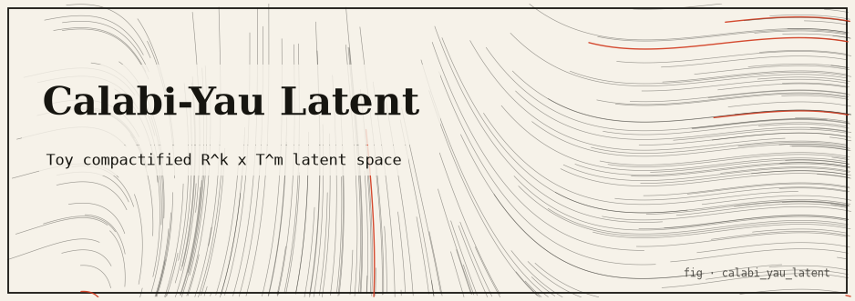
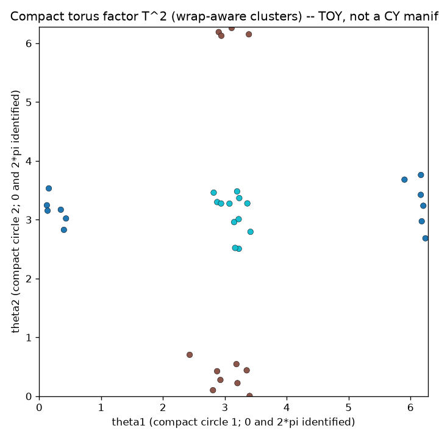

# calabi_yau_latent — a compactified latent space over `R^k × T^m`



> *Structure hidden in small, periodic dimensions is invisible to a naive
> Euclidean eye — until you respect the topology.*

A small, fully runnable model of a latent space in which a few axes are **large /
extended** (`R^k`) and the rest are **compactified** — periodic, small-radius
circles forming a torus `T^m`. Clusters planted in the compact, periodic axes are
easy to *miss* under a flat Euclidean view (it tears wrap-around groups apart at
the `0 / 2π` seam), yet they reappear the instant the periodic topology is honored.
It is an honest, deliberately simplified stand-in for the string-theory idea of
extra-dimension **compactification**, used here as an **analogy** for latent-space
structure — not a physics claim.

This package lives in the [`infinity-lab`](../../README.md) monorepo and shares the
internal [`commons`](../commons) package: seeded RNG (`commons.core.rng`), the
immutable config base (`commons.core.config.FrozenConfig`), and optional-dependency
detection (`commons.core.optional`).

---

## TL;DR

- A latent point is `(extended ∈ R^k) × (angles ∈ T^m)`; each angle lives on a
  circle of small radius `r_j` taken mod `2π`.
- Two metrics are compared: a **naive** one that treats angles as points on the
  real line, and a **wrap-aware toroidal** one that uses the shortest arc on each
  circle.
- With the default seed (`7`), three ground-truth clusters are planted — two of
  them straddling the `0 / 2π` seam. The naive metric **over-segments** (`> 3`
  connected components); the wrap-aware metric recovers exactly **3** at purity
  `≈ 1.0`.
- Everything in `core/` is **pure standard library + `commons.core`**. `numpy`
  (fast paths) and `matplotlib` (PNG export) are optional and lazily guarded.
- **This is a TOY. It is NOT a Calabi–Yau manifold** — see
  [Limitations](#limitations--honest-caveats).

---

## The idea

In string theory our familiar large spacetime dimensions are extended while the
extra dimensions are *compactified* — curled so small that everyday observation
cannot resolve them, yet their shape governs the observable physics. Calabi–Yau
manifolds are the favored shape for those hidden dimensions.

The latent-space analogy: imagine an autoencoder-style latent code where a few axes
carry "large" variation and other axes are **periodic and small-radius**. Structure
encoded in the compact, periodic axes is easy to overlook if you treat the latent
space as ordinary flat Euclidean space, because you ignore the wrap-around
topology. Respect the periodicity and the hidden structure snaps back into view.
This package makes that intuition concrete and *checkable*.

---

## The mathematics

Let `TWO_PI = 2π`. A point is `p = (extended, angles)` with `extended ∈ R^k` and
`angles ∈ [0, 2π)^m`; angles are normalized on construction (`a % 2π`) without
mutating the caller's input.

### Encode / decode

`encode` splits a raw vector: the first `k` entries become the extended part, the
rest become phases (`% 2π`), padding missing phases with `0.0`:

```
extended = raw[:k]
angles   = [ raw[k + j] % 2π   for j in range(m) ]   # short input padded with 0.0
```

`decode` embeds each circle as a 2-D point of radius `r_j`, so the embedding lives
in `R^{k + 2m}`:

```
decode(p) = extended  ++  [ r_j·cos θ_j , r_j·sin θ_j   for each angle θ_j ]
```

Because the radii are small (default `0.10`), the compact part contributes little
Euclidean magnitude — which is exactly *why* a naive view overlooks it.

### The two metrics

The shortest signed arc between two angles is

```
circle_delta(a, b) = ((a − b) mod 2π),  then subtract 2π if the result exceeds π
                    ∈ (−π, π]
```

| Metric | Formula | Topology |
|---|---|---|
| `naive_angular_distance` | `sqrt( Σ_j (θ_j − φ_j)² )` (raw angle difference) | wrong — treats angles as reals |
| `toroidal_angular_distance` | `sqrt( Σ_j circle_delta(θ_j, φ_j)² )` | wrap-aware, radius-independent |
| `naive_distance` | Euclidean over extended **and raw** angles | wrong |
| `toroidal_distance` | `sqrt( Σ_ext (x−y)² + Σ_j (r_j · circle_delta(θ_j, φ_j))² )` | wrap-aware, radius-scaled |

The seam is the whole point: two angles at `0.02` and `2π − 0.02` are `0.04` apart
on the circle but look `≈ 2π` apart on the line. The distance test pins this gap:
for that seam pair, `naive_distance > 6.0`, `toroidal < 0.1`, and the ratio
`naive / wrap > 50×`.

### Hidden-structure recovery (clustering)

Clusters are recovered by **connected components** (union-find with path halving):
join any two points closer than a `threshold`, then relabel roots in first-seen
order. Cluster quality is scored by `purity` — for each predicted cluster, the size
of its most common ground-truth label, summed and divided by `n`.

With `DEFAULT` (seed `7`, `12` points × `3` centers = `36` points, threshold `0.9`):

| Metric | Recovered clusters | Purity | Nearest-neighbor accuracy |
|---|---|---|---|
| wrap-aware `toroidal_angular_distance` | **3** (ground truth) | `≈ 1.0` | all 36 correct |
| naive `naive_angular_distance` | **> 3** (over-segments the seam) | — | — |

The three planted centers are `(0, π)`, `(π, 0)`, `(π, π)`: center 0 straddles the
`θ1` seam, center 1 straddles the `θ2` seam, center 2 sits in the interior.

### Holonomy-flavored parallel transport (labelled analogy)

A vector `v0` is carried once around a compact loop under a toy connection of
constant "curvature". Each of `steps` micro-steps rotates `v` by
`curvature · (2π / steps)`; the closed form of the net rotation is

```
holonomy_angle(curvature) = (curvature · 2π) mod 2π
```

so with the default `curvature = 0.15` the accumulated angle is
`0.15 · 2π ≈ 0.9425 rad`, and the transported vector's length is preserved
(rotation is an isometry). **This is a deliberately labelled cartoon** — a nod to
Calabi–Yau's *special holonomy*, not a model of it.

### Honesty ledger

| Ingredient | Status |
|---|---|
| Compactification = small periodic dimensions | **genuine** (flat torus `T^m`) |
| Wrap-around topology / shortest-arc metric | **genuine** ultrametric-free product metric |
| Cluster recovery under the right metric | **genuine, measured** |
| "Holonomy" parallel transport | **metaphor** — ad-hoc connection, clearly labelled |
| Ricci-flat metric / SU(n) special holonomy | **absent** — nothing here computes it |

---

## How it works

### Module map

```
src/calabi_yau_latent/
  core/          PURE: stdlib + commons.core only
    config.py       CYConfig(FrozenConfig): k, radii, centers, per_cluster, spread,
                    seed, cluster_threshold, curvature, grid_w/h  (+ DEFAULT)
    latent.py       LatentPoint, CompactifiedLatentSpace.encode/decode/roundtrip
    distance.py     circle_delta, naive_/toroidal_ (angular) distances
    clustering.py   connected-components cluster(), nearest_neighbor, purity
    sampling.py     make_stream (seeded), Box–Muller gauss()
    data.py         generate(): plants seam-straddling clusters
    holonomy.py     transport_around_loop, holonomy_angle, loop_trace
  accel/         OPTIONAL numpy (lazily guarded; never a top-level import)
    numpy_backend.py  vectorised pairwise distance matrices, ULP-parity tested
  adapters/      presentation (import core; core never imports them)
    ascii_viz.py   torus_grid, wrap_number_line, render_holonomy (pure stdlib)
    cli.py         argparse front end (seam|cluster|holonomy|torus|all)
    viz.py         OPTIONAL matplotlib torus scatter PNG (Agg, lazy)
  demo.py        narrated end-to-end demo
```

### Key algorithms

- **Seeded data** flows through a single `commons.core.rng.DeterministicRNG` stream
  (Box–Muller Gaussians) so `(config, seed)` fully determines a run; the
  process-global RNG is never touched.
- **numpy fast paths** (`accel/numpy_backend.py`) mirror the pure angular-gap and
  toroidal distance matrices; the parity test asserts
  `np.allclose(fast, pure, atol=1e-12, rtol=0.0)`.

### The core-purity rule

Everything under `core/` imports **only the standard library and `commons.core`** —
never an adapter, never `numpy`/`matplotlib` at module top level. `numpy` lives only
in `accel/`; `matplotlib` only in `adapters/viz.py`, both reached lazily through
`commons.core.optional.try_import`. This is enforced by
`tests/test_cy_core_purity.py`, which (1) checks the expected core modules exist,
(2) statically scans every `core/*.py` import line for forbidden substrings, and
(3) imports `calabi_yau_latent.core` in a **fresh subprocess** and asserts neither
`numpy` nor `matplotlib` ends up in `sys.modules`.

---

## Install & run

No install and no network are required for the pure path. From the monorepo root
(`infinity-lab/`):

```bash
# The full narrated demo (stdlib only — runs anywhere)
PYTHONPATH="packages/commons/src:packages/calabi_yau_latent/src" \
  python3 -m calabi_yau_latent.demo

# Drive individual sections via the CLI
PYTHONPATH="packages/commons/src:packages/calabi_yau_latent/src" \
  python3 -m calabi_yau_latent.adapters.cli all
#   subcommands: seam | cluster | holonomy | torus | all
#   shared flags: --per-cluster N  --seed N  --threshold F
#   torus/all also accept: --png OUTDIR   (needs the optional 'viz' extra)

# Offline tests (optional numpy/matplotlib tests SKIP without them)
python3 -m pytest packages/calabi_yau_latent -q
```

Enable the optional layers in a venv:

```bash
python3 -m venv .venv
.venv/bin/python -m pip install numpy matplotlib pytest
.venv/bin/python -m pytest packages/calabi_yau_latent -q   # accel + PNG tests now RUN
```

### Sample output (seed 7)

`cluster` recovers the ground truth only under the wrap-aware metric:

```
2) Connected-components clustering (target = 3 clusters)
   threshold = 0.90
   naive      : #clusters= 5  purity=1.00  NN-acc=...%
   wrap-aware : #clusters= 3  purity=1.00  NN-acc=100%
```

The compact 2-torus with wrap-aware labels (opposite edges identified):

```
  +------------------------------------------------+   theta1 -> (right edge wraps to left)
  |                     11 11                      |
  |                     1  11                      |
  |                  1                             |
  |                        2                      0|
  |   0                    2 2                    0|
  |000                  22222                     0|
  | 0                                           0 0|
  |                      11 1                      |
  +------------------------------------------------+
  theta2 | (bottom edge wraps to top). Same digit = same cluster.
```

Cluster `0` appears at **both** the left and right edges, and cluster `1` at both
top and bottom — single wrap-around clusters that the naive number-line view splits
apart.

---

## Visual artifacts

The optional matplotlib exporter (`adapters/viz.py`, headless `Agg`) scatters the
compact `(θ1, θ2)` torus over `[0, 2π)²`, colored by wrap-aware cluster label:



Regenerate it with `... adapters.cli torus --png artifacts` (or `all --png`) on a
matplotlib-enabled interpreter — it writes
`artifacts/calabi_yau_latent_torus.png`.

---

## Testing

The suite (`tests/test_cy_*.py`) pins, among others:

- **latent** — angles normalized into `[0, 2π)`; caller input unchanged;
  `decode` length `= k + 2m`; short `encode` pads with `0.0`; too-short raw and
  zero radius raise `ValueError`.
- **distance** — `circle_delta` antisymmetric and in `(−π, π]`; seam pair
  `naive > 6.0`, `wrap < 0.1`, ratio `> 50×`; a half-circle at radius `0.5` gives
  toroidal `≈ 0.5π`; `2π` shifts leave toroidal distance invariant.
- **clustering** — wrap-aware `num_clusters == 3` (`= len(centers)`), purity `≈ 1.0`,
  all 36 nearest-neighbor labels correct; naive `> 3`; `threshold ≤ 0` raises.
- **holonomy** — measured vs closed-form net angle agree to `< 1e-6`; transported
  length `≈ 1.0`; `curvature = 0` gives `≈ 0`; `steps/samples = 0` raise.
- **data** — deterministic for a fixed seed, different for `seed+1`; cluster 0 truly
  straddles the seam (`min θ1 < 0.5` and `max θ1 > 2π − 0.5`).
- **accel parity** (numpy) — all three distance matrices match the pure core with
  `atol=1e-12`.
- **viz PNG** (matplotlib) — output begins with the 8-byte PNG signature and exceeds
  1 KiB; the CLI `--png` path creates missing output directories.

---

## Limitations & honest caveats

**This is a TOY. It is NOT a Calabi–Yau manifold.** A real Calabi–Yau manifold is a
compact Kähler manifold with vanishing first Chern class and a **Ricci-flat metric
with special SU(n) holonomy** — computing such a metric is research-grade numerical
geometry with no closed form for the generic case.

- The compact factor is a **flat torus** `T^m`, not a curved Calabi–Yau; the metric
  is the obvious product metric, not a Ricci-flat one.
- The "holonomy" uses an ad-hoc connection chosen to produce a visible, nonzero
  rotation; it does **not** model SU(n) special holonomy.
- Encode/decode is a fixed analytic map, not a trained autoencoder — it exists only
  to make the `R^k × T^m` structure concrete.

The value is pedagogical: it makes tangible *why periodic / compact latent
dimensions can hide structure from a naive Euclidean view*, using compactification
as the guiding analogy.

---

## References

- P. Candelas, G. Horowitz, A. Strominger, E. Witten, *Vacuum configurations for
  superstrings*, Nucl. Phys. B258 (1985) — the origin of Calabi–Yau
  compactification in string theory.
- S.-T. Yau, *On the Ricci curvature of a compact Kähler manifold and the complex
  Monge–Ampère equation* (1978) — existence of Ricci-flat Kähler metrics.
- Union-find / connected components: R. E. Tarjan, *Efficiency of a good but not
  linear set union algorithm*, JACM 22 (1975).
- Monorepo overview, core-purity rule, and optional-extras workflow:
  [`infinity-lab/README.md`](../../README.md).
