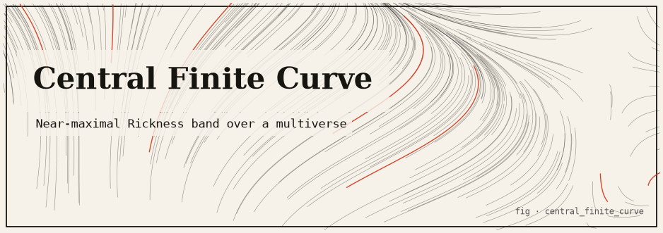
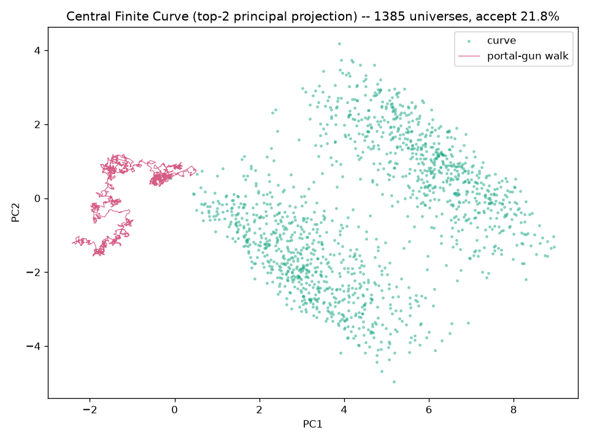
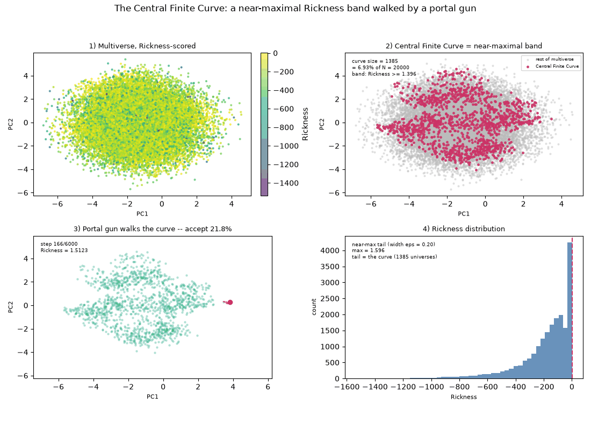

# central_finite_curve



> **The *Rick and Morty* "Central Finite Curve" as a near-maximal Rickness ridge,
> discovered and walked across a simulated high-dimensional multiverse.**

A pure, standard-library engine that models "the region of the multiverse
containing every reality in which a Rick is the smartest being" as a concrete,
reproducible computation: score a cloud of universes by a deterministic
**Rickness** function, filter to the thin near-maximal band (the ridge), and fire
a **portal gun** — a hard-constraint Metropolis walk — *along* that ridge. The
result is projected to 2-D/3-D by a pure-stdlib PCA.

---

## TL;DR

The multiverse is `N` points in `R^D`; each gets a bounded Rickness score
(complexity + entropy − a heavily-weighted constraint penalty). The Central Finite
Curve is the **super-level set** `{ x : rickness(x) ≥ max − ε }` — a thin ridge,
because the constraint penalty is flat (zero) along a sub-manifold while the
bounded terms vary only gently on it. A hard-constraint MCMC walk slides along the
band without ever leaving it. With the default config (`D=8`, `N=20000`,
`seed=137`, `ε=0.20`) the curve is **~1,385 universes (6.925% of the multiverse)**
and the walk runs at **~21.8% acceptance**, sometimes stepping to a universe
*slightly more Rick* than any that was generated. Everything is byte-reproducible
from `(config, seed)` alone; the core is stdlib-only, numpy/matplotlib are optional.

---

## The idea

* The **multiverse** is a cloud of `N` points in a high-dimensional space `R^D`.
  Each point is one universe; its coordinates are its "physical constants".
* Each universe gets a deterministic **Rickness** score.
* The **Central Finite Curve** is the subset of universes whose Rickness is within
  a small `ε` of the observed maximum — a thin ridge, *infinite in principle yet
  finitely varying*: you can slide along its free directions forever, but the
  constrained directions are pinned.
* A **portal gun** (a hard-constraint Metropolis random walk) travels *along* that
  ridge, only ever stepping to universes that stay inside the band.

### Two honest readings of the same idea

This monorepo hosts two mathematically distinct but faithful readings:

- **This package** reads the curve as a near-maximal **band / ridge (an argmax
  super-level set)**: `{ x : rickness(x) ≥ max − ε }`, a *statistical* object
  discovered empirically from samples, whose thickness is a tunable `ε`.
- **[`mobius_rickness`](../mobius_rickness/README.md)** reads it as an exact
  **zero set** `R^{-1}(0)` (a boundary where a sign-changing Rickness field
  vanishes) on a Möbius strip, plus an SCMS density ridge.

One line: *`mobius_rickness` reads the curve as `R = 0` (a boundary);
`central_finite_curve` reads it as `R ≥ max − ε` (a peak).*

---

## The mathematics (the heart)

The pipeline is four pure-core stages plus presentation adapters. Nothing is
hidden behind hand-waving.

### 1. Rickness score (`core/rickness.py`)

```
rickness(x) = w_complexity · complexity(x)
            + w_entropy    · entropy(x)
            - w_penalty    · penalty(x)
```

with defaults `w_complexity = w_entropy = 1.0`, `w_penalty = 6.0`:

- `complexity(x) = tanh(std(x) / 2)` in `[0, 1)` — rewards universes whose
  coordinates are spread out. **Bounded**, so it cannot run to infinity.
- `entropy(x)` = normalised Shannon entropy of `softmax(|x|)` in `[0, 1]` —
  rewards universes that spread their "mass" across many dimensions.
- `penalty(x) = Σ_k g_k(x)²` — sum of squared residuals of algebraic constraints
  `g_k(x) = 0`. Their common zero-set is a **manifold** embedded in `R^D`. Because
  the penalty is heavily weighted (`×6`), the near-maximal set is a thin tube
  hugging that manifold — this is what makes the maximum a **ridge** (a whole
  sub-manifold) rather than an isolated point.

The four constraints (with `D = 8`) pin ~4 of the 8 degrees of freedom:

| constraint | definition | meaning |
|-----------|------------|---------|
| `g0` | `x0² + x1² − r²` | dims (0,1) lie on a circle of radius `ring_radius` (the "ring") |
| `g1` | `x2 − sin(π·x0)` | dim 2 tied to dim 0 via a sine wave |
| `g2` | `x3 + x4` | dims (3,4) are mirror images (sum to 0) |
| `g3` | `x5·x6 − 1` | dims (5,6) are a reciprocal pair (product = 1) |

Dim 7 is completely free. So the ridge is roughly a **4-dimensional sub-manifold
living in 8-dimensional space**.

### 2. Generating the multiverse (`core/multiverse.py`, `core/sampling.py`)

A deterministic mixture: a `near_manifold_fraction = 0.18` of universes are solved
*onto* the manifold (`project_onto_manifold`: solve the ring/sine/mirror/reciprocal
constraints, then add a tiny `jitter_sigma = 0.02` Gaussian jitter) so the
near-maximal band stays populated; the rest are uniform-box junk in
`[-box, box]^D`. Every draw flows through `commons.core.rng.DeterministicRNG`
seeded from `config.seed` (Gaussian draws synthesised from the uniform stream via
Box-Muller), so two runs with the same config are **byte-identical**
(pinned by `tests/test_cfc_reproducibility.py`).

### 3. Filtering to the near-maximal band (`core/curve.py`)

The true supremum is unknown analytically, so the maximum *observed* score is the
practical peak, and every universe within an absolute tolerance is kept:

```
band_low = max_score - eps_absolute
curve    = { u : rickness(u) >= band_low }
```

Members are returned sorted by descending score (best universe first — a natural
walk start). With the default `ε = 0.20`: `max ≈ 1.5956`, `band_low ≈ 1.3956`,
curve size **1385**, fraction **6.925%**.

### 4. The portal gun (`core/portal_gun.py`)

A hard-constraint Metropolis walk: from the best universe, propose a Gaussian step
(`proposal_sigma = 0.045`) and **accept only if the new Rickness stays inside the
band** (`score ≥ band_low`); otherwise stay put. The acceptance rule is the
*indicator* of the band region, so the walk explores the ridge (near-)uniformly
instead of collapsing to a point. Over `walk_steps = 6000` the acceptance rate is
**~21.8%**, the trajectory is `6001` points, and the on-walk score range is
`1.3957 .. 1.6376` — the upper end exceeds the *generated* maximum, i.e. the walk
finds universes slightly more Rick than any that was sampled.

### 5. Projection & render (`core/projection.py`, `adapters/`)

The 8-D ridge is projected to 2-D via its **top-2 principal components** — a
pure-stdlib **power-iteration eigensolver with deflation** (200 iterations per
component, deterministic start vector, no RNG). `project_3d` extends this to the
top-3 components; because the deflation sequence is identical, the first two axes
of `project_3d` match `project_2d` *exactly*, so the 2-D and 3-D views share one
frame. An optional numpy `eigh` fast-path lives in `accel/`. The axes are fit on
the *combined* curve+walk cloud so both are drawn in the same frame.



*The Central Finite Curve projected to its top-2 principal-component plane; the
ring / reciprocal constraints give the cloud its shape, and the portal-gun
trajectory (overlaid) slides along the ridge.*

---

## How it works

### Module map

```
central_finite_curve/
  src/central_finite_curve/
    core/            # PURE engine: stdlib + commons.core ONLY
      config.py      #   frozen CurveConfig (all tunables) + DEFAULT
      sampling.py    #   seeded draws on commons.core.rng (Box-Muller Gaussians)
      rickness.py    #   the Rickness score + the four ridge constraints
      multiverse.py  #   seeded generation of N high-dim universes
      curve.py       #   filter to the near-maximal epsilon band
      portal_gun.py  #   hard-constraint Metropolis walk along the band
      projection.py  #   stdlib power-iteration PCA to 2-D / 3-D
      pipeline.py    #   end-to-end orchestrator (one source of truth)
    accel/
      numpy_backend.py  # OPTIONAL vectorised Rickness + numpy PCA (lazily guarded)
    adapters/
      render.py         # ASCII density scatter + walk overlay (stdlib)
      cli.py            # argparse subcommands + --png / animate
      viz.py            # OPTIONAL matplotlib projection PNG (lazy)
      animate.py        # OPTIONAL walk GIF / MP4 (lazy matplotlib + Pillow / ffmpeg)
      animate_panels.py # OPTIONAL four-panel composite explainer GIF / MP4 (lazy)
      animate_3d.py     # OPTIONAL rotating 3-D projection GIF / MP4 (lazy)
    demo.py          # runnable end-to-end demo
  tests/             # pytest (core tests always run; optional tests importorskip)
```

### Key algorithms

- **Deterministic RNG everywhere:** two independent child streams
  (`child_rng(seed, GEN_TAG)` and `child_rng(seed, WALK_TAG)`) so generation and
  the walk never share a sequence, yet the whole run is reproducible from
  `(config, seed)`.
- **Constraint-shaped ridge:** the heavily-weighted quadratic penalty flattens
  Rickness along the constraint manifold, turning the argmax into a sub-manifold.
- **Hard-constraint Metropolis:** the band indicator as an accept rule gives a
  near-uniform walk *along* the ridge, not a hill-climb to a point.
- **Deterministic power-iteration PCA with deflation:** a no-dependency,
  reproducible top-`k` eigensolver whose 2-D and 3-D views share a frame.

### The core-purity rule (hard invariant)

Every module under `core/` imports **only the standard library and
`commons.core`** — never numpy, matplotlib, or an adapter. Enforced by
`tests/test_cfc_core_purity.py`. Optional acceleration is reached lazily via
`commons.core.optional.try_import`; absent the dependency, the guarded function
raises `OptionalDependencyError` instead of failing at import.

---

## Install & run

Offline, zero install, zero network. Requires Python 3.11+. From the repo root
(`infinity-lab/`):

```bash
export PYTHONPATH=packages/commons/src:packages/central_finite_curve/src

# Full pipeline, canonical report + ASCII projection
python3 -m central_finite_curve.adapters.cli all

# Individual stages (all stdlib-only)
python3 -m central_finite_curve.adapters.cli generate
python3 -m central_finite_curve.adapters.cli curve
python3 -m central_finite_curve.adapters.cli walk
python3 -m central_finite_curve.adapters.cli project

# Small, fast run
python3 -m central_finite_curve.adapters.cli all --universes 800 --walk-steps 300

# The runnable demo
python3 -m central_finite_curve.demo

# Full package test suite
python3 -m pytest packages/central_finite_curve
```

### Real sample output (`cli all`, default config)

```
======================================================================
CENTRAL FINITE CURVE ENGINE
======================================================================
dimensions           : 8
universes generated  : 20000
seed                 : 137

-- Rickness landscape ------------------------------------------
max Rickness         : 1.5956
epsilon band width   : 0.2000
band lower bound     : 1.3956

-- Central Finite Curve ----------------------------------------
curve size (universes): 1385
fraction of multiverse: 6.925%
best universe coords : [1.5387, -1.2664, -1.0029, 1.9391, -1.9047, 1.9630, 0.5101, -2.6825]

-- Portal gun (constrained MCMC walk) --------------------------
walk steps           : 6000
acceptance rate      : 21.8%
trajectory length    : 6001 points
score range on walk  : 1.3957 .. 1.6376

-- ASCII projection (top-2 principal components) ---------------
+----------------------------------------------------------------------+
|                                      .                               |
|                                   .  .: .:..                         |
|                                ..::.. .:..--:-.                      |
|    @@@@@@@@@@@@        :  ..      . :. .: ..-: :--=%+-::..           |
|    @@@@@@@@@@@@@@. ..  .:. .  .   .  .    ..:::::-*-==*---:. ..      |
|  @@@@@@         ::.::--- :-:: ..: .        ....::=:..+=-::#=-:: .    |
|@@@@@@@@@             ::==-+-+:-:::- .:   ...   .   : .: . ... :-::.: |
|                         :::*-+=+%-::::::- .:.    .  . .  .     :     |
+----------------------------------------------------------------------+
legend:  ' ' empty   .:-=+*#% curve density   @ portal-gun walk
```

**Reading the picture:** the `.:-=+*#%` cloud is the curve's density in the top-2
principal-component plane (the ring/reciprocal constraints give it its shape); the
`@` band is the portal-gun trajectory sliding *along* the ridge without falling
off. Exact numbers depend on the seeded RNG algorithm, but the shape — a thin,
near-maximal ridge walked by a constrained sampler — is reproducible from
`(config, seed)` alone.

### Optional extras (numpy acceleration & matplotlib visualization)

- **`central_finite_curve.accel.numpy_backend`** — vectorised Rickness
  (`complexity_values`, `entropy_values`, `penalty_values`, `rickness_values`) and
  a numpy PCA (`project_2d_numpy`, `project_3d_numpy`), lazily guarded and
  parity-tested against the stdlib core.
- **matplotlib PNG** in `adapters/viz.py` — `save_projection_png` (the top-2
  projection scatter).

Enable them via the venv:

```bash
python3 -m venv .venv
.venv/bin/python -m pip install --upgrade pip
.venv/bin/python -m pip install numpy matplotlib pytest

# Optional accel + PNG + animation tests RUN on the venv interpreter
.venv/bin/python -m pytest packages/central_finite_curve -q

# On the stdlib-only system interpreter they SKIP
python3 -m pytest packages/central_finite_curve -q
```

Generate the figures and animations (need the `viz` extra; MP4 needs ffmpeg on
`PATH`):

```bash
# Projection PNG -> OUTDIR/central_finite_curve_projection.png
python3 -m central_finite_curve.adapters.cli all --png artifacts

# Walk GIF + four-panel explainer + rotating 3-D (each GIF; with --mp4 also MP4)
python3 -m central_finite_curve.adapters.cli animate artifacts --panels --rotate --mp4
```

The repo-level `scripts/regenerate_artifacts.sh` runs exactly this (via the venv).

---

## Visual artifacts

Committed at the repo root under [`artifacts/`](../../artifacts/). Every number in
each animation is pulled from the **real pure core**
(`multiverse → curve → portal_gun → projection`), never fabricated.



*The four-panel explainer (`central_finite_curve_four_panels.gif`): (1) the whole
multiverse cloud in the top-2 PCA plane, coloured by Rickness; (2) the same
projection with the near-maximal `ε`-band highlighted (with its size and share of
`N`); (3) the portal gun walking the band step by step, never leaving it, with the
acceptance ratio; (4) the Rickness histogram with the `ε` band shaded as the
near-max tail.*

| Artifact | Shows |
|----------|-------|
| `central_finite_curve_projection.png` | Top-2 PCA projection of the curve + walk |
| `central_finite_curve_walk.gif` / `.mp4` | The 2-D scatter with the portal-gun trajectory as a growing trail |
| `central_finite_curve_four_panels.gif` / `.mp4` | The whole pipeline on one 2×2 timeline, ending on a summary banner |
| `central_finite_curve_rotating_3d.gif` / `.mp4` | Top-3 PCA scatter (multiverse faint, band highlighted, walk overlaid) while the camera orbits |

---

## Testing

```bash
# Offline core (stdlib-only interpreter): optional numpy/matplotlib tests SKIP
python3 -m pytest packages/central_finite_curve -q
# → 40 passed, 5 skipped

# Full suite (venv with numpy + matplotlib + ffmpeg): optional tests RUN
.venv/bin/python -m pytest packages/central_finite_curve -q
# → 72 passed
```

What the tests pin:

- **Reproducibility:** same `(config, seed)` → byte-identical multiverse (coords
  *and* scores) and an exactly equal curve size; a different seed changes them.
- **Rickness bounds:** `complexity ∈ [0,1)`, `entropy ∈ [0,1]`; `penalty ≈ 0` on
  the manifold, `> 0` off it; near-manifold universes score higher than junk.
- **Curve invariants:** every member has `score ≥ band_low`; `max − score ≤ ε`;
  members sorted descending; `band_low = max − ε`; fraction in `(0, 0.5)`.
- **Portal gun:** every walk state stays `≥ band_low`; acceptance in `(0, 1)`;
  trajectory length `= walk_steps + 1`; deterministic replay.
- **Projection:** orthonormal axes (`|v| = 1`, `v1·v2 < 1e-6`); variance ordered
  `var(pc1) > var(pc2) ≥ var(pc3)`; `project_3d`'s first two coords equal
  `project_2d`'s exactly; numpy PCA parity.
- Core purity (`test_cfc_core_purity.py`).

---

## Limitations & honest caveats

- **This is a simulation and a metaphor, not physics.** "Rickness" is a designed
  scalar field, not anything from the show; the "multiverse" is a sampled point
  cloud.
- **The peak is empirical, not analytic.** The band is defined around the maximum
  *observed* score, so the exact curve size and coordinates depend on the sample
  (though fully reproducible from `(config, seed)`). The walk can find points
  slightly more Rick than any generated — that is expected, not a bug.
- **The ridge is a super-level set, not a codimension-1 contour.** Its thickness is
  a tunable `ε`; it is a *statistical* object discovered from samples, unlike the
  exact `R^{-1}(0)` zero set in `mobius_rickness`.
- **Absolute numbers shift with the RNG algorithm.** The reproducible invariant is
  the *shape* (a thin near-maximal ridge walked by a constrained sampler), pinned
  from `(config, seed)`.

### Tuning

Everything lives on the frozen `CurveConfig` (`core/config.py`); functions thread
an explicit config, defaulting to `DEFAULT`:

- `dim`, `n_universes`, `seed` — size and reproducibility.
- `eps_absolute` — ridge thickness (smaller = thinner curve).
- `proposal_sigma`, `walk_steps` — portal-gun step size and length (smaller sigma
  raises acceptance but travels more slowly along the ridge).
- `w_complexity`, `w_entropy`, `w_penalty` — reshape the Rickness landscape.
- `near_manifold_fraction`, `box`, `ring_radius`, `jitter_sigma` — multiverse
  geometry.

---

## References / attribution

- The Rickness score combines standard, bounded information-theoretic proxies
  (Shannon entropy of a softmax, a `tanh`-bounded dispersion term) with a
  quadratic **penalty method** for equality constraints — a classic optimisation
  technique for turning `g_k(x) = 0` constraints into a soft objective.
- The **portal gun** is a hard-constraint **Metropolis–Hastings** random walk
  (Metropolis et al., 1953; Hastings, 1970) whose acceptance rule is the indicator
  of the feasible band.
- Projection is **principal component analysis** via deterministic **power
  iteration with deflation** (a standard dominant-eigenvector method).
- *Rick and Morty* and the "Central Finite Curve" concept are © their respective
  rights holders; this package uses the idea as inspiration and reproduces no
  copyrighted imagery — banners and figures here are our own renders.
- See the sibling package [`mobius_rickness`](../mobius_rickness/README.md) for a
  *different* honest reading of the same idea (an exact zero set `R^{-1}(0)` on a
  Möbius strip, plus an SCMS density ridge).
