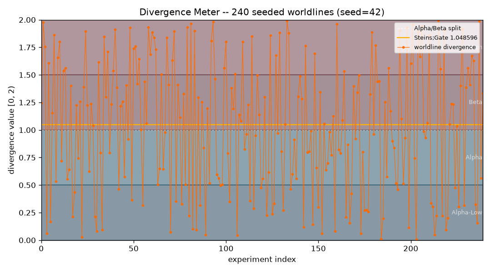

# divergence_meter — a worldline divergence reading from real data


> *"The Divergence Meter reads 1.048596. This is the Steins;Gate worldline.
>  El Psy Congroo."*

A **Steins;Gate**-inspired package for the [`infinity-lab`](../../README.md)
monorepo. It computes a real "worldline divergence" number from a snapshot of *world
state*, classifies it into an **attractor field**, renders it on a **nixie-tube
ASCII display**, and lets you save and recall named worldlines via **Reading
Steiner**. It reproduces the *format and behaviour* of the show's device while
deriving the number **honestly and deterministically** from data — no clocks, no
randomness.

This is the monorepo port of the standalone `divergence-meter` prototype. It keeps
the honest systems core, adopts the shared [`commons`](../commons) package, and
follows the `src`-layout / core-purity conventions used across `infinity-lab`.

---

## TL;DR

- A divergence value in `[0, 2)` is derived from `SHA-256(payload)`: take the first
  8 bytes as a 64-bit integer `word`, then `value = round(word / 2⁶³, 6)`.
- The `[0, 2)` range is partitioned into **Alpha** (`< 1.0`) and **Beta** (`≥ 1.0`)
  attractor fields; `1.048596` is the **Steins;Gate** worldline.
- Deterministic across machines (SHA-256, *not* Python's salted `hash()`); the exact
  value is exposed losslessly as `Fraction(word, 2⁶³)`.
- **Reading Steiner** saves/recalls named worldlines to an atomically-written JSON
  store and reports the signed divergence delta between them.
- Pure stdlib + `commons.core`; **no `accel/` layer**; `matplotlib` (PNG) is the only
  optional, lazily-guarded dependency.

---

## The idea

In *Steins;Gate*, the **Divergence Meter** is a nixie-tube device that displays the
current worldline's divergence from the original timeline. Worldlines cluster into
**attractor fields** — convergent groups that resist small changes. The two major
fields are **Alpha** (divergence `< 1.0`) and **Beta** (`≥ 1.0`); the value
`1.048596` marks the **Steins;Gate** worldline. This is a *systems* homage, not a
replica: the number is computed honestly from real input, and hitting exactly
`1.048596` from arbitrary data is astronomically unlikely by design — which is the
whole premise of the show.

Reference: *Steins;Gate* (2011), 5pb./Nitroplus.

---

## The mathematics

### The honest hash → worldline mapping

A divergence number is derived deterministically from a *snapshot* of world state.
The same input always yields the same worldline:

```
digest   = SHA-256(payload)                 # 256 bits, cryptographic avalanche
word     = int.from_bytes(digest[:8], "big")# first 8 bytes → a 64-bit integer
fraction = word / 2**64                     # a real number in [0, 1)
value    = round(fraction * 2.0, 6)         # a real number in [0, 2), e.g. 1.048596
```

Using SHA-256 (standard library) makes the result **deterministic across machines**
— unlike Python's per-process-salted `hash()` — and **well-distributed**: a
one-byte change scatters the number unpredictably across the whole range.

The **exact** value is exposed losslessly as a `fractions.Fraction`. Because
`value = word / 2⁶⁴ · 2 = word / 2⁶³`, the code computes it via
`commons.core.exact` as `to_fraction(word) · half_power(63)`, i.e.

```
DivergenceReading.exact_value == Fraction(word, 2**63)
```

so no floating-point rounding ever creeps into the ultrametric-free comparisons; the
displayed `value` is that rational rounded to 6 decimals.

### Snapshot canonicalization

`core/worldstate.py` builds canonical bytes from one of:

- a **directory** → a sorted `relative/path\tsize` listing (order-independent);
- a **file** → its raw contents;
- **`-`** → data read from standard input;
- **JSON text** → normalised canonical JSON (`sort_keys=True`, compact separators),
  so key order is irrelevant;
- **plain text** → the text itself, UTF-8 encoded;
- a **list of numbers** (via the API `snapshot_from_numbers`).

Reads are capped at `MAX_READ_BYTES = 8 MiB` to avoid memory exhaustion; empty or
whitespace-only literals raise `WorldStateError`.

### Attractor fields

The `[0, 2)` range is partitioned into contiguous named half-open bins:

| Field | Range | Cluster |
|---|---|---|
| Alpha-Low | `[0.0, 0.5)` | Alpha |
| Alpha | `[0.5, 1.0)` | Alpha |
| Beta | `[1.0, 1.5)` | Beta |
| Beta-High | `[1.5, 2.0)` | Beta |

Classification (`core/attractor.py`) reports the containing field, the coarse
Alpha/Beta cluster (`Alpha` if `value < 1.0` else `Beta`), the **nearest field
boundary** among `{0.0, 0.5, 1.0, 1.5, 2.0}`, and the **distance** to it. Values
within `STEINS_GATE_TOLERANCE = 5e-7` of `1.048596` are flagged as the
**Steins;Gate** worldline. `inf`/`nan` inputs raise `ValueError`.

### Reading Steiner & ensembles

- **Reading Steiner** (`core/steiner.py`) is a JSON-backed store mapping
  `name → record`. Saving builds a **new** dict and writes it **atomically**
  (`tempfile.mkstemp` + `os.replace`), never mutating loaded data in place. `jump`
  recalls a saved line and reports the signed `divergence_delta = round(to − from, 6)`.
- **Seeded ensembles** (`core/ensemble.py`) — `simulate_worldlines(count, seed)`
  draws reproducible tokens from a private `commons.core.rng.make_rng(seed)`
  (`randint` in `[0, 2³¹ − 1]`; the process-global RNG is never touched) and hashes
  each into a worldline, so you can watch worldlines scatter across `[0, 2)` and
  populate the fields.

---

## How it works

### Module map

```
src/divergence_meter/
  core/               PURE: stdlib + commons.core only  (no accel layer)
    worldstate.py       Snapshot (frozen) + canonical byte gathering, 8 MiB cap
    divergence.py       compute_divergence → DivergenceReading (+ exact Fraction)
    attractor.py        classify() → FieldClassification (field/cluster/boundary)
    steiner.py          Reading Steiner store: save/get/list + divergence_delta
    ensemble.py         simulate_worldlines (seeded), field_histogram
  adapters/           presentation / optional I/O (never imported by core)
    nixie.py            3×5 seven-segment nixie-tube ASCII renderer
    timeline.py         ASCII worldline timeline + field histogram (via commons)
    cli.py              argparse CLI (measure/field/save/jump/lines)
    viz.py              OPTIONAL matplotlib worldlines PNG (lazy via commons.optional)
  demo.py             runnable end-to-end demo
```

All snapshots, readings, classifications, and records are **frozen dataclasses** —
no shared state is mutated.

### The core-purity rule

`core/*` imports **only** the standard library and `commons.core`, enforced by
`tests/test_dm_core_purity.py` (expected-modules check, static import scan, and a
fresh-subprocess import asserting `numpy`/`matplotlib` never enter `sys.modules`).
`numpy`/`matplotlib` are never hard-imported; the PNG exporter reaches matplotlib
lazily via `commons.core.optional.try_import` and raises a clear
`OptionalDependencyError` when it is absent.

---

## Install & run

Imports resolve via the repo's pytest `pythonpath` (no install). To run the CLI or
demo directly, put the two `src` dirs on `PYTHONPATH`:

```bash
export PYTHONPATH=packages/commons/src:packages/divergence_meter/src

# Measure a literal string, a file, a directory, or stdin
python -m divergence_meter.adapters.cli measure "El Psy Congroo"
python -m divergence_meter.adapters.cli measure ./README.md
printf 'Kurisu Makise' | python -m divergence_meter.adapters.cli measure -

# JSON is normalised: key order does not change the worldline
python -m divergence_meter.adapters.cli measure '{"a":1,"b":2}'

# Classify into an attractor field (source defaults to ".")
python -m divergence_meter.adapters.cli field "El Psy Congroo"

# Reading Steiner: save, list, and jump between worldlines
python -m divergence_meter.adapters.cli save alpha "worldline alpha"
python -m divergence_meter.adapters.cli save beta  "worldline beta"
python -m divergence_meter.adapters.cli lines
python -m divergence_meter.adapters.cli jump alpha "worldline beta"

# The end-to-end demo (measure + ASCII timeline + field histogram)
python -m divergence_meter.demo
```

The store defaults to `worldlines_store.json` in the package directory; override it
with the global `--store /path/to/store.json` flag. `main()` exits `0` on success,
`1` on a `WorldStateError`/`SteinerError` (prints `error: …` to stderr), `2` on a
`ValueError`/`TypeError`.

### Optional PNG timeline

With the `viz` extra (`numpy`, `matplotlib`), export a divergence timeline with the
Alpha/Beta bands shaded and the Steins;Gate line marked:

```python
from divergence_meter.adapters import viz
viz.save_worldlines_png()  # -> infinity-lab/artifacts/divergence_meter_worldlines.png
```

Without matplotlib the call raises `viz.OptionalDependencyError`; use the ASCII
`adapters.timeline.render_worldline_timeline` instead (no dependencies).

### Sample output

`measure "El Psy Congroo"` (this input hashes to `1.062031`, word
`9795511409617762124`):

```
+---------------------------------+
|          _   _   _   _   _      |
|   |     | | |     | | |   |   | |
|   |     | | |_   _| | |  _|   | |
|   |     | | | | |   | |   |   | |
|   |  .  |_| |_| |_  |_| ._|   | |
+---------------------------------+
      DIVERGENCE: 1.062031
      origin   : text:literal
      sha256   : 87f0a5ba6b8d774c...
      Field: Beta (cluster Beta) | nearest boundary 1.000000 (distance 0.062031)
```

`jump`:

```
      Reading Steiner engaged. Jump target: 'alpha'
      saved line   : 0.120241  (text:literal)
      current line : 0.124228  (text:literal)
      divergence delta : +0.003987  [Beta-ward (+)]
```

---

## Visual artifacts

`adapters/viz.py` renders a seeded ensemble's divergence timeline with the four
attractor bands shaded and the Steins;Gate line marked:



Regenerate with `viz.save_worldlines_png()` on a matplotlib-enabled interpreter; it
writes `artifacts/divergence_meter_worldlines.png`.

---

## Testing

The suite (`tests/test_dm_*.py`) pins, among others:

- **divergence** — determinism (equal `value`/`digest`/`word` on repeat); the golden
  pair `"El Psy Congroo" → display "1.062031"`, `word 9795511409617762124`; values
  in `[0, 2)`; `display` matches `^\d\.\d{6}$`; `exact_value == Fraction(word, 2⁶³)`
  and `round(float(exact_value), 6) == value`; **JSON key-order invariance**.
- **worldstate** — frozen `Snapshot`; whitespace/empty input raises; stdin,
  directory (order-independent), numbers, and JSON canonicalization paths.
- **attractor** — bin edges (`0.25→Alpha-Low`, `0.75→Alpha`, `1.25→Beta`,
  `1.75→Beta-High`); `classify(1.048596)` → nearest boundary `1.0`, distance
  `≈0.048596`, `on_steins_gate` True; `inf`/`nan` raise.
- **steiner** — round-trip save/recall; overwrite keeps a single key; sorted
  `list_lines`; atomic write; `divergence_delta` correct.
- **ensemble** — `simulate_worldlines(30, seed=7)` reproducible and distinct from
  `seed=8`; histogram sums to `count` over the four fields.
- **nixie** — output is exactly 7 lines (border + 5 rows + border), all equal length;
  unknown characters render as blank tubes without crashing.
- **viz PNG** (matplotlib) — 8-byte PNG signature, size `> 1 KiB`; default artifact
  path ends in `artifacts/divergence_meter_worldlines.png`.

---

## Limitations & honest caveats

- Values are deterministic and reproducible across machines (SHA-256, not `hash()`),
  but they are a **hash homage**, not a physical divergence — the number carries no
  meaning beyond its well-distributed reproducibility.
- The tool never signals processes or touches files outside its own directory; the
  Reading Steiner store lives in the package folder by default.
- Reaching exactly `1.048596` from arbitrary input is astronomically unlikely by
  design — that is the whole premise of the show.

---

## References

- *Steins;Gate* (2011), 5pb./Nitroplus — the Divergence Meter, attractor fields, and
  the value `1.048596`.
- FIPS 180-4, *Secure Hash Standard (SHS)* — SHA-256, used here for deterministic,
  well-distributed digests.
- Python `fractions.Fraction` — exact rational arithmetic backing `exact_value`.
- Monorepo overview and core-purity rule: [`infinity-lab/README.md`](../../README.md).
