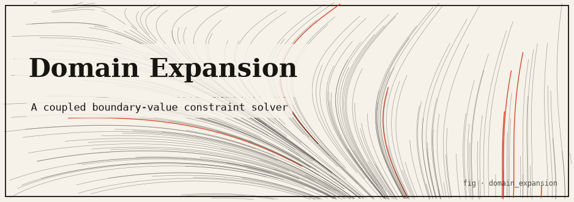
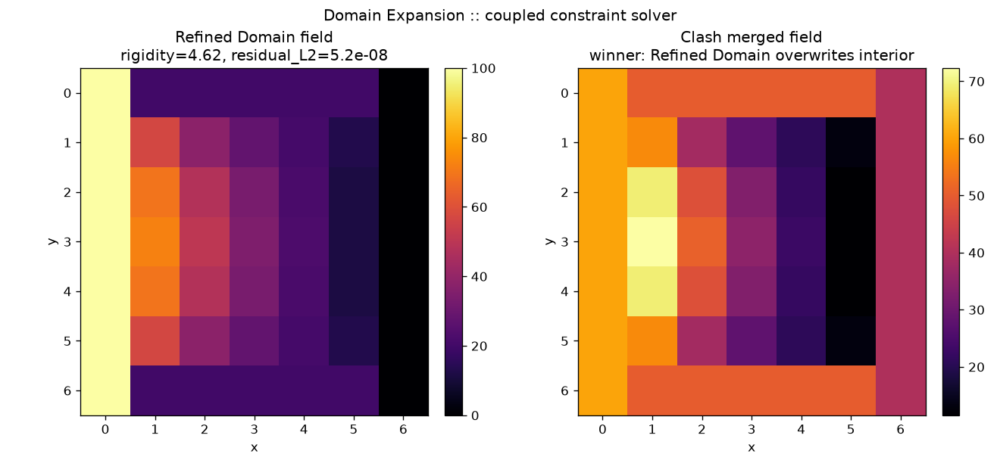

# domain_expansion — a Domain Expansion as a coupled constraint solver



> *A Domain Expansion is a closed space that forces a guaranteed-hit condition on
> everything inside. Model that condition as thousands of simultaneous linear
> constraints, and a domain's "power" becomes the rigidity of its system.*

A *Jujutsu Kaisen* Domain Expansion manifests an innate technique as a **closed
space** and imposes a **sure-hit condition** on everything trapped within. This
package models that directly as a discretized **Laplace boundary-value problem** on
a grid: a large set of simultaneous linear constraints whose unique solution is the
domain's manifestation. A domain's power is literally the **well-posedness /
rigidity** of that constraint system — and when two domains clash, the more rigid,
better-posed one overwrites the weaker.

This is the monorepo port of the standalone `domain-expansion` prototype. The pure
mathematics lives in `domain_expansion.core` (standard library only, sharing
[`commons`](../commons)); ASCII/PNG rendering lives in `domain_expansion.adapters`;
optional numpy fast paths live in `domain_expansion.accel`.

---

## TL;DR

- Each domain is a **discretized Laplace equation** `∇²u = 0` on a 7×7 grid with
  fixed boundary values (the "sure-hit" Dirichlet condition).
- **Two independent solvers** agree, which is how we know relaxation reached the
  true field: Gauss–Seidel relaxation and direct Gaussian elimination
  (`max|relax − direct| ≈ 2.8e-08`).
- A domain's **rigidity** is a spectral-radius proxy; its **refinement score** is
  `rigidity / (1 + residual_L2)`. In a clash the higher score wins and overwrites
  the contested interior.
- **Unlimited Void** pins one interior cell with weight `1e6`: a huge residual, but
  astronomically higher rigidity (`≈ 1004.6` vs `0.231`), so it dominates anyway.
- `core/` is pure stdlib; `numpy` (accel) and `matplotlib` (viz) are optional and
  lazily guarded.

---

## The idea

| JJK notion | Mathematical model |
|---|---|
| The closed domain | A rectangular grid region |
| The guaranteed "sure-hit" condition | Fixed **boundary values** (Dirichlet condition) |
| The technique filling the space | The **field** that satisfies every interior constraint at once |
| Expanding / manifesting the domain | **Solving** the BVP until every point obeys the rule |
| A refined vs. crude domain | A well-posed, strongly-coupled system vs. a leaky, noisy one |
| Two domains clashing | Two systems overlapping a shared region; the **more stable** one overwrites |
| Unlimited Void | A single interior cell pinned with **enormous weight** (infinite information density) |

---

## The mathematics

### The constraint system

Each domain is a discretized Laplace equation on the grid:

```
∂²u/∂x² + ∂²u/∂y² = 0     inside the domain
u = g                      on the boundary  (the sure-hit condition)
```

Under the 5-point stencil every interior cell must equal the average of its four
neighbours. With a `coupling` weight and interior `noise`:

```
coupling · (4·u[i,j] − u[i−1,j] − u[i+1,j] − u[i,j−1] − u[i,j+1]) = noise
```

- `coupling = 1.0`, `noise = 0` → a clean Laplace domain (**refined**).
- `coupling < 1`, `noise > 0` → constraints weakly / inconsistently enforced; the
  technique "leaks" (**crude**).

### Two independent solvers

1. **Gauss–Seidel relaxation** (`core.domain.solve_domain`) iterates the averaging
   update in place until the max cell change drops below `tol` (default `1e-8`, max
   `5000` iters). Writing `coupling = max(domain.coupling, 1e-9)`, each interior
   update is `new = (neighbour_sum + noise / coupling) / 4`. This is the domain
   "expanding" until it reaches its fixed point.
2. **Direct Gaussian elimination** (`core.domain.direct_solve_domain` +
   `core.linalg.gaussian_solve`) assembles the interior linear system `A x = b`
   (boundary terms moved to the right-hand side: diagonal `4·coupling`, interior
   neighbours `−coupling`, boundary neighbours added into `b`) and solves it exactly
   with **partial pivoting** (singular pivot threshold `1e-15`). Pure Python; an
   optional numpy path (`accel.numpy_backend.gaussian_solve_numpy`, via
   `numpy.linalg.solve`) mirrors it.

The demo cross-checks them: `max|relax − direct| ≈ 2.8e-08`.

### Refinement metric

For a solved field the constraint residual `r` is computed per interior cell
(`r = coupling·(4u − neighbours) − noise`), with each Unlimited-Void cell appending
`void_weight·(u − target)`. We report:

- `residual_L2 = ‖r‖₂` — total constraint violation (well-posed domains drive this
  to `~1e-8`, near the relaxation tolerance).
- `residual_Linf = ‖r‖∞` — the single worst-violated constraint.
- `rigidity` — a conditioning **proxy**: the spectral radius (power iteration,
  default 200 steps) of a representative 4×4 tridiagonal interior stencil scaled by
  `coupling`, plus a void-reinforcement bonus, divided by a noise penalty:

  ```
  rigidity = (spectral_radius(stencil) + void_bonus) / (1 + |noise|)
  void_bonus = void_weight · 1e-3   if the domain has any void cell, else 0
  ```

- **refinement score** = `rigidity / (1 + residual_L2)`. Larger is better-posed.

**On the rigidity proxy (honest treatment).** `rigidity` is a *proxy*, not the true
condition number of the fully assembled matrix. It is the operator norm of a small
representative stencil plus a void bonus over a noise penalty, chosen because it is
**cheap, pure-Python, and monotone** in the qualities we care about (coupling
strength, void reinforcement, low noise). It is a *comparative* score for ranking
domains in a clash, not an absolute physical quantity.

### Domain clash

Two domains expand onto the same grid and both claim the interior. Both are solved;
the winner is decided by the tuple

```
key = (refinement, −residual_L2, rigidity)     # compared with >=
```

so the tie-break order is **higher refinement → lower residual → higher rigidity**.
The winner re-solves with the loser's field pre-loaded and **overwrites** the
contested interior region (the 5×5 interior of the 7×7 grid) with its own solution,
while the loser keeps its own boundary edges so the takeover is visible.

### Unlimited Void

A void cell is a constraint `void_weight · (u[i,j] − target)` with
`void_weight = 1e6` (the canonical void pins cell `(3,3)` to `999.0`). It forces a
discontinuity against the smooth Laplace field, so its **residual is large** — but
its **rigidity is astronomically higher** (via `void_weight · 1e-3 = 1000` added to
the spectral base), so it still dominates a clash. Infinite information density
overpowers a weak technique on sheer rigidity, even though it is not a "smooth"
solution.

### Sample run numbers (7×7 canonical domains)

| Domain | coupling / noise | converged | residual L2 | rigidity | refinement | clash |
|---|---|---|---|---|---|---|
| Refined Domain | `1.0` / `0.0` | 74 iters | `5.23e-08` | `4.618` | **4.6180** | beats Crude |
| Crude Domain | `0.45` / `8.0` | 78 iters | `2.15e-08` | `0.231` | `0.2309` | loses |
| Unlimited Void | `1.0` / `0.0`, pin `(3,3)=999` | 50 iters | `2.21e+03` | `1004.6` | `0.4537` | beats Crude |

The crude domain reaches a small residual too (Gauss–Seidel converges on its own
weak system), but its rigidity is `~20×` lower, so the refined domain wins the
overlap. The Void wins on raw rigidity despite a huge residual.

---

## How it works

### Module map

```
src/domain_expansion/
  core/                 PURE engine: stdlib + commons.core only
    linalg.py             zeros, dot, norm2, norm_inf, matvec,
                          gaussian_solve (partial pivoting),
                          spectral_radius_estimate (power iteration)
    domain.py             Domain dataclass, SolveResult(.refinement),
                          solve_domain (Gauss–Seidel), direct_solve_domain,
                          rigidity, max_grid_diff
    clash.py              ClashResult, clash(), contested_region, region overwrite
    scenarios.py          canonical make_refined/crude/void_domain (all 7×7)
  adapters/             presentation / I/O (never imported by core)
    render.py             ASCII field grid + heatmap + solve/clash reports
    cli.py                argparse front end (refined|crude|clash|void|all)
    viz.py                OPTIONAL matplotlib 2-panel PNG (Agg, lazy)
  accel/                OPTIONAL numpy fast paths (lazily guarded)
    numpy_backend.py      gaussian_solve_numpy, spectral_radius_numpy
  demo.py               runnable end-to-end demo
```

### The core-purity rule

`core/*` imports only the standard library and `commons.core` — never an adapter,
never `numpy`/`matplotlib` at module top level. Enforced by
`tests/test_de_core_purity.py`: it checks the expected modules exist, statically
scans every core import line for forbidden substrings, and imports
`domain_expansion.core` in a **fresh subprocess** asserting neither `numpy` nor
`matplotlib` lands in `sys.modules` (subprocess isolation so a prior in-process
numpy import from the parity tests cannot taint the check).

---

## Install & run

No dependencies are required for the ASCII path. From the repo root:

```bash
# The end-to-end demo
PYTHONPATH=packages/commons/src:packages/domain_expansion/src \
  python3 -m domain_expansion.demo

# The CLI, one subcommand per stage (refined | crude | clash | void | all):
PYTHONPATH=packages/commons/src:packages/domain_expansion/src \
  python3 -m domain_expansion.adapters.cli clash

# Optional PNG of the solved field + clash (needs the 'viz' extra / matplotlib):
PYTHONPATH=packages/commons/src:packages/domain_expansion/src \
  .venv/bin/python -m domain_expansion.adapters.cli all --png artifacts
#  -> artifacts/domain_expansion_field.png   (--png only on 'clash' and 'all')

# Offline tests (optional numpy/matplotlib tests SKIP without them)
python3 -m pytest packages/domain_expansion -q
```

### Sample output (`clash`)

```
================================================================
CLASH: Crude Domain  vs  Refined Domain
================================================================
WINNER : Refined Domain
LOSER  : Crude Domain
WHY    : Refined Domain is more refined: refinement=4.6180 (rigidity=4.618,
         residual_L2=5.231e-08) vs Crude Domain refinement=0.2309 ...

Contested region overwritten by Refined Domain:
    60.0    50.0    50.0    50.0    50.0    50.0    40.0
    60.0    56.9    38.2    28.1    20.8    13.1    40.0
    60.0    69.3    47.9    33.3    22.1    11.7    40.0
    60.0    72.3    50.8    35.0    22.7    11.5    40.0
    60.0    69.3    47.9    33.3    22.1    11.7    40.0
    60.0    56.9    38.2    28.1    20.8    13.1    40.0
    60.0    50.0    50.0    50.0    50.0    50.0    40.0
```

The loser keeps its own boundary (`60 / 50 / 40` edges) but its entire interior is
overwritten by the winner's field — the refined domain has imposed its constraints
on the contested region.

---

## Visual artifacts

`adapters/viz.py` (headless `Agg`, `cmap="inferno"`) renders a two-panel figure: the
refined domain's steady-state field beside the clash's merged field.



Regenerate with `... adapters.cli all --png artifacts` (or `clash --png`) on a
matplotlib-enabled interpreter; it writes `artifacts/domain_expansion_field.png`.

---

## Testing

The suite (`tests/test_de_*.py`) pins, among others:

- **linalg** — `gaussian_solve` exact to `1e-12` on small systems and robust to a
  zero leading pivot; non-destructive on inputs; singular systems raise; `norm2` and
  `norm_inf` exact; `spectral_radius_estimate` recovers dominant eigenvalues
  (`diag(5,−2,1) → 5`, `[[2,1],[1,2]] → 3`) to `1e-6`.
- **domain** — `max|relax − direct| < 1e-6` (`≈ 2.79e-08`); residual is
  monotone-decreasing in iteration count; discrete maximum principle
  (`0 ≤ interior ≤ 100`); `rigidity(refined) > rigidity(crude)`;
  `rigidity(void) >` both; void field pins `(3,3) = 999.0`; degenerate grids and
  bad tolerances raise.
- **clash** — refined beats crude; loser keeps its walls (`60`/`40`); void beats
  crude with `winner.residual_L2 > loser.residual_L2` yet still wins;
  `contested_region(7,7)` has 25 cells and excludes the corner.
- **accel parity** (numpy) — `gaussian_solve_numpy` and `spectral_radius_numpy`
  match the pure core to `1e-10`/`1e-9`.
- **viz PNG** (matplotlib) — output starts with the 8-byte PNG signature and exceeds
  1 KiB; `--png` creates missing (nested) output directories.

---

## Limitations & honest caveats

- The Laplace BVP, the 5-point stencil, both solvers, and the residual are **real
  and exact** — the direct/relaxation cross-check is a genuine correctness signal.
- `rigidity` is a deliberately chosen **proxy**, not the spectral condition number
  of the assembled operator. It is comparative, not absolute; the power-iteration
  estimate returns the dominant eigenvalue reachable from a uniform start (the
  representative stencil is chosen so that start has a component along the dominant
  mode).
- The clash "overwrite" and the Void's rigidity bonus are modelling choices that
  dramatize the anime, not derived physics.
- Grids are small (7×7) by design, for legible ASCII output and fast exact solves.

---

## References

- Discrete Laplacian & the 5-point stencil: standard finite-difference theory (e.g.
  LeVeque, *Finite Difference Methods for Ordinary and Partial Differential
  Equations*, SIAM 2007).
- Gauss–Seidel relaxation and partial-pivoted Gaussian elimination: Golub & Van
  Loan, *Matrix Computations*, 4th ed.
- Power iteration for the dominant eigenvalue: Golub & Van Loan, §7.3.
- Discrete maximum principle for the Laplacian: any standard numerical-PDE text.
- Monorepo overview and core-purity rule: [`infinity-lab/README.md`](../../README.md).
