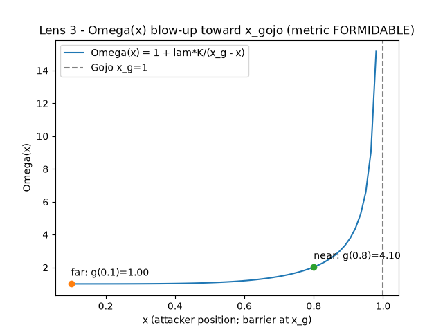
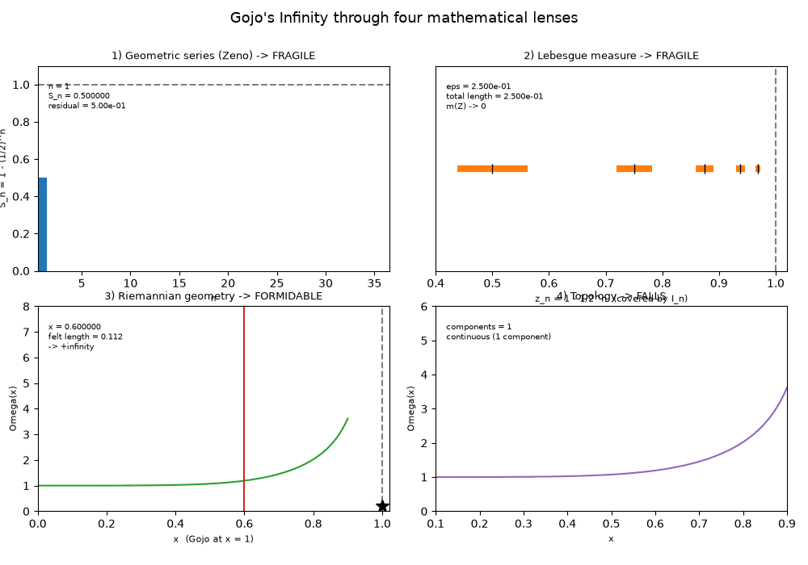

# gojo_infinity


> **Gojo Satoru's "Infinity", interrogated by four independent branches of
> mathematics — and one honest answer per branch.**

A pure, standard-library Python package that takes the *Jujutsu Kaisen* barrier
technique "Infinity" (Muryōkūsho / Limitless) seriously as a mathematical object
and asks the same question through four different lenses: *can an attacker ever
reach Gojo?* It reproduces the argument of Achmad Roykhan Sabiq's Oxford Maths
essay (2026) — grounded in the 2021 RIKEN × Gege Akutami *"Abyss of Math"*
collaboration — and extends the Riemannian lens to real 1-D / 2-D / 3-D geodesics.

---

## TL;DR

Four models of "Infinity" give four different verdicts, and **that disagreement
is the whole point**: the answer depends entirely on which mathematics you use to
model the barrier. Geometric-series (Zeno) and Lebesgue-measure readings both say
the barrier is **Fragile** (the attacker arrives in finite time; the barrier is a
null set of length zero). The Riemannian-geometry reading makes it **Formidable**
(felt distance to Gojo diverges to `+∞`). A topological cut makes it **Fall**
(severing continuity disconnects the space; the metric becomes undefined). Every
headline number is computed exactly — `fractions.Fraction` where it matters,
`math.inf` for genuine divergence, `None` for genuinely undefined — never faked
with a large float.

| Lens | Model | Verdict |
|------|-------|---------|
| 1 | Geometric series / Zeno's paradox | **Fragile** |
| 2 | Lebesgue measure | **Fragile** |
| 3 | Riemannian conformal geometry (1/2/3-D) | **Formidable** |
| 4 | Topology / World-Cutting Slash | **Falls** |

---

## The idea

In the manga, Gojo describes Infinity as follows: between any attacker and Gojo
there is always some distance; halve it, then halve it again, forever — no attack
completes the infinite sequence of steps, so Gojo is never reached. This is
literally **Zeno of Elea's** 2,500-year-old Achilles-and-the-tortoise paradox,
weaponised.

The essay's thesis is that "is Infinity undefeatable?" is not a single question —
it is four questions, one per mathematical language:

1. **Convergence.** Does the infinite sequence of halvings actually sum to a
   finite distance (and a finite *time*)? If so, the attacker arrives.
2. **Measure.** How "large" is the infinite set of subdivision points? If it has
   measure zero, the barrier occupies no space at all.
3. **Metric geometry.** What if Infinity is not a subdivision of distance but a
   *transformation of the ruler* — a metric that stretches near Gojo? Then the
   *felt* distance can diverge even though Euclidean position barely moves.
4. **Topology.** What if you stop attacking Gojo and attack the *space around
   him* — severing the continuity the metric relies on? (This is how Sukuna's
   World-Cutting Slash and Mahoraga's adaptation defeat it.)

This package implements all four, plus a modern enhancement: genuine Riemannian
geodesics on a real conformally-flat manifold in 1, 2, and 3 dimensions.

---

## The mathematics (the heart)

All headline quantities below are machine-checked in the test suite. Lenses 1–2
are computed with exact `fractions.Fraction`; the Riemannian numbers are pinned in
`tests/test_riemannian*.py`.

### Lens 1 — Geometric series (Zeno) → Fragile

The attacker halves the remaining gap forever. Partial sums are exact:

```
S_n = 1/2 + 1/4 + ... + 1/2^n = 1 - (1/2)^n
S_1..S_8 = 1/2, 3/4, 7/8, 15/16, 31/32, 63/64, 127/128, 255/256
         = 0.5, 0.75, 0.875, 0.9375, 0.96875, 0.984375, 0.9921875, 0.99609375
```

The residual `(1/2)^n` is **strictly positive for every finite `n`** — verified
past `half_power(1075)`, where an IEEE-754 double underflows to `0.0` but a
`Fraction` does not. Yet the closed-form geometric sum `a/(1-r)` with
`a = r = 1/2` equals **exactly `1`**, and the total arrival *time* at speed `1/2`
is the finite value **`2`** (the travel times form their own convergent geometric
series). The attacker arrives: Infinity is **Fragile**.

### Lens 2 — Lebesgue measure → Fragile

The subdivision points `Z = { z_n = 1 - 1/2^n } = {1/2, 3/4, 7/8, ...}` form a
countably infinite set. Cover `z_n` by an interval of width `eps/2^n`; the total
length telescopes (exactly, in `Fraction`):

```
sum_{n>=1} eps/2^n = eps * sum_{n>=1} 1/2^n = eps * 1 = eps
```

So the full cover has length **exactly `eps`** (`outer_measure_upper_bound(eps)
== eps`), with finite-term partials rising toward it with tail `eps/2^terms → 0`.
Since `eps > 0` is arbitrary, the infimum — hence the outer measure `m(Z)` — is
**`0`**. The barrier is a null set of total length zero: **Fragile**.

### Lens 3 — Riemannian conformal geometry → Formidable

Space near Gojo carries a conformal metric `ds = Ω(x) dx`, `g11 = Ω(x)^2`, built
from the RIKEN Gaussian (RBF) kernel:

```
K(x, y) = exp(-|x - y|^2 / sigma^2)
Ω(x)    = 1 + lambda * K(x, x_gojo) / (x_gojo - x),   x_gojo = 1
```

`lambda` is **derived, not hardcoded**: `calibrate()` fits it by bisection
(`commons.core.bisection`) to hit the essay's Figure-8 target `g(0.8) = 4.1`,
which gives `sigma = 0.35` and `lambda ≈ 0.284118`. The far target then verifies:
`g(0.1) ≈ 1.0008 ≈ 1.0` (felt step `ds ≈ 0.10`); near the pole `g(0.8) = 4.1000`
(felt step `ds ≈ 0.20`).

The felt geodesic to the barrier is an **improper integral that diverges**:
`geodesic_to_barrier(x0)` returns the literal `math.inf` — never a large finite
approximation — because the integrand `~ lambda/(x_gojo - x)` has antiderivative
`-lambda·ln(x_gojo - x) → +∞`. Each decade of approach adds
`lambda·ln(10) ≈ 0.6542`. (A `naive_geodesic_to_barrier` finite midpoint sum is
retained only as a labelled *"float fails here"* demonstration.) Every strike must
cross infinite felt distance: **Formidable**.



*The metric factor `Ω(x)` is flat (`g ≈ 1`) far from Gojo and blows up as
`x → x_gojo = 1`. A physical step `dx = 0.1` feels like `ds ≈ 0.1` far away but is
stretched without bound near the barrier.*

#### Lens 3 (2-D) — Riemannian manifold geodesics (enhancement)

Beyond the essay's 1-D treatment, `core/riemannian_manifold.py` builds a genuine
two-dimensional, conformally-flat Riemannian manifold around Gojo (at the origin
of `R^2`), with a real geodesic solver. For radial distance `d = |x - g|`:

```
Ω(x)    = 1 + lambda * exp(-d^2/sigma^2) / d
g_ij(x) = Ω(x)^2 * delta_ij          (2x2, symmetric, positive-definite)
```

With `phi = ln(Ω)`, a conformal metric `g_ij = e^{2φ} δ_ij` has closed-form
Christoffel symbols `Γ^k_ij = δ^k_i ∂_j φ + δ^k_j ∂_i φ − δ_ij ∂^k φ`, so the
geodesic equation collapses to

```
x'' = |x'|^2 grad(phi) - 2 (grad(phi) . x') x'
```

integrated by fixed-step **RK4** (`integrate_geodesic`); `grad(phi)` is analytic.
Machine-checked in `tests/test_riemannian_manifold.py`:

| Property | Result |
|----------|--------|
| Christoffel closed-form vs finite-difference `general` form | max diff `~2.6e-10` |
| Affine invariant `Ω(x)^2 |v|^2` conserved along a geodesic | relative drift `~2.7e-15` |
| Flat-region geodesic stays straight (far from Gojo) | turning angle `< 1e-6` |
| Radial approach reproduces the 1-D `geodesic_length` exactly | `0.918122` vs `0.918122`, `|diff| ~3.6e-13` |
| Grazing ray (impact parameter `0.5`) bends toward Gojo | `-0.8176 rad` (final `v_y < 0`) |

Felt length to reach within `delta` of Gojo is monotone and unbounded, climbing by
`lambda·ln 10 ≈ 0.6542` per decade:

```
 delta    felt length
1e-01      1.085273
1e-02      1.818231
1e-03      2.481322
1e-04      3.136427
1e-06      4.444938
```

#### Lens 3 (3-D) — n-D geodesics + the planarity symmetry

The conformal geodesic mathematics is **dimension-agnostic**: the Christoffel and
geodesic closed forms above are identical in every dimension.
`core/riemannian_manifold_nd.py` (`ConformalMetricND`) generalises the solver to
`n`-vectors, so **one code path serves 1-D, 2-D and 3-D** (dimension inferred from
`len(gojo)`, default: origin of `R^3`). There is exactly **one** copy of the
geodesic right-hand side (`conformal_acceleration`); the legacy 2-D
`ConformalMetric.geodesic_rhs` delegates to it. Machine-checked in
`tests/test_riemannian_manifold_3d.py`:

- **Christoffel cross-check (3-D):** closed-form vs finite-difference, max diff `~1.4e-10`.
- **Affine invariant (3-D):** `Ω(x)^2 |v|^2` conserved to relative drift `~5.3e-15`.
- **Radial parity:** a purely radial 3-D approach reproduces the 1-D felt length
  exactly (`0.918122`, `|diff| ~3.6e-13`).
- **Planarity (the key 3-D symmetry):** a 3-D geodesic stays inside the 2-plane
  spanned by its initial position, initial velocity and Gojo, because both
  `grad(φ)` (radial) and `x'` lie in that plane. Out-of-plane drift stays
  `< 1.1e-14` along the whole trajectory.
- **Deflection (3-D light-bending):** a grazing 3-D ray bends toward Gojo by a
  turning angle `~0.128 rad`.
- **Divergence:** radial felt length to within `delta` is monotone and unbounded
  (same `lambda·ln 10` per-decade tail). Formidable.


*A bundle of geodesics bending around Gojo at the origin of `R^3`. Higher `Ω` near
the barrier acts like a denser optical medium: rays curve inward.*

### Lens 4 — Topology / World-Cutting Slash → Falls

The intact metric factor `Ω` is continuous across the domain (oscillation → 0).
The **severed** factor is undefined at the cut `c = 0.5`, so `continuity_at`
reports `continuous = False` — the continuity check FAILS after the cut. The
geodesic integral across the cut is therefore `None` (`severed_geodesic_length` —
**undefined**, a distinct third semantics from both `math.inf` and any finite
length). And the domain `[x0, x1] \ {c}` splits into **exactly 2 connected
components** `[(0.1, 0.5), (0.5, 0.9)]`. The cut crosses no distance; it tears
continuity. Infinity **Falls**.

---

## How it works

### Module map

```
src/gojo_infinity/
  core/            # PURE math — stdlib + commons.core ONLY (never adapters)
    zeno.py                    # Lens 1: partial sums, residuals, arrival time
    measure.py                 # Lens 2: covering length, m(Z) = 0
    riemannian.py              # Lens 3 (1-D): conformal metric, divergent geodesic
    riemannian_manifold.py     # Lens 3 (2-D): real RK4 manifold geodesic solver
    riemannian_manifold_nd.py  # Lens 3 (n-D): dimension-agnostic solver (1/2/3-D)
    topology.py                # Lens 4: continuity, severed metric, connectivity
    verdicts.py                # frozen Verdict dataclass + conclusion table
  accel/           # OPTIONAL numpy fast paths (lazy try_import; outside core)
    numpy_backend.py           # vectorised omega/metric/geodesic/cover/zeno mirrors
    manifold_backend.py        # vectorised batch geodesic integrator (2-D + n-D)
  adapters/        # may import core; core NEVER imports these
    viz.py                     # ASCII charts + DEFERRED matplotlib PNG (2-D & 3-D)
    animate.py                 # DEFERRED GIF/MP4 of the approach (matplotlib+Pillow/ffmpeg)
    animate_3d.py              # DEFERRED rotating 3-D geodesic animation
    animate_lenses.py          # DEFERRED four-lens 2x2 composite explainer
    cli.py                     # argparse: zeno/measure/riemannian/manifold/topology/all/animate
  demo.py          # end-to-end narrated report (headline + lenses + gallery)
tests/             # pytest suite (pure-core tests + optional accel/PNG/GIF tests)
```

### Key algorithms

- **Exact arithmetic (Lenses 1–2):** `fractions.Fraction` throughout, so headline
  numbers carry no floating-point rounding and the strict-positivity certificate
  survives past IEEE underflow.
- **Calibration by bisection (Lens 3):** `lambda` is solved from the essay's
  `g(0.8) = 4.1` target via `commons.core.bisection` — nothing is hardcoded.
- **Honest infinities:** genuine divergence returns `math.inf`; a genuinely
  undefined quantity returns `None`; neither is faked with a large finite number.
- **RK4 geodesics:** fixed-step integration of the closed-form conformal geodesic
  RHS, with analytic `grad(φ)`, validated by Christoffel cross-checks and
  affine-energy conservation.

### The core-purity rule (hard invariant)

Modules under `core/` import **only the standard library plus `commons.core`** —
never an adapter (`cli`/`viz`/`io`), and never `numpy`/`matplotlib` at module top
level. Adapters may import core; core never imports adapters. This is enforced by
`tests/test_gojo_core_purity.py`, not by convention. `numpy`/`matplotlib` are
reached only lazily, inside adapter/accel functions, via
`commons.core.optional.try_import`; when absent, the guarded function raises a
clear `OptionalDependencyError` instead of failing to import.

---

## Install & run

Everything in the core runs **offline** — no network, no `pip install`. Requires
Python 3.11+ and the standard library only. Run from the repo root
(`infinity-lab/`).

```bash
# Full package test suite (offline core)
python3 -m pytest packages/gojo_infinity

# Narrated demo end-to-end
PYTHONPATH=packages/commons/src:packages/gojo_infinity/src \
  python3 -m gojo_infinity.demo

# Individual lenses via the CLI (zeno | measure | riemannian | manifold | topology | all)
PYTHONPATH=packages/commons/src:packages/gojo_infinity/src \
  python3 -m gojo_infinity.adapters.cli all --ascii
```

### Sample output (verbatim headline + conclusion)

```
MATHEMATICS BEHIND JUJUTSU KAISEN: GOJO SATORU'S INFINITY

Four lenses, after Achmad Roykhan Sabiq (Oxford Maths Essay 2026).
```

Key evidence emitted at runtime: `S_8 = 255/256 = 0.99609375`; geometric sum
`= 1` exactly; arrival time `= 2`; `m(Z) = 0` with full cover length `= eps`;
calibrated `lambda = 0.284118`, `g(0.8) = 4.1000`; `geodesic_to_barrier = inf`;
severed felt length `= None`; domain `→ 2 components`.

```
CONCLUSION — four lenses, four verdicts
Lens                     Verdict     Reason
-------------------------------------------
Geometric series (Zeno)  Fragile     attacker arrives; crossed series and arrival-time series both -> finite
Lebesgue measure         Fragile     m(Z) = 0; the barrier is a null set of total length zero
Riemannian geometry      Formidable  felt geodesic length to the barrier diverges to +infinity
Topology                 Falls       severing continuity disconnects the domain; the metric is undefined

Honest caveat: applying real analysis to a fictional universe has
limits. 'Cursed energy' and authorial intent do not obey the axioms
of real analysis; these four models illuminate the idea of Infinity,
they do not govern it.
```

### Optional extras (numpy acceleration & matplotlib visualization)

The core is stdlib-only. Optional capabilities live *outside* `core/` and reach
`numpy` / `matplotlib` / `ffmpeg` lazily — never a top-level import:

- **`gojo_infinity.accel.numpy_backend`** — vectorised numpy fast paths mirroring
  the stdlib core (`omega_values`, `metric_g11_values`, `felt_ds_values`,
  `geodesic_partial_length`/`_midpoint`, `cover_interval_lengths`,
  `zeno_partial_sums`, `zeno_residuals`). The dyadic cover/Zeno mirrors are
  **bit-identical**; the exp/quadrature paths agree to **0–2 ULP**.
- **`gojo_infinity.accel.manifold_backend`** — a vectorised **batch geodesic
  integrator** (`integrate_geodesics_batch`, `integrate_geodesics_batch_nd`) with
  the same RK4 scheme, parity-tested against the pure solver to a few ULP.
- **matplotlib PNG exports** in `adapters/viz.py` — `save_metric_blowup_png`
  (Lens 3), `save_series_convergence_png` (Lens 1), `save_covering_png` (Lens 2),
  `save_geodesic_bundle_png`, `save_length_divergence_png`, and the 3-D
  `save_geodesic_3d_png` (`mpl_toolkits.mplot3d`). All headless (`Agg`).
- **animations** in `adapters/animate*.py` — approach GIF/MP4, "never arrives"
  GIF, rotating 3-D GIF/MP4, and the four-lens composite explainer GIF/MP4. GIFs
  need matplotlib **and** Pillow; MP4s additionally need an **ffmpeg** binary on
  `PATH` (probed at call time).

Create the venv and run the optional tests:

```bash
python3 -m venv .venv
.venv/bin/python -m pip install --upgrade pip
.venv/bin/python -m pip install numpy matplotlib pytest

# Optional accel + PNG + animation tests RUN on the venv interpreter
.venv/bin/python -m pytest packages/gojo_infinity -q

# On the stdlib-only system interpreter they SKIP (core stays green)
python3 -m pytest packages/gojo_infinity -q
```

Generate the figures and animations:

```bash
# One PNG per lens into OUTDIR
PYTHONPATH=packages/commons/src:packages/gojo_infinity/src \
  .venv/bin/python -m gojo_infinity.adapters.cli all --png artifacts

# 2-D manifold charts (geodesic bundle + length divergence)
PYTHONPATH=packages/commons/src:packages/gojo_infinity/src \
  .venv/bin/python -m gojo_infinity.adapters.cli manifold --png artifacts

# Baseline approach GIFs; --rotate adds the rotating 3-D GIF, --lenses the
# four-lens explainer, --mp4 the MP4s (MP4 needs ffmpeg on PATH)
PYTHONPATH=packages/commons/src:packages/gojo_infinity/src \
  .venv/bin/python -m gojo_infinity.adapters.cli animate artifacts --rotate --lenses --mp4
```

---

## Visual artifacts

All samples are committed at the repo root under
[`artifacts/`](../../artifacts/), rendered via the `viz`/`animate` adapters (they
are deliverables, not test output).



*The four-lens composite explainer (`gojo_four_lenses.gif`): all four lenses
animate together on a 2×2 grid over a shared timeline, ending on a hold frame with
the verdict table `Fragile / Fragile / Formidable / Falls`. Each panel draws from
the real pure core.*

| Artifact | Shows |
|----------|-------|
| `gojo_metric_blowup.png` | Lens 3: `Ω(x)` metric blow-up toward `x_gojo = 1` |
| `gojo_series_convergence.png` | Lens 1: Zeno partial sums `S_n → 1` with residual |
| `gojo_cover_convergence.png` | Lens 2: covering intervals telescoping to length `eps` |
| `gojo_geodesic_bundle.png` | Lens 3 (2-D): geodesics bending around Gojo |
| `gojo_length_divergence.png` | Lens 3 (2-D): felt length vs `delta` (diverges) |
| `gojo_geodesic_3d.png` | Lens 3 (3-D): a bundle of geodesics bending in `R^3` |
| `gojo_geodesic_approach.gif` / `.mp4` | A geodesic travelling and bending around Gojo, slowing as its felt length climbs |
| `gojo_never_arrives.gif` | Zeno steps `x_n = 1 − (1/2)^n` approaching Gojo forever, residual `> 0` |
| `gojo_geodesic_3d_rotating.gif` / `.mp4` | Geodesics in `R^3` while the camera orbits (azimuth + elevation sweep) |
| `gojo_four_lenses.gif` / `.mp4` | Four-lens composite explainer ending on the verdict table |

---

## Testing

```bash
# Offline core (stdlib-only interpreter): optional numpy/matplotlib tests SKIP
python3 -m pytest packages/gojo_infinity -q
# → 155 passed, 8 skipped

# Full suite (venv with numpy + matplotlib + ffmpeg): optional tests RUN
.venv/bin/python -m pytest packages/gojo_infinity -q
# → 217 passed
```

What the tests pin (numeric targets):

- Lens 1: `S_8 = 255/256`; `a/(1-r) = 1` exactly; arrival time `= 2`;
  `(1/2)^n > 0` past `n = 1075`.
- Lens 2: full cover length `= eps` exactly (`Fraction`); `m(Z) = 0`.
- Lens 3: calibrated `lambda ≈ 0.284118`, `g(0.8) = 4.1000`;
  `geodesic_to_barrier = math.inf`; Christoffel cross-checks (`~1e-10`),
  affine-energy conservation (`~1e-15`), radial parity `0.918122`, planarity drift
  `< 1.1e-14`.
- Lens 4: `severed_geodesic_length = None`; domain → exactly 2 components.
- Core purity (`test_gojo_core_purity.py`) and accel/manifold parity.

---

## Limitations & honest caveats

- **This is a fictional universe.** "Cursed energy" and authorial intent do not
  obey the axioms of real analysis. These four models *illuminate* the idea of
  Infinity; they do not govern it.
- **The four verdicts genuinely disagree**, and that is intended — each is correct
  *within its own mathematics*. There is no single "true" answer.
- **The Riemannian conformal factor is a modelling choice**, calibrated to two
  figure points from the essay, not a derivation from physics. The RBF kernel
  comes from machine learning (image/music similarity), which the essay flags as a
  deliberate irony.
- The 2-D/3-D manifold geodesics are a faithful mathematical *enhancement* beyond
  the essay's 1-D treatment, not part of the original text.

---

## References / attribution

- **Source essay:** *"Mathematics Behind Jujutsu Kaisen: Gojo Satoru's Infinity"*
  by **Achmad Roykhan Sabiq**, Oxford University Mathematics Essay Competition
  2026 (March 2026). PDF (hosted on Tom Rocks Maths):
  <https://tomrocksmaths.com/wp-content/uploads/2026/06/achmad-roykhan-sabiq_essay_competition_2026-achmad-roykhan-sabiq.pdf>
  A faithful, section-by-section companion (summary + the reproduced formulas +
  a section→code mapping, **not** a reproduction of the essay's prose) lives at
  [`docs/essay-source.md`](../../docs/essay-source.md).
- The Riemannian lens follows the **2021 RIKEN × Gege Akutami "Abyss of Math"**
  collaboration (Jump GIGA, Summer 2021).
- Standard references cited by the essay: Bartle, *The Elements of Integration and
  Lebesgue Measure*; Bartle & Sherbert, *Introduction to Real Analysis*; Lee,
  *Introduction to Riemannian Manifolds*; Munkres, *Topology*.
- *Jujutsu Kaisen* and its characters are © Gege Akutami / Shueisha. This package
  cites and summarises only; it reproduces no copyrighted essay prose or anime
  imagery — banners and figures here are our own renders.
