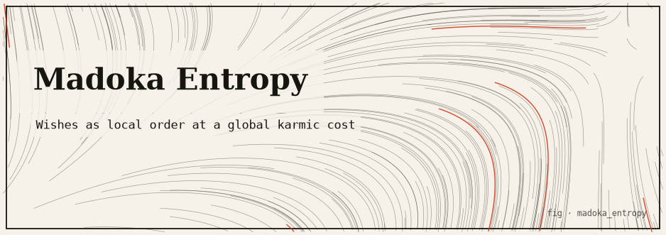
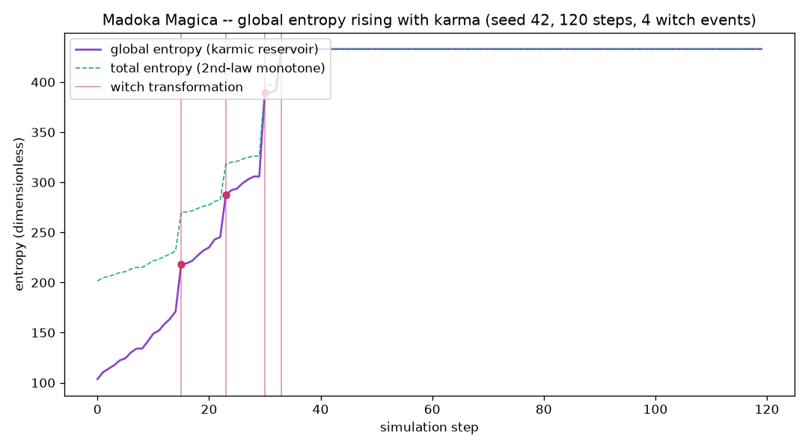

# madoka_entropy — buying local order by exporting a larger global cost



> *A wish bends reality into a more ordered local state — but the miracle is never
> free. The karmic cost is dumped somewhere the buyer cannot see.*

A `src`-layout package in the [`infinity-lab`](../../README.md) monorepo: a small,
seeded simulation of a closed system of magical girls, a global entropy budget, and
the incubators (Kyubey) who harvest the difference. It is a deliberate **caricature
of thermodynamics** used to dramatize *Puella Magi Madoka Magica* — not a physics
derivation. Its one honest, checkable property is that **total entropy never
decreases at any step.**

The pure engine (`core/`) is **standard-library only** plus the shared internal
[`commons`](../commons) package (`commons.core.rng` for all randomness). matplotlib
drives only the optional PNG and is reached lazily via
`commons.core.optional.try_import`.

---

## TL;DR

- Each wish imposes `x > 0` units of local order: `dS_local = −x`,
  `dS_global = +k·x` with `k > 1`, so `dS_total = (k − 1)·x > 0`. That one
  inequality is the engine of the whole simulation.
- Every cast clouds a girl's soul-gem **purity**; at the `witch_threshold` she
  becomes a **witch** — a burst of fresh entropy released into the reservoir.
- The **incubator** skims a fixed fraction of each wish's karmic surplus and each
  witch burst as `harvested_energy` — bookkeeping on top of the ledger that does not
  change the total.
- All randomness flows through a single seeded `DeterministicRNG`, so `(config,
  seed)` fully determines a run and the process-global RNG is never touched.
- The **second-law-like invariant** `dS_total ≥ 0` is verified per step, in the CLI
  summary, and across **60 seeds** in the test suite — 0 violations.
- Pure stdlib + `commons.core`; **no `accel/` layer**; `matplotlib` (PNG) is the only
  optional, lazily-guarded dependency.

---

## The idea

In *Madoka Magica*, the incubator Kyubey grants a girl one **wish** in exchange for
becoming a magical girl. A wish bends reality into a more ordered local state — a
healed body, an undone accident, a rescued life — but that miracle accrues karmic
destiny. Every use of magic clouds her **soul gem**, and when the gem is fully
corrupted she becomes a **witch**, a burst of despair released into the world.
Kyubey's species harvests the emotional energy of these transformations to **fight
the heat death of the universe**. The show is, quite literally, about buying local
order by exporting a larger cost somewhere the buyer cannot see. This package models
that bargain as an entropy ledger.

---

## The mathematics

We track one scalar "entropy" (dimensionless), partitioned into `S_local` (the
summed entropy of each girl's subsystem) and `S_global` (the universe's reservoir).
Total entropy is `S_total = S_global + Σ S_local`.

### A wish — the karmic calculus (`core/entropy.py`)

For a wish that imposes `x > 0` units of local order (`karmic_multiplier = k > 1`):

```
dS_local  = −x                       # local order created (entropy down)
dS_global = +k · x                   # strictly larger karmic cost
--------------------------------------------------------------------
dS_total  = (k − 1) · x  >  0         # net entropy ALWAYS rises
```

That single inequality (`k > 1`) is a second-law-like invariant: **a local decrease
in entropy must be paid for by a strictly larger global increase.** The default
`k = 1.8`. `wish_deltas` guards `x > 0` and `k > 1.0` (both raise otherwise). The
`EntropyLedger` is a frozen dataclass; `with_changes(...)` returns a **new** ledger.

### Soul-gem purity → witch transformation (`core/magical_girl.py`, `core/simulation.py`)

Each girl starts at `purity = 1.0`. A cast decays purity in proportion to the order
she forced onto the world and removes that order from her local entropy:

```
new_purity     = max(0.0, purity − decay_per_order · x)     # clamped at 0
new_local      = local_entropy − x
```

When `purity ≤ witch_threshold` (default `0.15`) she becomes a **witch**: an entropy
singularity that (1) evacuates her subsystem's local entropy into the reservoir
(`dS_local = −local_entropy`, `dS_global = +local_entropy`, total conserved for that
move), then (2) dumps an additional **burst** of fresh entropy:

```
burst      = witch_burst_base + witch_burst_per_order · (order she cast in life)
dS_total   = +burst  >  0
```

The more miracles she cast in life, the bigger the despair.

### Incubators (`core/incubator.py`)

The incubator (`Kyubey`, `harvest_fraction = 0.35`) skims a fixed fraction of the
**karmic surplus** of each wish (`surplus = dS_global + dS_local`, i.e. the global
increase beyond the local order removed) and of each witch burst, accumulating
`harvested_energy` — the negentropy exported to delay heat death. Only positive
surplus is harvested; it is bookkeeping *on top of* the ledger and does not change
the total-entropy invariant.

### The loop and the invariant (`core/simulation.py`)

Each step: Phase 1 — every living girl may wish with probability `wish_probability`,
drawing her order uniformly in `[local_order_min, local_order_max]`; Phase 2 — any
girl at/below the purity threshold transforms. The step then verifies
`d_total ≥ −ε` (`ε = 1e-9`) against the previous step and records it. A `SimResult`
reports the per-step records, final girls, `invariant_holds`, and `min_d_total`.

### `SimConfig` defaults (`core/config.py`)

| Field | Default | Meaning |
|---|---|---|
| `seed` | `42` | RNG seed (reproducible) |
| `steps` | `120` | simulation steps |
| `girl_names` | `("Madoka","Homura","Sayaka","Mami","Kyoko")` | the roster |
| `base_local_entropy` | `20.0` | each girl's starting subsystem entropy |
| `base_global_entropy` | `100.0` | reservoir starting value |
| `wish_probability` | `0.55` | per-step chance a living girl casts |
| `local_order_min` / `local_order_max` | `0.4` / `1.6` | order-per-cast range |
| `karmic_multiplier` (`k`) | `1.8` | strength of the second-law asymmetry |
| `decay_per_order` | `0.06` | purity lost per unit of order |
| `witch_threshold` | `0.15` | purity at which a gem turns |
| `witch_burst_base` | `12.0` | fixed part of each despair burst |
| `witch_burst_per_order` | `1.5` | burst growth per unit cast in life |

`harvest_fraction = 0.35` and `name = "Kyubey"` are defaults on `Incubator`, not on
`SimConfig`. Validation is fail-fast: notably `karmic_multiplier > 1.0` is required
("must be > 1 to preserve the 2nd law").

---

## How it works

### Module map

```
src/madoka_entropy/
  core/               PURE engine: stdlib + commons.core ONLY  (no accel layer)
    config.py           frozen SimConfig (every tunable) + DEFAULT
    entropy.py          immutable EntropyLedger + wish_deltas() karmic rule
    magical_girl.py     immutable MagicalGirl: purity decay + witch flag
    incubator.py        Incubator (Kyubey) harvest accounting
    simulation.py       seeded loop (commons.core.rng) + per-step invariant
  adapters/
    plot.py             dependency-free ASCII charts (witch-event marks)
    cli.py              argparse --seed / --steps (+ optional --png)
    viz.py              OPTIONAL matplotlib entropy PNG (lazy, guarded)
  demo.py             runnable end-to-end demo
```

All state is carried in **frozen dataclasses** (`EntropyLedger`, `MagicalGirl`,
`Incubator`, `StepRecord`, `SimResult`); nothing is mutated in place.

### The core-purity rule

`core/*` imports only the standard library and `commons.core` — never numpy,
matplotlib, or an adapter. Enforced by `tests/test_me_core_purity.py`
(expected-modules check, static import scan for forbidden substrings including
`madoka_entropy.accel`, and a fresh-subprocess import asserting `numpy`/`matplotlib`
never enter `sys.modules`).

---

## Install & run

From the repo root:

```bash
export PYTHONPATH=packages/commons/src:packages/madoka_entropy/src

# The runnable demo (default: seed 42, 120 steps)
python3 -m madoka_entropy.demo

# The CLI (any integer seed, fully reproducible)
python3 -m madoka_entropy.adapters.cli --seed 7
python3 -m madoka_entropy.adapters.cli --seed 42 --steps 200

# Optional entropy PNG (needs the 'viz' extra / matplotlib)
python3 -m madoka_entropy.adapters.cli --seed 42 --steps 120 --png artifacts
#   -> artifacts/madoka_entropy_entropy.png

# Offline tests (viz PNG test SKIPS without matplotlib)
python3 -m pytest packages/madoka_entropy -q
```

### Sample output (`python3 -m madoka_entropy.demo`, seed 42)

```
====================================================================
 MADOKA MAGICA  --  Entropy & Karmic Calculus
====================================================================
 seed=42  steps=120  girls=Madoka, Homura, Sayaka, Mami, Kyoko
 karmic_multiplier=1.8  (each wish: -x local, +1.8x global => net >0)
 witch_threshold(purity)=0.15  decay_per_order=0.06

GLOBAL entropy (the universe's reservoir) -- climbs with karma:
   433.0 |                 *oooooooooooooooooooooooooooooooooooooooooo
         |               **
         |            *oo
         |          o*
         |        *o
         |      o*
         |    oo
   103.6 |ooo
         +------------------------------------------------------------
                 ^^  ^^  ^^^
          step 0 .. 119   ('^' = witch transformation)

--------------------------------------------------------------------
 WITCH TRANSFORMATIONS (5):
   step   15:  Sayaka -> witch (entropy singularity)
   step   23:  Mami -> witch (entropy singularity)
   step   30:  Madoka -> witch (entropy singularity)
   step   30:  Kyoko -> witch (entropy singularity)
   step   33:  Homura -> witch (entropy singularity)

--------------------------------------------------------------------
 FINAL ACCOUNTING
   global_entropy    :      432.994
   local_entropy     :        0.000
   TOTAL entropy     :      432.994
   incubator harvest :       81.548  (negentropy)

====================================================================
 SECOND-LAW INVARIANT CHECK   (dS_total >= 0 every step)
====================================================================
   steps checked        : 120
   min per-step dS_total: +0.000000
   violations           : 0
   RESULT: PASS -- total entropy never decreased. 2nd law holds.
====================================================================
```

Global entropy rises monotonically as girls spend wishes; `*` columns are witch
bursts and `^` marks are transformations (note the cascade around steps 15–33). Once
every girl is a witch, no more wishes are cast, so entropy flatlines: `dS_total = 0`,
which still satisfies "non-decreasing" — hence the reported `min per-step dS_total`
of `+0.000000`.

---

## Visual artifacts

`adapters/viz.py` (headless `Agg`) plots global entropy rising over the run with
witch events marked:



Regenerate with `... adapters.cli --seed 42 --steps 120 --png artifacts` on a
matplotlib-enabled interpreter; it writes `artifacts/madoka_entropy_entropy.png`.

---

## Testing

The invariant is checked three ways — per step at runtime, in the CLI/demo summary,
and in the test suite. The suite (`tests/test_me_*.py`) pins, among others:

- **invariant** — `invariant_holds` and `min_d_total ≥ −1e-9` for the default run
  **and for every seed in `range(60)`** (`steps=150`); global reservoir and total
  entropy both non-decreasing; `steps=0` gives empty records, holds trivially,
  `min_d_total == 0.0`.
- **reproducibility** — same seed → identical per-step fingerprints and
  `min_d_total`; different seeds diverge; `random.getstate()` is unchanged across a
  run (the global RNG is never touched).
- **wish** — `wish_deltas(1.0, 1.8)` gives `d_local ≈ −1.0`, `d_global ≈ 1.8`, net
  `> 0`; net `== (k−1)·x` across a grid of `x` and `k`; `k = 1.0` and `x = 0.0`
  raise; ledger copy-on-change; `cast` decays purity (`1.0 → 0.8`) and clamps at 0;
  incubator harvests only positive surplus and rejects fractions outside `[0,1]`.
- **witch** — a girl at exactly `witch_threshold` turns, with `witch_step` recorded
  and `Δtotal == witch_burst_base + witch_burst_per_order·order` (`= 12 + 1.5·4 =
  18.0`); a pure girl does not; burst scales with order cast; a full run produces
  witches and every flagged step has `d_total > 0`.
- **cli / demo** — every report section present; `RESULT: PASS` and
  `violations : 0`; ASCII chart marks witch events; bad config raises.
- **viz PNG** (matplotlib) — 8-byte PNG signature, size `> 1 KiB`; `--png` creates
  missing output directories.

---

## Limitations & honest caveats

This is a **measure / accounting caricature, not real thermodynamics**:

- "Entropy" here is a single made-up scalar with no units, temperature, or microstate
  count. There is no Boltzmann `S = k_B ln W`, no free energy, no actual heat.
- The second law is *imposed by construction* (`k > 1` per wish, `burst > 0` per
  witch), not *derived* from statistics. We enforce the invariant and then verify our
  bookkeeping never accidentally breaks it — that is the real software claim tested.
- The incubator "harvest" is a narrative label on a fraction of the surplus; it is
  not a Maxwell's-demon claim and does not reduce total entropy.

Treat the numbers as a story-shaped ledger whose one honest, checkable property is:
**total entropy is non-decreasing at every step.**

---

## References

- *Puella Magi Madoka Magica* (2011), Shaft / Aniplex — the wish/soul-gem/witch/heat
  -death premise dramatized here.
- Second law of thermodynamics and entropy accounting: any standard statistical-
  mechanics text (e.g. Kittel & Kroemer, *Thermal Physics*).
- Maxwell's demon and the cost of information (for the honest contrast with the
  incubator "harvest"): Leff & Rex, *Maxwell's Demon 2*.
- Monorepo overview and core-purity rule: [`infinity-lab/README.md`](../../README.md).
