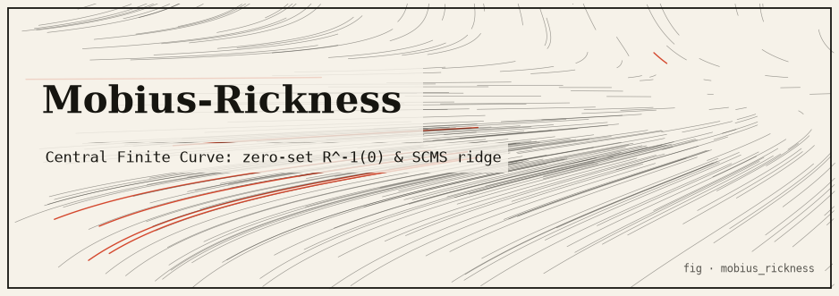
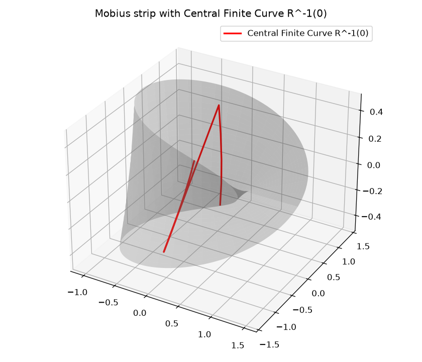
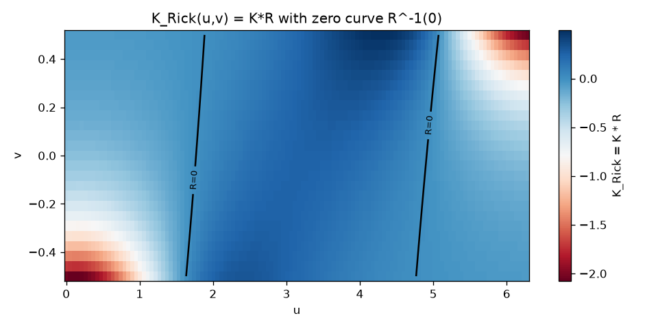
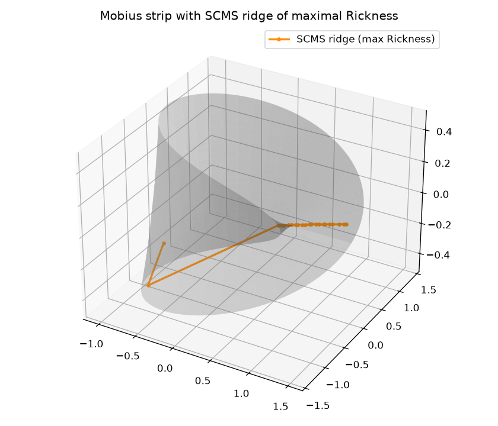
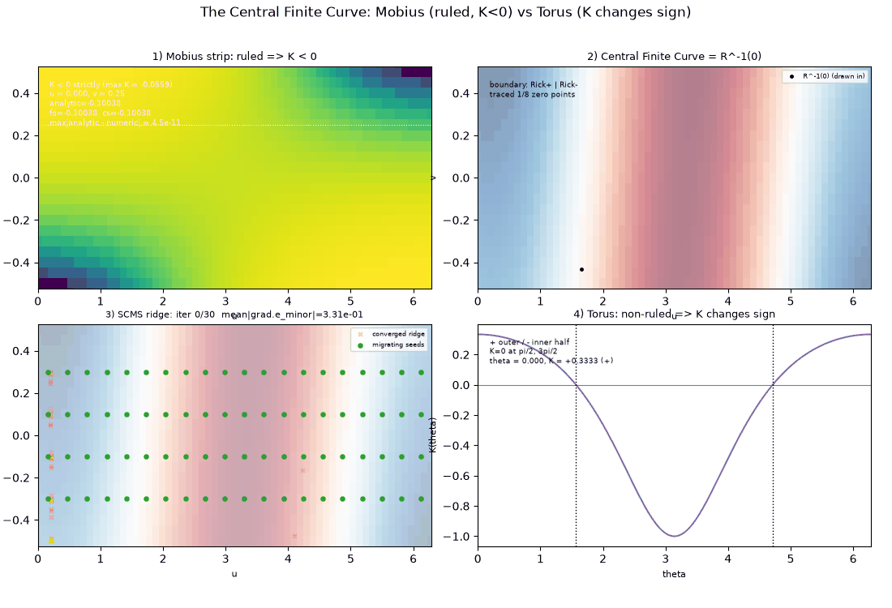

# mobius_rickness



> **The *Rick and Morty* "Central Finite Curve" realised as an exact zero set
> `R^{-1}(0)` on a Möbius strip of strictly negative Gaussian curvature.**

A pure, standard-library differential-geometry package that turns a *Rick &
Morty* conceit into honest mathematics. The "Central Finite Curve" — the one arc
of realities in which a Rick exists — is modelled as the exact zero set of a
sign-changing scalar field layered on the Gaussian curvature of a Möbius strip,
and (a second, distinct reading) as the SCMS / Eberly density ridge of maximal
Rickness. The torus is the non-ruled counterpoint whose curvature changes sign on
its own.

---

## TL;DR

Because the Möbius strip is a **ruled** surface, its Gaussian curvature `K` is
**strictly negative** everywhere on the interior (`K = -1/(4E²) < 0`). Multiplying
a sign-changing field `R(u,v)` by a nowhere-vanishing `K` leaves its zero set
unchanged, so the weighted field `K_Rick = K·R` vanishes **exactly** where `R`
does — a genuine 1-D locus `R^{-1}(0)`, the Central Finite Curve, traced exactly
by scan-line bisection + marching squares (every point verified `|R| < 1e-6`). The
package also ships a *second* formalization — the SCMS/Eberly height-ridge (crest
of maximal Rickness) — and demonstrates it is a genuinely different curve. All
core math is stdlib-only, cross-validated by three independent curvature paths
that agree to `~7e-9`.

---

## The idea

In *Rick and Morty*, the Central Finite Curve is "the one curve on which a Rick
exists" — the arc of the multiverse where Ricks are possible. That phrase admits
**two mathematically distinct readings**, and this package ships both:

1. **The zero-set wall — `R^{-1}(0)`** (pure `core/`, always available). The curve
   is the **boundary** where a sign-changing Rickness field vanishes:
   `K_Rick(u,v) = K(u,v)·R(u,v) = 0 ⇔ R(u,v) = 0`. It separates the
   "Rick-positive" from the "Rick-negative" universes — the *frontier* of the set
   of realities with a Rick.

2. **The SCMS / Eberly height-ridge** (`mobius_rickness.ridge`, optional numpy).
   Here the curve is the **1-D crest** where Rickness is locally *maximal
   transverse to the curve* — the "spine" of the most-Rick realities, not their
   boundary.

The two are genuinely different curves: traced ridge points sit emphatically *off*
the zero wall (`|R| ∈ [0.60, 1.15]`, mean `> 0.5`) while the zero set has
`|R| < 1e-6`. Zero-set boundary versus argmax spine — two faithful ways to make
"the only arc of realities where a Rick exists" concrete.

---

## The mathematics (the heart)

All headline quantities are machine-checked in `tests/`.

### The Möbius strip: strictly negative curvature (`mobius.py`, `geometry.py`)

Parametrization

```
r(u,v) = ((1 + v cos(u/2)) cos u, (1 + v cos(u/2)) sin u, v sin(u/2)),
         u ∈ [0, 2π],  v ∈ [-0.5, 0.5]
```

The strip is **ruled** (`r_vv = 0`) and `M = -1/(2√E)` never vanishes, so its
Gaussian curvature is strictly negative on the interior:

```
K = (L·N - M²) / (E·G - F²) = -1/(4 E²) < 0,   E = (1 + v cos(u/2))² + v²/4
```

`geometry.py` computes `K` via **three independent, cross-validating paths**:

- **(a) analytic oracle** — the closed form `K = -1/(4E²)`.
- **(b) central finite differences** — via `commons.core.numerics.central_difference`.
- **(c) complex-step** — cancellation-free first derivatives via
  `commons.core.numerics.complex_step_derivative`.

The Möbius **seam v-flip** `r(2π, v) = r(0, -v)` is load-bearing: any periodic
stencil sampling a neighbour outside `[0, 2π]` wraps `u` mod `2π` *and* flips `v`
for an odd number of wraps (`mobius_seam_wrap`); ordinary surfaces use
`identity_wrap`. Verified target: `K < 0` strictly (worst/max `K = -0.055927`);
three paths agree to `max |analytic − numeric| = 6.85e-09`.

### The sign-changing Rickness field & the zero set (`rickness.py`, `field.py`)

```
R(u, v) = cos(u) + 0.4 v cos(u/2) + 0.2 sin(u)
```

`R` respects the seam constraint `R(0, -v) = R(2π, v)`, so its zero set is a
*continuous* curve on the band. For fixed `u` the field is affine in `v`
(`R = A(u) + B(u) v`), giving an exact per-column root `v* = -A/B` independent of
grid resolution. Since `K < 0` everywhere, the sampled `K_Rick = K·R` grid
**straddles zero iff `R` does**, and the zero set is exactly `R^{-1}(0)`. (A legacy
`rickness_naive` with a `+1.5` constant is always `> 0` and is retained to
document why an earlier design had **no** genuine zero.)



*The Möbius strip surface with the traced Central Finite Curve `R^{-1}(0)` (the
boundary between Rick-positive and Rick-negative regions) overlaid.*

### Tracing the zero set (`tracer.py`)

Two complementary, cross-checking paths (stdlib + `commons.core` only):

- **scan-line bisection** — per-`u`-column sign scan + `bisection` refine to `1e-9`.
- **marching squares** — 16-case contour extraction, each edge crossing refined by
  bisection, segments stitched into ordered polylines across the Möbius seam.

Every traced point satisfies `|R| < 1e-6` **and** `|K_Rick| < 1e-6`
(`verify_curve`) — the reproduced run yields 11 zero points, all `|R| < 1.6e-10`,
e.g.:

```
         u          v          x          y          z        |R|
------------------------------------------------------------------
    1.6368    -0.4888    -0.0439    +0.6645    -0.3568    5.9e-11
    1.6896    -0.3015    -0.0948    +0.7942    -0.2255    1.5e-10
    ...
    5.0688    +0.4915    +0.2081    -0.5589    +0.2805    1.6e-11
```



*The weighted field `K_Rick(u,v) = K·R` as a heatmap. Because `K < 0` everywhere,
`K_Rick` straddles zero exactly where `R` does; the zero contour is `R^{-1}(0)`.*

### The SCMS / Eberly ridge — the second formalization (`ridge/scms.py`, optional numpy)

The height-ridge is defined by the Subspace-Constrained Mean-Shift / Eberly
condition on `R`: at a ridge point the gradient is orthogonal to the minor Hessian
eigenvector **and** that eigenvalue is negative:

```
|g · e_minor| < tol   AND   λ_minor < 0
```

Computed via `numpy.linalg.eigh` with a Newton transverse projection
`t = -(g·e_minor)/λ_minor`. Over the Möbius Rickness field the mean ridge-condition
residual `mean_i |∇R·e_minor|` falls from **≈3.3e-1 to ≈3.0e-9** across 29
iterations (110 seeds), e.g.
`3.32e-01 → 2.16e-01 → 1.22e-01 → … → 9.85e-07 → 4.47e-08 → 3.00e-09`. The traced
ridge sits off the zero wall (`|R| ∈ [0.60, 1.15]`), confirming the two readings
are distinct curves.



*The same surface with the SCMS/Eberly ridge — the crest of maximal Rickness —
overlaid. Contrast with `mobius_strip_curve.png`: this spine sits off the zero
wall.*

### The torus — the geometry-driven counterpoint (`torus.py`)

A ring torus needs **no** weighting, because its curvature changes sign on its
own:

```
K(θ) = cos(θ) / (r0 (R0 + r0 cos θ))      — positive outer half, negative inner half
```

with zeros **exactly at `θ = π/2` and `θ = 3π/2`** (traced `1.570796`,
`4.712389`). Numeric `K` (shared central-difference engine) matches the closed
form, and `require_ring` fails fast on `R0 ≤ r0` (self-intersecting, singular `K`).

---

## How it works

### Module map

```
src/mobius_rickness/
├── core/            # PURE: stdlib + commons.core ONLY (no adapters, no numpy/matplotlib)
│   ├── geometry.py  #   fundamental forms E,F,G,L,M,N + 3 curvature paths + Möbius seam wrap
│   ├── mobius.py    #   Möbius parametrization; K = -1/(4E²) < 0 strictly
│   ├── rickness.py  #   sign-changing Rickness field R(u,v) (+ legacy naive weighting)
│   ├── field.py     #   K_Rick = K·R grid + strict-negativity certificate
│   ├── tracer.py    #   real zero-set tracing (scan-line bisection + marching squares)
│   └── torus.py     #   ring torus; closed-form K sign-changing, zero at π/2 & 3π/2
├── accel/           # OPTIONAL numpy fast paths (lazy try_import; outside core)
│   └── numpy_backend.py  # vectorised curvature / rickness / K_Rick / surface meshes
├── ridge/           # OPTIONAL numpy SCMS/Eberly ridge (lazy; the 2nd CFC formalization)
│   └── scms.py      # gradient/Hessian, eigen-split, height-ridge trace + convergence history
└── adapters/        # import core, NEVER the reverse
    ├── viz.py            # ASCII sign map, K_Rick heatmap, curvature table (matplotlib deferred)
    ├── animate_3d.py     # rotating 3-D GIF/MP4 of the strip + both CFC readings (deferred)
    ├── animate_scms.py   # 2-D GIF/MP4 of the SCMS seed cloud converging onto the ridge (deferred)
    ├── animate_panels.py # four-panel composite explainer GIF/MP4 (deferred)
    └── cli.py            # argparse: curvature / trace / torus / all / animate
```

### Key algorithms

- **Three cross-validating curvature paths** (analytic, finite-difference,
  complex-step) so the strictly-negative `K` is not an artefact of one method.
- **Seam-aware differentiation:** the `mobius_seam_wrap` v-flip makes periodic
  stencils correct across the Möbius join.
- **Exact per-column zero roots:** `R` affine in `v` gives `v* = -A/B`, so the
  zero curve is resolution-independent; marching squares provides an independent
  contour cross-check.
- **SCMS/Eberly Newton projection** for the density ridge, with per-iteration
  residual histories driving the convergence animation.

### The core-purity rule (hard invariant)

Every module under `core/` imports **only the standard library and
`commons.core`** — no adapter, and nothing anywhere imports `numpy`/`matplotlib`
at module top level. Enforced by `tests/test_mr_core_purity.py`. Optional paths are
deferred behind `commons.core.optional.try_import` and raise
`OptionalDependencyError` when a dependency is absent — never a hard import.

---

## Install & run

Offline, zero install, zero network. Requires Python 3.11+; `numpy`/`matplotlib`
are optional (only for the numpy fast paths, the SCMS ridge, and the deferred PNG
/ animation exports). From the repo root (`infinity-lab/`):

```bash
# Full package test suite (offline core)
python3 -m pytest packages/mobius_rickness

# Demo (headline math + reproduced table + traced curve + torus + ASCII gallery)
PYTHONPATH=packages/commons/src:packages/mobius_rickness/src \
  python3 -m mobius_rickness.demo

# CLI subcommands: curvature | trace | torus | all  (--ascii on curvature/trace/all)
PYTHONPATH=packages/commons/src:packages/mobius_rickness/src \
  python3 -m mobius_rickness.adapters.cli all
```

### Real sample output (demo headline)

```
MOBIUS-RICKNESS: THE CENTRAL FINITE CURVE AS A REAL ZERO SET

K<0 on the ruled Mobius strip, so K_Rick = K*R vanishes exactly where R vanishes.

======================================================================
CURVATURE -- Mobius strip: K < 0 strictly (ruled surface)
======================================================================
r(u,v) = ((1 + v cos(u/2)) cos u, (1 + v cos(u/2)) sin u, v sin(u/2))
K < 0 strictly on the interior (worst / max K = -0.055927).
Three curvature paths at (u,v)=(pi/3, 0.25): analytic=-0.111778891  fd=-0.111778898  cs=-0.111778891
max |analytic - numeric| = 6.85e-09  (paths agree).
```

Torus zero set (geometry-driven, no weighting):

```
       theta       K_closed      K_numeric   sign
--------------------------------------------------
  pi/2 (top)       0.000000       0.000000      0
 3pi/2 (bot)      -0.000000       0.000000      0
Traced K=0 circles at theta = 1.570796, 4.712389  (pi/2, 3pi/2)
```

### Optional extras (numpy acceleration & matplotlib visualization)

- **`mobius_rickness.accel.numpy_backend`** — vectorised numpy mirrors of the core
  (`curvature_fd_mesh`, `curvature_analytic_mesh`, `rickness_mesh`, `k_rick_mesh`,
  `mobius_surface_mesh`). Parity against the core is **bit-exact** (analytic `K`,
  `R`, `K_Rick`, surface: max abs diff `0.0`; the FD mixed partial replicates the
  core's nested central-difference grouping to stay bit-exact).
- **`mobius_rickness.ridge.scms`** — the SCMS/Eberly ridge (the second CFC
  formalization), via `numpy.linalg.eigh`; on the stdlib interpreter it imports but
  raises `OptionalDependencyError` when called.
- **matplotlib PNG exports** in `adapters/viz.py` — `save_strip_3d_png` (surface +
  `R^{-1}(0)` wall), `save_krick_heatmap_png` (`K_Rick` field + zero contour),
  `save_ridge_png` (surface + SCMS ridge), all headless (`Agg`).

Create the venv and run the optional tests:

```bash
python3 -m venv .venv
.venv/bin/python -m pip install --upgrade pip
.venv/bin/python -m pip install numpy matplotlib pytest

# Optional accel + ridge + PNG + animation tests RUN on the venv interpreter
.venv/bin/python -m pytest packages/mobius_rickness -q

# On the stdlib-only system interpreter they SKIP (the 70 core tests stay green)
python3 -m pytest packages/mobius_rickness -q
```

Generate the PNGs and animations:

```bash
# The three PNGs into OUTDIR
PYTHONPATH=packages/commons/src:packages/mobius_rickness/src \
  .venv/bin/python -m mobius_rickness.adapters.cli all --png artifacts

# Rotating 3-D GIF; --mp4 adds the MP4, --scms adds the ridge-convergence GIF,
# --panels adds the four-panel explainer (MP4s need ffmpeg on PATH)
PYTHONPATH=packages/commons/src:packages/mobius_rickness/src \
  .venv/bin/python -m mobius_rickness.adapters.cli animate artifacts --mp4 --scms --panels
```

---

## Visual artifacts

Committed at the repo root under [`artifacts/`](../../artifacts/).



*The four-panel explainer (`mobius_four_panels.gif`): (1) the strictly-negative
Möbius `K` heatmap with a scan line and the three-path agreement readout; (2) the
Central Finite Curve `R^{-1}(0)` drawn point-by-point over the Rickness sign map;
(3) the SCMS seed cloud converging onto the Eberly ridge with the residual → 0;
(4) the torus `K(θ)` with its two `K = 0` circles. Every number is pulled from the
real pure core.*

| Artifact | Shows |
|----------|-------|
| `mobius_strip_curve.png` | Möbius surface + traced zero-set wall `R^{-1}(0)` |
| `mobius_krick_heatmap.png` | `K_Rick = K·R` heatmap + zero contour |
| `mobius_ridge.png` | Möbius surface + SCMS/Eberly ridge of maximal Rickness |
| `mobius_rotating.gif` / `.mp4` | Orbiting 3-D scene with **both** CFC readings (zero wall + ridge) |
| `mobius_ridge_convergence.gif` / `.mp4` | The SCMS seed cloud migrating onto the ridge, one step per frame, residual → 0 |
| `mobius_four_panels.gif` / `.mp4` | The whole story on one 2×2 timeline, ending on a summary banner |

MP4s decode cleanly (`ffmpeg -v error -i <file>.mp4 -f null -`). The rotating scene
**degrades gracefully**: when numpy or the ridge subpackage is unavailable, the
strip and the `R^{-1}(0)` zero curve still render and the ridge overlay is simply
omitted.

---

## Testing

```bash
# Offline core (stdlib-only interpreter): optional modules SKIP
python3 -m pytest packages/mobius_rickness -q
# → 70 passed, 6 skipped

# Full suite (venv with numpy + matplotlib + ffmpeg): optional tests RUN
.venv/bin/python -m pytest packages/mobius_rickness -q
# → ~109 passed (accel + ridge + PNG + rotating/SCMS/panel animation tests execute)
```

What the tests pin (numeric targets):

- `K < 0` strictly on the interior (worst/max `K = -0.055927`).
- Three curvature paths agree: `max |analytic − numeric| = 6.85e-09`.
- Every traced curve point: `|R| < 1e-6` **and** `|K_Rick| < 1e-6` (11 points, all
  `|R| < 1.6e-10`).
- Torus numeric `K` matches the closed form; `K = 0` exactly at `θ = π/2, 3π/2`
  (traced `1.570796, 4.712389`).
- SCMS ridge lies off the zero wall (`|R| ∈ [0.60, 1.15]`); residual → `~3e-9`.
- numpy accel parity is bit-exact; core purity (`test_mr_core_purity.py`).

---

## Limitations & honest caveats

- **This is a fictional conceit made rigorous, not physics.** The mapping from
  "the arc of realities where a Rick exists" to a zero set / density ridge is a
  deliberate metaphor; the mathematics underneath (Gaussian curvature, zero-set
  tracing, SCMS ridges) is real and exact.
- **Two readings, both honest, genuinely different.** The zero-set wall
  `R^{-1}(0)` (a *boundary*) and the SCMS ridge (a *crest*) are distinct curves;
  neither is "the" Central Finite Curve — they answer different questions.
- **The Rickness field `R(u,v)` is a designed function**, chosen to be
  seam-consistent and sign-changing; it is not derived from the show.
- The SCMS ridge and the numpy fast paths are **optional**; without numpy the core
  zero-set result (the main claim) still holds and is fully tested.

---

## References / attribution

- The Gaussian curvature of ruled surfaces (`K ≤ 0`), the first/second fundamental
  forms, and the Möbius parametrization are standard differential geometry (see any
  text, e.g. do Carmo, *Differential Geometry of Curves and Surfaces*).
- The height-ridge definition follows **Eberly**'s ridge theory and the
  **Subspace-Constrained Mean-Shift (SCMS)** algorithm (Ozertem & Erdogmus, 2011).
- Marching squares is the standard contour-extraction method.
- *Rick and Morty* and the "Central Finite Curve" concept are © their respective
  rights holders; this package uses the idea as inspiration and reproduces no
  copyrighted imagery — banners and figures here are our own renders.
- See the sibling package [`central_finite_curve`](../central_finite_curve/README.md)
  for a *different* honest reading of the same idea (a near-maximal band / ridge
  over a sampled high-dimensional multiverse).
