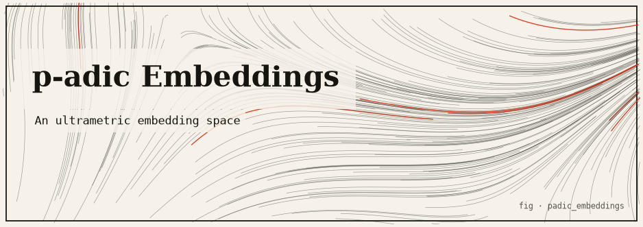
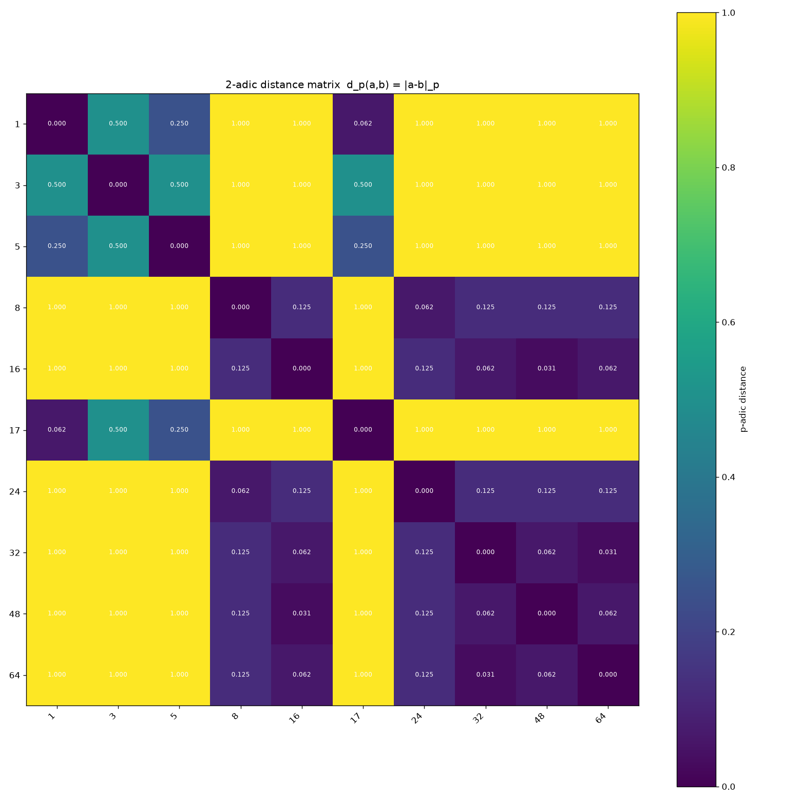

# padic_embeddings — an embedding space where closeness is divisibility



> *In the p-adic world a number is **small** when it is **highly divisible by a
> prime `p`** — not when it sits near zero on the number line.*

An "embedding space" whose geometry is governed by the **p-adic metric** instead of
the usual Euclidean one. Items (integers or short strings) are mapped to integer
coordinates in `Z`, and closeness is measured by how divisible their difference is
by a fixed prime `p`. The result is a genuine **ultrametric** space with a natural
tree / hierarchy structure — a good fit for taxonomies, nested categories, and
prefix / factor-sharing data.

This package is the monorepo port of a standalone prototype. The pure math lives
under `padic_embeddings.core` (standard library + [`commons`](../commons)`.core`
only); text rendering and an optional matplotlib PNG export live under
`padic_embeddings.adapters`, with matplotlib reached lazily through
`commons.core.optional.try_import`.

---

## TL;DR

- Fix a prime `p`. The **valuation** `v_p(n)` is the largest `k` with `pᵏ | n`; the
  **absolute value** is `|x|_p = p^(−v_p(x))`; the **distance** is
  `d_p(a, b) = |a − b|_p`.
- This is an **ultrametric**: `d_p(a, c) ≤ max(d_p(a, b), d_p(b, c))`. The package
  verifies it **exhaustively** on real data over exact `Fraction` distances — for a
  10-item sample, all `10·9·8 = 720` ordered triples hold with **0 violations**.
- Absolute values and distances are computed **exactly** as `fractions.Fraction`
  (always a power of `p`), so ultrametric checks never depend on a float tolerance.
- Residue classes mod `pᵏ` are exactly the balls of radius `p^(−k)`; increasing `k`
  refines a nested tree of clusters.
- Pure stdlib + `commons.core`; **no `accel/` layer**; `matplotlib` (PNG) is the only
  optional, lazily-guarded dependency.

---

## The idea

Ordinary machine-learning embeddings place items in `R^d` and use Euclidean (or
cosine) distance: two points are close when their coordinates are numerically near.
The p-adic world uses a completely different notion of "size":

> A number is **small** when it is **highly divisible by a prime `p`**.

Under this metric, `1_000_000` and `0` are *very close* for `p = 2` (their
difference is divisible by a high power of 2), while `1` and `2` are *far* apart.
This produces a hierarchical, tree-shaped geometry.

---

## The mathematics

Fix a prime `p`.

### p-adic valuation `v_p`

For a nonzero integer `n`, `v_p(n)` is the largest integer `k` with `pᵏ | n`. By
convention `v_p(0) = +∞` (returned as `math.inf`). For a rational `a/b`:

```
v_p(a/b) = v_p(a) − v_p(b)
```

Examples: `v_2(8) = 3` (`8 = 2³`), `v_2(12) = 2`, `v_7(49) = 2`,
`v_2(3/4) = 0 − 2 = −2`. Non-prime `p` raises `ValueError`.

### p-adic absolute value `|x|_p`

```
|x|_p = p^(−v_p(x))     and     |0|_p = 0
```

So `|8|_2 = 2⁻³ = 0.125`, `|3|_2 = 2⁰ = 1`, and `|3/4|_2 = 2² = 4`. Highly divisible
numbers have *small* absolute value. This package computes `|x|_p` **exactly** as a
`fractions.Fraction`, since it is always an exact power of `p`.

### p-adic distance `d_p`

```
d_p(a, b) = |a − b|_p
```

A genuine **metric**: non-negative, symmetric, and zero iff `a = b`.

### The ultrametric (strong triangle) inequality

The defining property, stronger than the ordinary triangle inequality:

```
d_p(a, c)  ≤  max( d_p(a, b),  d_p(b, c) )
```

A space obeying this is an **ultrametric space**. Consequences:

- every triangle is isosceles, with the two longest sides equal;
- "balls" are nested rather than overlapping, forming a tree;
- the residue class of an integer mod `pᵏ` is *exactly* a ball of radius `p^(−k)`:
  two integers agree mod `pᵏ` **iff** `d_p(a, b) ≤ p^(−k)`.

The package verifies the inequality **exhaustively on real data** — all ordered
distinct triples, `O(n³)` — over exact `Fraction` distances. For the default 10-item
2-adic sample this is `10·9·8 = 720` triples with `0` violations; a 7-item 7-adic
sample and a 7-item hashed-string sample also hold with zero violations.

### Worked distance matrix (`p = 2`)

```
pairwise 2-adic distance matrix  d_p(a,b) = |a-b|_p
                1        3        5        8       16       17       24       32       48       64
       1        0  0.50000  0.25000  1.00000  1.00000  0.06250  1.00000  1.00000  1.00000  1.00000
       3  0.50000        0  0.50000  1.00000  1.00000  0.50000  1.00000  1.00000  1.00000  1.00000
       5  0.25000  0.50000        0  1.00000  1.00000  0.25000  1.00000  1.00000  1.00000  1.00000
       8  1.00000  1.00000  1.00000        0  0.12500  1.00000  0.06250  0.12500  0.12500  0.12500
      16  1.00000  1.00000  1.00000  0.12500        0  1.00000  0.12500  0.06250  0.03125  0.06250
      17  0.06250  0.50000  0.25000  1.00000  1.00000        0  1.00000  1.00000  1.00000  1.00000
      24  1.00000  1.00000  1.00000  0.06250  0.12500  1.00000        0  0.12500  0.12500  0.12500
      32  1.00000  1.00000  1.00000  0.12500  0.06250  1.00000  0.12500        0  0.06250  0.03125
      48  1.00000  1.00000  1.00000  0.12500  0.03125  1.00000  0.12500  0.06250        0  0.06250
      64  1.00000  1.00000  1.00000  0.12500  0.06250  1.00000  0.12500  0.03125  0.06250        0
```

`1` and `17` are very close (`0.0625`, since `17 − 1 = 16 = 2⁴`), while every odd
number is at distance `1` from every even one. The nearest neighbor of `16` is `48`
(`48 − 16 = 32 = 2⁵`, distance `0.03125`) — the p-adic metric groups numbers by
*shared prime factors*.

### Induced hierarchical clusters (`p = 2`)

```
  level 1: balls of radius 0.5 (mod 2**1 = 2)
    residue 0 : [8, 16, 24, 32, 48, 64]
    residue 1 : [1, 3, 5, 17]
  level 2: balls of radius 0.25 (mod 2**2 = 4)
    residue 0 : [8, 16, 24, 32, 48, 64]
    residue 1 : [1, 5, 17]
    residue 3 : [3]
  level 3: balls of radius 0.125 (mod 2**3 = 8)
    residue 0 : [8, 16, 24, 32, 48, 64]
    residue 1 : [1, 17]
    residue 3 : [3]
    residue 5 : [5]
```

---

## How it works

### Module map

```
src/padic_embeddings/
  core/            PURE: stdlib + commons.core only  (no accel layer)
    padic.py         is_prime, valuation, p_adic_abs / p_adic_abs_exact (Fraction),
                     distance / distance_exact, is_ultrametric_triple
    embedding.py     embed_item / embed (int passthrough; str → SHA-256 mod 2**20),
                     distance_matrix, nearest_neighbors, verify_ultrametric (O(n³)),
                     cluster_by_valuation (residue-class balls), sample_integers (seeded)
  adapters/        presentation (import core; core never imports them)
    render.py        ASCII distance matrix + heatmap (via commons) + clusters + report
    cli.py           argparse front end
    viz.py           OPTIONAL matplotlib distance-matrix heatmap PNG (lazy)
  demo.py          one-shot showcase (headline + canonical p=2 report)
```

The embedding layer maps **integers** to themselves (they already live in `Z`) and
**strings** to integers via `SHA-256(item) mod 2²⁰` (deterministic across runs,
unlike Python's salted `hash()`). Distances and absolute values are exact
`Fraction`s throughout the core; the ASCII/PNG float formatting happens only in the
adapters.

### The core-purity rule

`core/*` imports only the standard library and `commons.core`, enforced by
`tests/test_pe_core_purity.py` (expected-modules check, static import scan, and a
fresh-subprocess import asserting `numpy`/`matplotlib` never enter `sys.modules`).
`matplotlib` is reached only lazily in `adapters/viz.py`.

---

## Install & run

No install is needed — the repo's `pyproject.toml` wires each package's `src` onto
`pythonpath` for pytest, and the CLI runs with `PYTHONPATH` set to the `commons` and
`padic_embeddings` src dirs.

```bash
export PYTHONPATH=packages/commons/src:packages/padic_embeddings/src

# Default showcase: 2-adic structure of a list of integers
python3 -m padic_embeddings.adapters.cli --p 2

# Pick a prime and supply your own integers
python3 -m padic_embeddings.adapters.cli --p 7 --ints 7 14 49 50 98 100 343 --query 49

# Embed short strings and query nearest neighbors
python3 -m padic_embeddings.adapters.cli --p 2 --strings cat cot cog dog apple --query cat

# The one-shot demo (headline + canonical report)
python3 -m padic_embeddings.demo

# OPTIONAL: also export the distance-matrix heatmap PNG (needs matplotlib)
python3 -m padic_embeddings.adapters.cli --p 2 --png artifacts

# Offline tests (optional matplotlib PNG test SKIPS without it)
python3 -m pytest packages/padic_embeddings -q
```

CLI flags: `--p` (prime, default `2`), `--ints` / `--strings` (items), `--query`
(nearest-neighbor target), `--levels` (cluster levels, default `1 2 3`), `--modulus`
(hash modulus for strings, default `2²⁰`), `--png OUTDIR` (optional PNG export). A
non-prime `--p` exits with an error.

### 7-adic example (`--p 7 --ints 7 14 49 50 98 100 343 --query 49`)

```
  level 1: balls of radius 0.142857 (mod 7**1 = 7)
    residue 0 : [7, 14, 49, 98, 343]
    residue 1 : [50]
    residue 2 : [100]

nearest neighbors of '49' under the 7-adic metric
  98    distance 0.020408
  343   distance 0.020408
  7     distance 0.142857
```

Multiples of `7` collapse together, and among them `49, 98, 343` (all divisible by
`49 = 7²`) form a tighter sub-cluster.

### Verified ultrametric property (real)

```
ultrametric (strong triangle inequality) verification
  d_p(a,c) <= max(d_p(a,b), d_p(b,c)) for ALL ordered triples?
  triples checked : 720
  violations found: 0
  RESULT: HOLDS (this is a true ultrametric)
```

---

## Visual artifacts

`adapters/viz.py` (headless `Agg`, `cmap="viridis"`, `vmin=0`, `vmax=1`) renders the
pairwise distance matrix as a labelled heatmap:



Regenerate with `... adapters.cli --p 2 --png artifacts` (or
`viz.save_distance_matrix_png`) on a matplotlib-enabled interpreter; it writes
`artifacts/padic_embeddings_distance_matrix.png`. Without matplotlib the exporter
raises a clear `OptionalDependencyError` and the ASCII renderers are used instead.

---

## Testing

The suite (`tests/test_pe_*.py`) pins, among others:

- **padic** — `v_2(8)=3`, `v_2(12)=2`, `v_7(49)=2`, `v_2(3/4)=−2`, `v_p(0)=∞`;
  non-prime `p` raises; `p_adic_abs(8,2)=0.125`, `p_adic_abs_exact(8,2)=Fraction(1,8)`,
  `p_adic_abs_exact(3/4,2)=Fraction(4)`; distance symmetry and
  `distance_exact(5,13,2)=Fraction(1,8)`.
- **embedding** — integer identity (`embed([1,42,−7]) == [1,42,−7]`); deterministic
  string hashing; `bool`/`float` items and non-positive modulus raise; residue-class
  clusters; nearest neighbors (`16 → 48` at `k=1`, self excluded); symmetric,
  zero-diagonal matrix; `sample_integers` reproducible for a fixed seed.
- **ultrametric** — the 10-item 2-adic sample checks exactly `720` triples with `0`
  violations; 7-adic and hashed-string samples also hold; direct probe
  `is_ultrametric_triple(0,2,4,2) is True` with `distance_exact(0,4,2)=Fraction(1,4)`.
- **render / cli / demo** — the report contains the expected sections
  (`distance matrix`, `ultrametric verification`, `HOLDS`, `nearest neighbors`, …);
  matrix text shows `0.06250` for the `1↔17` pair; non-prime `--p` raises `SystemExit`.
- **viz PNG** (matplotlib) — 8-byte PNG signature, size `> 1 KiB`; empty coords raise;
  `--png` writes `padic_embeddings_distance_matrix.png` into the target directory.

---

## Limitations & honest caveats

- Coordinates are single integers in `Z`, not vectors; this is a faithful **1-D**
  p-adic embedding, not a learned high-dimensional one.
- The string embedding is a deterministic hash, so semantic similarity of words is
  **not** captured — proximity reflects the hashed integers' divisibility, which is
  what the p-adic geometry acts on. The string mode exists to show the metric works
  on hashed items, not to model language meaning.
- The ultrametric check is exhaustive `O(n³)`; fine for the small demo sizes, not
  intended for large corpora.

---

## References

- N. Koblitz, *p-adic Numbers, p-adic Analysis, and Zeta-Functions*, 2nd ed.,
  Springer GTM 58 — valuations, `|·|_p`, and ultrametric structure.
- F. Q. Gouvêa, *p-adic Numbers: An Introduction*, Springer — an accessible
  treatment of the ultrametric inequality and p-adic balls.
- R. Rammal, G. Toulouse, M. A. Virasoro, *Ultrametricity for physicists*,
  Rev. Mod. Phys. 58 (1986) — ultrametric spaces as hierarchical trees.
- FIPS 180-4 (SHA-256) for the deterministic string→integer embedding.
- Monorepo overview and core-purity rule: [`infinity-lab/README.md`](../../README.md).
