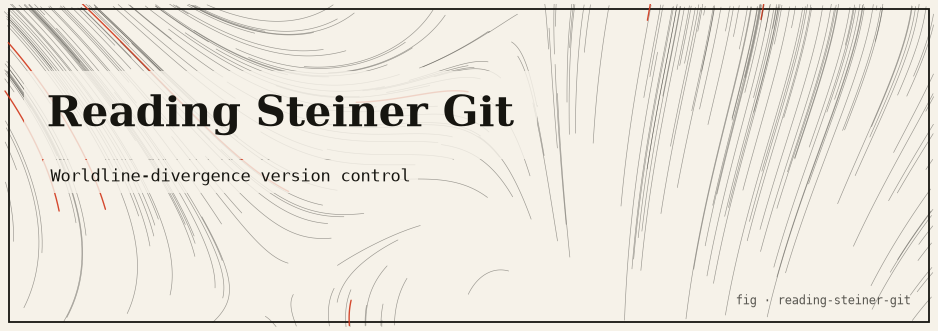

# Reading Steiner Git

> A worldline version-control toy — content-addressable snapshots with a six-decimal Divergence Meter.
>
> *El Psy Kongroo.*

A tiny, self-contained **worldline version-control system** written in TypeScript,
inspired by *Steins;Gate*. It snapshots a sandbox directory, addresses every file
by the SHA-1 of its bytes, and reports a six-decimal **Divergence Meter** reading
for every commit. Jumping between commits is a *world line jump*: you keep the
memory of the divergence delta and of exactly what changed on disk — that is the
"Reading Steiner" ability made literal.

**Concept / reference.** In *Steins;Gate*, every altered timeline is a **world
line** identified by a **divergence number** on a nixie-tube *Divergence Meter*
(the canonical reading is `1.048596`). World lines cluster into **attractor
fields** — **Alpha (α)** below `1.0`, **Beta (β)** at or above `1.0`. The
protagonist Okabe has **Reading Steiner**: when the world line shifts, he alone
retains his memories of the previous line. This project maps those ideas onto a
real content-addressable VCS.

---

## TL;DR

- A **real** content-addressable store: files become SHA-1 blobs, snapshots
  become trees, commits reference a tree + a parent, and branches/HEAD mirror
  git's model — all in ~600 lines of dependency-free TypeScript.
- Every commit carries a deterministic **divergence reading** in `[0, 2)`,
  computed purely from tree content. Same files ⇒ same reading, always.
- `jump` restores the sandbox to any past snapshot and reports the **divergence
  delta**, whether you crossed the **α ⇄ β** attractor-field boundary, and every
  file added/removed/modified.
- **Sandboxed by construction**: it never shells out to real `git` and refuses to
  touch any path outside this project folder.
- Build and see it: `npm install && npm run build && npm run demo`.

---

## The idea

Git is, at heart, a content-addressable filesystem with a commit graph layered on
top. *Steins;Gate* is, at heart, a story about a branching graph of timelines
where each node has a number and moving between nodes has consequences. The two
line up almost perfectly, so this project builds the git core honestly and then
reads it through the Divergence Meter lens.

| Steins;Gate              | Reading Steiner Git                                          |
| ------------------------ | ----------------------------------------------------------- |
| World line               | a commit (a full snapshot of the sandbox)                   |
| Divergence number        | deterministic hash of the tree state, projected into `[0, 2)` |
| Attractor field α / β    | divergence `< 1.0` / `>= 1.0`                               |
| Branch of world lines    | a branch (`main`, `beta`, `steinsgate`, …)                  |
| Time-leap / world jump   | `steiner jump <ref>` — restores that snapshot on disk       |
| Reading Steiner          | after a jump you keep the divergence **delta** + a change log |
| History destabilizing    | a warning when the divergence delta grows large             |

An endpoint into that story is a single command: `steiner`. You `init` a sandbox,
`commit` snapshots as world lines, `branch` to fork a new line, `log` the tree,
`status` the working reading, and `jump` between lines to relive them.

---

## The honest core (what is real vs. flavor)

This README separates the genuine computer-science substance from the narrative
skin. Both are here on purpose; only one of them is load-bearing.

### 1. Content-addressable model (real)

Every tracked file is stored as a **blob** named by the SHA-1 of its raw bytes,
under `.steiner/objects/<sha1>`. Identical content is stored once (write is a
no-op if the object already exists), so the store deduplicates naturally.

A **tree** is a manifest that maps each POSIX-relative path to its blob hash and
byte size. Trees are serialized canonically — entries are sorted by path — so the
tree hash does not depend on directory read order:

```
tree
<blob-sha1> <size> <path>
<blob-sha1> <size> <path>
...
```

A **commit** references a tree hash, a parent commit id (or `null` for a root),
the branch it was made on, the divergence reading, a timestamp, a message, and
the full snapshot manifest inline. The commit's own id is the SHA-1 of a
canonical text form of those fields. This is exactly the blob → tree → commit
layering that real content-addressable VCSs use; the only concession to "toy
scope" is that the manifest is stored inline in each commit JSON instead of as a
separate hashed tree object.

**Branches & HEAD** mirror git precisely: `refs/heads/<branch>` is a text file
holding a commit id, and `HEAD` is either `ref: <branch>` (attached) or a raw
commit id (detached). After a `jump` to a bare commit, HEAD is detached and
committing is blocked until you `branch` to anchor a new world line.

### 2. The divergence reading in `[0, 2)` (honest projection)

The World Line Divergence Number is a deterministic projection of the tree hash:

```
slice = first 13 hex digits of the tree SHA-1     (13 hex digits < 2^52, safe in a JS double)
value = parseInt(slice, 16)
raw   = (value / 16^13) * 2                        // project into [0, 2)
divergence = round(raw * 1e6) / 1e6                // six decimals, Divergence-Meter style
```

This is an **honest hash projection**, not a physically meaningful value. What
matters is the property it guarantees: divergence is a **pure function of tree
content**. The same set of files always yields the same reading, regardless of
commit order, branch, or timestamp. That is why the demo's readings are
reproducible across runs while only the commit *ids* (which fold in wall-clock
time) vary.

### 3. Alpha / Beta attractor fields

The reading's attractor field is a simple threshold:

```
attractorField(n) = n < 1.0 ? "Alpha" : "Beta"
```

A `jump` reports `crossedField = true` when the source and target readings fall in
different fields — the narrative "the world line has shifted into another
attractor field."

### 4. Destabilization thresholds (narrative, not integrity)

After a jump, the absolute divergence delta drives a purely narrative warning:

| Delta `|Δ|`      | Signal                                                        |
| ---------------- | ------------------------------------------------------------- |
| `< 0.4`          | `worldline stable.`                                           |
| `>= 0.4`         | `⚠ history is destabilizing.` (`DESTABILIZE_WARN`)            |
| `>= 1.0`         | `‼ WORLD LINE SHIFT CRITICAL` (`DESTABILIZE_CRITICAL`)        |

These thresholds live in `repo.ts`. They are flavor: nothing about the store's
integrity depends on them. The α ⇄ β crossing note is likewise narrative.

### 5. The one engineered number

Everything above falls out of file content — with a single deliberate exception.
In the demo, the Beta-field `steinsgate` world line collapses the tree to one file
containing a **pre-computed nonce** (`nonce=188`) so its reading (`1.153035`)
reproducibly lands in the Beta field. That nonce is the only "engineered" value in
the entire project; every other reading is whatever the bytes happen to hash to.

### 6. The sandbox guard (real safety)

This is a *toy* VCS and it takes care never to behave like a real one on your
machine:

- It **never** invokes real `git`.
- Every workspace path is resolved against the project root (the parent of
  `dist/` / `src/`) and rejected if it escapes:

  ```ts
  const rel = path.relative(root, target);
  const escapes = rel === "" || rel.startsWith("..") || path.isAbsolute(rel);
  if (escapes) throw new Error("Refusing to operate outside the project sandbox.");
  ```

  So `--dir ../../etc`, absolute paths, or the project root itself are all
  refused. All state lives in a sandbox directory inside the project (default
  `./workspace`, demo uses `./workspace-demo`), each with its own `.steiner/`
  store.

---

## How it works

### Store layout

```
<workspace>/                 # the sandbox working tree (your tracked files)
  <your files...>
  .steiner/
    objects/<sha1>           # content-addressed blobs (raw file bytes)
    commits/<id>.json        # one world-line node each (tree, parent, divergence, manifest)
    refs/heads/<branch>      # text file holding a commit id
    HEAD                     # "ref: <branch>" or a detached commit id
```

### Module map

| Module          | Responsibility                                                                    |
| --------------- | --------------------------------------------------------------------------------- |
| `src/hash.ts`   | SHA-1, canonical tree serialization + `treeHash`, the `divergence` projection, `attractorField` |
| `src/paths.ts`  | Sandbox path resolution and the "stay inside the project" guard                   |
| `src/store.ts`  | `.steiner` persistence: blobs, commits, refs, HEAD, commit-id resolution          |
| `src/workspace.ts` | Read/`snapshot` the sandbox and `restore` it to a target snapshot (+ prune empty dirs) |
| `src/diff.ts`   | Manifest-level tree diffing (`added` / `removed` / `modified`)                    |
| `src/repo.ts`   | High-level ops: `init`, `commit`, `branch`, `log`, `jump`, `status`               |
| `src/format.ts` | Divergence-Meter-flavored console rendering (colors, glyphs, meter)               |
| `src/cli.ts`    | The `steiner` command-line entry point                                            |
| `src/demo.ts`   | The runnable multi-world-line demo                                                |

### Key types

```ts
// hash.ts
interface TreeEntry { path: string; blob: string; size: number; }
function treeHash(entries: TreeEntry[]): string;
function divergence(treeHex: string): number;              // -> [0, 2), 6 decimals
function attractorField(n: number): "Alpha" | "Beta";

// store.ts
interface Commit {
  id: string; tree: string; divergence: number;
  parent: string | null; branch: string;
  message: string; timestamp: string; entries: TreeEntry[];
}
interface HeadState { detached: boolean; branch: string | null; commitId: string | null; }

// diff.ts
interface Change { path: string; kind: "added" | "removed" | "modified"; }

// repo.ts — every op returns a structured result the CLI/demo render:
function init(dir?: string, branch?: string): InitResult;
function commit(ctx: RepoContext, message: string): CommitResult;
function branch(ctx: RepoContext, name: string): BranchResult;
function log(ctx: RepoContext): LogResult;
function jump(ctx: RepoContext, target: string): JumpResult;
function status(ctx: RepoContext): StatusResult;
```

### Operation flow

1. **commit** — refuse if HEAD is detached; `snapshot` the working tree into a
   manifest + blob map; if the tree hash equals the parent's, report "nothing to
   commit"; otherwise write blobs, write the commit, advance the branch ref, and
   diff against the parent for the change log.
2. **branch** — write `refs/heads/<name>` at the current commit and point HEAD at
   it. If HEAD was detached (post-jump), this anchors a new world line there.
3. **jump** — resolve the target (branch name wins, else commit id/prefix ≥ 4
   chars), `restore` the sandbox to that snapshot (writing/overwriting wanted
   files, removing the rest, pruning empty dirs), attach HEAD to the branch if the
   target is a branch head else detach, and compute the delta / field crossing /
   destabilization signals.
4. **log** — list commits newest-first, mark branch heads and HEAD, render the
   world-line tree.
5. **status** — compare the working tree against the current commit and report
   both the committed and working-tree readings plus any uncommitted changes.

---

## Install & run

Requires Node.js (tested on Node 24) and npm. **Zero runtime dependencies** — the
only dev dependencies are `typescript` and `@types/node`.

```bash
cd reading-steiner-git
npm install      # dev-only: typescript + @types/node
npm run build    # compiles src/*.ts -> dist/*.js via tsc
```

### Run the CLI

```bash
node dist/cli.js <command> [options]

# commands
init    [--dir <ws>] [--branch <name>]   create a repo in a sandbox dir
commit  -m "<msg>"  [--dir <ws>]         snapshot the sandbox as a world line
log     [--dir <ws>]                     show the world-line tree + divergence
status  [--dir <ws>]                     show HEAD + working-tree divergence
branch  <name>      [--dir <ws>]         fork a new world line and switch to it
jump    <ref>       [--dir <ws>]         restore a world line (Reading Steiner)
```

`<ref>` is a branch name or a commit id / prefix (≥ 4 chars). `--dir` (`-d`)
defaults to `./workspace` and must stay inside the project. Set `NO_COLOR=1` to
disable ANSI colors. A `steiner` bin is declared in `package.json`, so after a
global link you can call `steiner …` directly.

#### Quick tour

```bash
node dist/cli.js init --dir workspace
echo "hello" > workspace/a.txt
node dist/cli.js commit -m "first world line" --dir workspace
node dist/cli.js log --dir workspace
node dist/cli.js branch beta --dir workspace
echo "changed" > workspace/a.txt
node dist/cli.js commit -m "diverge" --dir workspace
node dist/cli.js jump main --dir workspace   # Reading Steiner: restore + delta
```

### Run the demo

```bash
npm run demo        # rebuilds a fresh ./workspace-demo, commits on 3 world lines, jumps around
```

The demo is deterministic in its **divergence readings** (they depend only on file
content). Only the short commit **ids** change between runs, because a commit id
folds in its wall-clock timestamp.

### Captured demo output

Real output from `NO_COLOR=1 node dist/demo.js` (abridged to the interesting
nodes; commit ids will differ on your machine, readings will not):

```
════════════════════════════════════════════════════════════════
  commit #1 on main
════════════════════════════════════════════════════════════════
Committed 80ef7592 on main
  message   : First lab mail; establish the α world line
  divergence: 0.473449 [α Alpha]
  (root worldline — no parent)
  + lab-mail.txt
  + notes/divergence.txt

════════════════════════════════════════════════════════════════
  commit #2 on main
════════════════════════════════════════════════════════════════
Committed d82fbcb0 on main
  message   : Kurisu survives; add a plan
  divergence: 0.123902 [α Alpha]
  Δ from parent: -0.349547
  ~ lab-mail.txt
  + notes/plan.txt

════════════════════════════════════════════════════════════════
  commit #4 on steinsgate  (crosses into the Beta field)
════════════════════════════════════════════════════════════════
Committed 0aaa6911 on steinsgate
  message   : Reach the Beta attractor field
  divergence: 1.153035 [β Beta]
  Δ from parent: +0.532882
  - lab-mail.txt
  - notes/plan.txt
  + worldline.txt

════════════════════════════════════════════════════════════════
  log — the world line tree
════════════════════════════════════════════════════════════════
World Line Tree  (Divergence Meter readings)
branches: beta, main, steinsgate

● 0aaa6911  1.153035 [β Beta] (steinsgate) ← HEAD
    Reach the Beta attractor field
    steinsgate parent a9a0acf4
○ a9a0acf4  0.620153 [α Alpha] (beta)
    Diverge: Mayuri route; drop divergence note
    beta parent d82fbcb0
○ d82fbcb0  0.123902 [α Alpha] (main)
    Kurisu survives; add a plan
    main parent 80ef7592
○ 80ef7592  0.473449 [α Alpha]
    First lab mail; establish the α world line
    main root

════════════════════════════════════════════════════════════════
  jump → steinsgate  (Alpha ⇒ Beta: history destabilizes)
════════════════════════════════════════════════════════════════
READING STEINER — worldline jump
  from d82fbcb0  0.123902 [α Alpha]
  to   0aaa6911  1.153035 [β Beta]
  divergence Δ: 1.029133
  ⚠ attractor-field boundary crossed (Alpha ⇄ Beta).
  ‼ WORLD LINE SHIFT CRITICAL — history is destabilizing violently.
  HEAD now on worldline steinsgate.
  restored files:
    - lab-mail.txt
    - notes/divergence.txt
    - notes/plan.txt
    + worldline.txt
  (You alone retain the memory of the previous world line.)

════════════════════════════════════════════════════════════════
  jump → 80ef7592  (root worldline, detached)
════════════════════════════════════════════════════════════════
READING STEINER — worldline jump
  from 0aaa6911  1.153035 [β Beta]
  to   80ef7592  0.473449 [α Alpha]
  divergence Δ: 0.679586
  ⚠ attractor-field boundary crossed (Alpha ⇄ Beta).
  ⚠ history is destabilizing.
  HEAD detached at 80ef7592 — you remember, but this line is read-only until you branch.
  restored files:
    + lab-mail.txt
    + notes/divergence.txt
    - worldline.txt
  (You alone retain the memory of the previous world line.)

════════════════════════════════════════════════════════════════
  status — where are we now?
════════════════════════════════════════════════════════════════
HEAD: beta
committed worldline : 0.620153 [α Alpha]
working-tree reading: 0.620153 [α Alpha]
working tree clean.
```

Note the detached jump to `80ef7592`: its delta from the Beta node is `0.679586`,
which is `>= 0.4` (destabilizing) but `< 1.0` (not critical), yet it still crosses
the α ⇄ β field boundary — showing that the field-crossing note and the delta
thresholds are independent signals.

---

## Testing

This project ships a **runnable, deterministic demo** rather than a unit-test
suite; the demo is the behavior spec. What it exercises and verifies by
observation:

- **Content addressing & deduplication** — repeated identical bytes map to one
  blob under `objects/`.
- **Deterministic divergence** — the readings (`0.473449`, `0.123902`,
  `0.620153`, `1.153035`, …) reproduce on every run because they are pure
  functions of tree content; only ids vary. The engineered `nonce=188` reliably
  lands `steinsgate` in the Beta field.
- **Round-trip snapshot/restore** — after committing on three world lines and
  jumping across all of them, the final `status` reports the working tree
  **clean** and its reading equal to the committed reading, proving `restore`
  reconstructs a snapshot byte-for-byte (matching blob hashes) and prunes files
  that are not in the target.
- **Divergence deltas & field crossings** — each jump prints the computed `Δ`,
  the α ⇄ β crossing note, and the correct destabilization tier.
- **HEAD attach/detach semantics** — jumping to a branch head attaches HEAD;
  jumping to a bare commit detaches it (and blocks further commits until you
  `branch`).
- **Change classification** — the `+ / - / ~` glyphs come from `diffTrees`
  comparing manifest blob hashes, so "modified" vs "added" vs "removed" is derived
  from content, not guesses.

To re-verify at any time:

```bash
npm run build && npm run demo
# inspect the store the demo left behind:
ls workspace-demo/.steiner/objects        # content-addressed blobs
cat workspace-demo/.steiner/HEAD          # "ref: beta" after the demo
```

---

## Limitations & honest caveats

- **Toy scope.** No merges, no rebases, no packing, no delta/zlib compression.
  Snapshots are stored inline in each commit JSON — fine for small sandboxes,
  wasteful for large ones.
- **SHA-1 for brevity, not security.** SHA-1 is used because its hex output is
  short and convenient, not for cryptographic strength. Do not treat object ids as
  tamper-proof.
- **Divergence is a projection, not physics.** The `[0, 2)` reading and the
  destabilization warnings are narrative. They convey nothing about data integrity
  and should not be read as such.
- **One engineered value.** The `nonce=188` in the demo's `worldline.txt` is
  hand-tuned so the reading lands in the Beta field; every other number is
  emergent.
- **Committing needs an attached HEAD.** After a `jump` to a bare commit, HEAD is
  detached; run `steiner branch <name>` to anchor a new world line before
  committing again.
- **Single working tree, no concurrency control.** There is no locking; running
  two commands against the same sandbox concurrently is unsupported.
- **Binary-safe but line-diff-free.** Diffs are manifest-level (whole-file
  add/remove/modify by blob hash), not textual line diffs.

---

## References

- *Steins;Gate* — 5pb./Nitroplus (2009). Divergence Meter, attractor fields (α/β),
  and the Reading Steiner ability. The canonical Divergence Meter reading is
  `1.048596`.
- Scott Chacon & Ben Straub, *Pro Git*, ch. 10 "Git Internals" — the blob / tree /
  commit content-addressable object model this project mirrors.
- Git object model documentation — `git help hash-object`, `git help cat-file`.

## License

MIT
