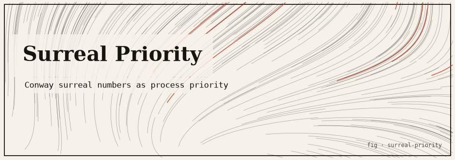

# Surreal Priority

> Conway's surreal numbers as OS-style process priorities — one ordered number line holding
> `1/ω`, every dyadic fraction, and `ω` at once, driving a deterministic scheduler simulation.

Priorities are usually plain integers, which forces awkward hacks whenever you want a task that
*always* wins or a task that runs *only* when nothing else can. **Surreal Priority** replaces the
integer with an element of a real, honest slice of John Conway's surreal number line, so
"infinitely important" and "infinitesimally important" become first-class, comparable values —
and a tiny scheduler simulation shows the ordering doing useful work.

---

## TL;DR

- A `Priority` is `p = a·ω + b + c·(1/ω)` where `a`, `b`, `c` are **dyadic rationals** (`n / 2^k`).
- This is a genuine ordered subgroup of the surreals: `1/ω < 1 < ω < 2ω`, and `ω` beats every
  finite priority while `1/ω` sits below every positive finite one yet stays strictly positive.
- A deterministic, **OS-free** scheduler picks the highest-priority runnable task each tick. An
  `ω` task starves all finite tasks until done; a `1/ω` task is a perfect idle/best-effort band.
- Pure Rust, **zero dependencies**, `#![forbid(unsafe_code)]`, 16 passing tests. All ordering is
  exact integer arithmetic — no floating point in any comparison.

```bash
cargo test    # 16 tests: dyadic arithmetic, surreal ordering, scheduler behaviour
cargo run     # prints the ordering table, then a scheduler run
```

---

## The idea: surreal numbers

**Surreal numbers** were discovered by John H. Conway and popularized in Donald Knuth's 1974
novella *Surreal Numbers*. Every surreal is a pair `x = { L | R }` of sets of
previously-constructed surreals, subject to the rule that no member of `L` is `≥` any member of
`R`. From that single recursive definition, built up over "days", you get an astonishingly rich
totally-ordered field:

| Day | What is born | Examples |
| --- | --- | --- |
| Day 0 | zero | `0 = { \| }` |
| Finite days | every **dyadic rational** `n / 2^k` | `1 = {0\|}`, `-2`, `1/2 = {0\|1}`, `3/4` |
| Day `ω` | the first infinite number and its reciprocal | `ω = {0,1,2,3,…\|}`, `1/ω = {0\|1,1/2,1/4,…}` |

The magic is that finites, infinities (`ω`, `ω+1`, `2ω`, `ω²`, …), and infinitesimals (`1/ω`,
`2/ω`, …) all live on **one** number line with **one** ordering. That is exactly what you want if
you would like a scheduler priority to be able to say "beats literally everything finite" or
"loses to literally everything positive and finite" without inventing special-case flags.

The name of this project is the whole joke made literal: give the scheduler *surreal* priorities.

---

## The honest core

### The real mathematics

Full surreal numbers form a proper class defined by transfinite recursion — far more than a
scheduler needs. This project implements exactly the piece scheduling uses and is explicit about
the boundary. A priority is the element

```
    p = a·ω + b + c·(1/ω),      a, b, c ∈ dyadic rationals
```

This is a *faithful* sub-structure of the surreals: the lexicographically ordered group of
**Hahn series** supported on the three powers `{ ω¹, ω⁰, ω⁻¹ }`. Ordering "most significant order
first" reproduces the surreal order exactly on this subset:

```
    … < 1/ω < (any positive dyadic) < … < ω < ω+1 < 2ω < …
```

Concretely:

- **Comparison** is lexicographic on the coefficient triple `(a, b, c)`:

  ```
  compare(p, q) = cmp(a_p, a_q)  then  cmp(b_p, b_q)  then  cmp(c_p, c_q)
  ```

  So the infinite order dominates first, then the finite part breaks ties, then the
  infinitesimal part. This is a genuine **total order** — the tests check antisymmetry across a
  mixed ascending sample.

- **Addition and negation** are component-wise, and the subgroup is closed under both:

  ```
  p + q = (a_p+a_q)·ω + (b_p+b_q) + (c_p+c_q)·(1/ω)
   -p   = (-a_p)·ω + (-b_p) + (-c_p)·(1/ω)
  ```

- **Dyadic coefficients** are stored canonically as `num / 2^den_pow` with every shared factor of
  two removed, so equal values compare equal. Comparison cross-multiplies over the common
  denominator `2^max(k₁,k₂)` using integer shifts, and addition adds over that same denominator —
  **no floating point ever touches the ordering path**. (`Dyadic::to_f64` exists for display
  only.)

### What is real vs. simulated vs. theatrical

| Layer | Status | Notes |
| --- | --- | --- |
| Surreal ordering / arithmetic | **Real, exact** | A faithful Hahn-series slice of Conway's surreals; all comparisons are exact `i128` integer math. |
| The scheduler | **Simulated** | A pure in-memory model. It never touches the real OS scheduler, spawns no processes, and makes no privileged syscalls. |
| Anything else | **None** | No theatrics, no fake side effects, no external I/O. |

The scheduler is a faithful *demonstration* of what the ordering buys you, not a real kernel
scheduler. The surreal math underneath it, however, is the honest article.

### What is deliberately left out

- Surreal **multiplication** (only the additive group is implemented — enough to order and
  combine priorities).
- Higher powers of omega (`ω²`, `√ω`, fractional exponents) and general transfinite birthdays.
- The raw `{ L | R }` set machinery. The equivalent coefficient / Hahn-series representation is
  used instead, which is faithful for this subset.

Arithmetic uses `i128` numerators, so extreme coefficients could overflow — fine for a prototype
and far outside any realistic priority range.

---

## How it works

### Crate map

The crate ships both a library (`surreal_priority`) and a binary (`surreal-priority`).

| File | Role | Highlights |
| --- | --- | --- |
| `src/lib.rs` | Module wiring + crate docs | Declares `dyadic`, `surreal`, `scheduler`; `#![forbid(unsafe_code)]`. |
| `src/dyadic.rs` | Dyadic rationals `n / 2^k` — the coefficient ring | `Dyadic` type, `normalize`, exact `compare`/`Add`/`Neg`/`Sub`, `inv_pow2`, `to_f64` (display only). |
| `src/surreal.rs` | The priority subgroup `a·ω + b + c/ω` | `Priority`, `Term` builder enum, lexicographic `compare`, component-wise `Add`/`Neg`/`Sub`, `Ord`/`Display`. |
| `src/scheduler.rs` | Deterministic, OS-free scheduler simulation | `Task`, `ScheduleEntry`, `Scheduler` with `pick`/`step`/`run`; immutable task updates. |
| `src/main.rs` | Demo entry point | Prints the ordering table, then runs the scheduler; also `#![forbid(unsafe_code)]`. |

No third-party dependencies (`Cargo.lock` contains only this crate). No `unsafe` anywhere.

### Key types & algorithms

- **`Dyadic { num: i128, den_pow: u32 }`** — invariant: if `num != 0` then `num` is odd (all
  factors of two removed by `normalize`). `compare` and `add` bring both operands to the common
  denominator `2^max(k₁,k₂)` with left shifts, keeping arithmetic exact.
- **`Priority { omega, finite, inv_omega: Dyadic }`** — immutable; every operation returns a new
  value. Built directly (`Priority::omega`, `::integer`, `::inv_omega`, `::finite`) or from a list
  of `Term { Finite, Omega{scale}, InvOmega{scale} }` via `Priority::from_terms`, e.g.
  `2·ω + 3 + 1/ω`. Implements `Ord` so priorities drop straight into comparisons and sorts.
- **`Scheduler::pick`** — scans runnable tasks and returns the index of the greatest surreal
  priority; ties break by original task order, so runs are fully reproducible.
- **`Scheduler::step`** — runs the picked task for `min(quantum, remaining)` work, records an
  immutable `ScheduleEntry`, and swaps in an updated task copy (no in-place mutation). `run`
  loops `step` until nothing is runnable or a `max_ticks` safety cap is hit.

Because `ω` dominates every finite priority and `1/ω` is dominated by every positive finite
priority, strict-priority scheduling with an infinite "must-run-first" band and an infinitesimal
"idle-only" band falls out of the ordering itself — with **no special-case code** in the
scheduler.

---

## Install & run

Requires a Rust toolchain (`cargo`). Developed and verified with **Rust 1.94.0**.

```bash
# from the repository
cd surreal-priority

cargo build     # compile (add --release for the opt-level=3 profile)
cargo test      # run the 16 unit tests
cargo run       # run the demo: ordering table + scheduler simulation
```

### `cargo run` (captured output)

```text
== Surreal priority ordering ==
ascending priorities:
  1/omega    = 1/w
  1/2        = 1/2
  1          = 1
  3          = 3
  omega + 1  = 1w + 1
  2*omega    = 2w
checks:
  1/omega < 1      : true
  1      < omega   : true
  omega  < 2*omega : true
  omega  > 1000000 : true

== Scheduler simulation ==
tasks (priority, work, quantum):
  render[omega]    prio=1w work=4 quantum=1
  ui[3]            prio=3 work=3 quantum=1
  sync[1]          prio=1 work=2 quantum=1
  gc[1/omega]      prio=1/w work=2 quantum=1

schedule:
  tick  task              prio      ran  remaining
     0  render[omega]     1w          1          3
     1  render[omega]     1w          1          2
     2  render[omega]     1w          1          1
     3  render[omega]     1w          1          0
     4  ui[3]             3           1          2
     5  ui[3]             3           1          1
     6  ui[3]             3           1          0
     7  sync[1]           1           1          1
     8  sync[1]           1           1          0
     9  gc[1/omega]       1/w         1          1
    10  gc[1/omega]       1/w         1          0

observations:
  - render[omega] runs ticks 0..3 back-to-back: an infinite
    priority starves every finite task until it is done.
  - gc[1/omega] runs last: an infinitesimal priority only gets
    the CPU once nothing else is runnable.
```

Display convention: `w` prints for `omega`, so `1w` means `ω`, `2w` means `2ω`, and `1/w` means
`1/ω`.

### `cargo test` (captured output)

```text
running 16 tests
test dyadic::tests::addition_and_subtraction ... ok
test dyadic::tests::normalization_removes_factors_of_two ... ok
test dyadic::tests::ordering ... ok
test scheduler::tests::all_work_completes ... ok
test surreal::tests::addition_is_componentwise_and_commutative ... ok
test scheduler::tests::run_terminates_at_cap ... ok
test scheduler::tests::inv_omega_task_runs_last ... ok
test scheduler::tests::omega_task_starves_finite_tasks_until_done ... ok
test surreal::tests::canonical_ordering_of_omega_one_and_inv_omega ... ok
test surreal::tests::equality_ignores_construction_order ... ok
test surreal::tests::infinite_dominates_all_finites ... ok
test surreal::tests::infinitesimal_below_every_positive_finite ... ok
test surreal::tests::linear_combinations_order_lexicographically ... ok
test surreal::tests::negation_cancels ... ok
test surreal::tests::total_order_is_antisymmetric ... ok
test surreal::tests::two_omega_beats_omega ... ok

test result: ok. 16 passed; 0 failed; 0 ignored; 0 measured; 0 filtered out; finished in 0.00s
```

(Test order varies run-to-run because tests execute in parallel.)

---

## Testing

The 16 tests are unit tests living in `#[cfg(test)]` modules alongside the code they cover. What
they actually verify:

**`dyadic.rs`**
- `normalization_removes_factors_of_two` — `2/4 == 1/2`, `4/4 == 1`, `0/8 == 0` all canonicalize.
- `addition_and_subtraction` — `1/2 + 1/4 == 3/4`, `3/4 − 1/4 == 1/2`, and `a + (−a) == 0`.
- `ordering` — `1/4 < 1/2`, `3 > 3/2`, `−1 < 0`.

**`surreal.rs`**
- `canonical_ordering_of_omega_one_and_inv_omega` — the headline `1/ω < 1 < ω`.
- `infinite_dominates_all_finites` — `ω > 1,000,000`.
- `two_omega_beats_omega` — `2ω > ω`.
- `infinitesimal_below_every_positive_finite` — `1/ω < 1/2²⁰` yet `1/ω > 0`.
- `linear_combinations_order_lexicographically` — `ω+1 < ω+2`, and `ω+1000 < 2ω`.
- `addition_is_componentwise_and_commutative` — component sums and `p+q == q+p`.
- `negation_cancels` — `p + (−p) == 0` for a mixed priority.
- `equality_ignores_construction_order` — building `1 + ω` vs `ω + 1` yields equal values.
- `total_order_is_antisymmetric` — over the ascending sample `0 < 1/ω < 1 < 3 < ω < 2ω`, every
  pairwise comparison agrees with index order (a real total-order check).

**`scheduler.rs`**
- `omega_task_starves_finite_tasks_until_done` — an `ω` task takes the first three ticks
  back-to-back before any finite task runs.
- `inv_omega_task_runs_last` — a `1/ω` idle task runs only after the finite task drains.
- `all_work_completes` — a mixed `ω / finite / 1/ω` task set all reaches `remaining == 0`.
- `run_terminates_at_cap` — the `max_ticks` safety cap is respected (log length equals the cap).

Run subsets with the usual cargo filters, e.g. `cargo test surreal::` or
`cargo test --lib -- --nocapture`.

---

## Limitations & honest caveats

- **The scheduler is a simulation.** It does not schedule real threads or processes and makes no
  syscalls. It is a teaching model for the ordering.
- **Only the additive group is implemented.** No surreal multiplication, no `ω²` or fractional
  omega powers, no `{ L | R }` birthdays. The implemented slice is faithful but small.
- **`i128` overflow is possible** for pathological coefficients; there is no checked-arithmetic
  guard. This is outside any realistic priority range but worth knowing.
- **Ties are resolved by task order, not by any surreal tie-break.** Equal priorities fall back to
  first-declared-wins for determinism.
- **`to_f64` is display-only** and must never be used for ordering; floating point would break the
  exactness guarantees.

---

## References / attribution

- J. H. Conway, *On Numbers and Games* (1976) — the original surreal construction.
- D. E. Knuth, *Surreal Numbers* (1974) — the gentle narrative introduction that named them.
- H. Gonshor, *An Introduction to the Theory of Surreal Numbers* (1986) — the rigorous treatment,
  including the Hahn-series / normal-form view this project's representation mirrors.

License: MIT (see `Cargo.toml`).
