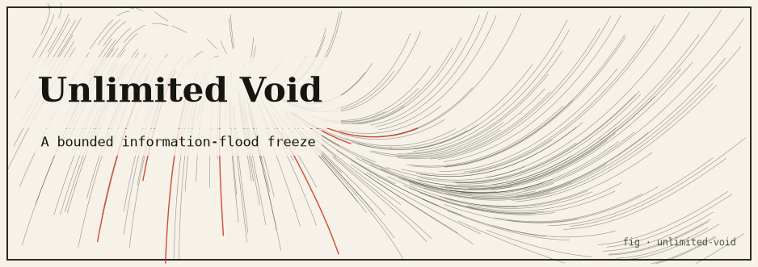

# Unlimited Void — as a Container Runtime (simulation)

**A bounded simulation of "shown infinity, unable to act": a privileged caster process opens a domain over victim processes and floods each with an overwhelming — but entirely virtual — stream of information, collapsing their useful throughput to ~0 while it stays immune.**

Concept & reference: Satoru Gojo's Domain Expansion **"Unlimited Void"** from *Jujutsu Kaisen* — victims are fed an infinite stream of information they cannot process, so they freeze for as long as the domain is open, while the caster is immune. This project reframes that as a container-runtime primitive and is scrupulously honest that it is a model.

> **This is a bounded SIMULATION, not a real denial-of-service tool.** No real memory is exhausted, no real CPU is flooded, no fork bombs are spawned, and no real logs are flooded. "Infinity" is represented entirely as integer counters (integer accounting). See [Safety model](#safety-model).

---

## TL;DR

- Each "process" is a goroutine-actor with a **finite attention budget** per tick — the number of virtual info units it can attend to in one step.
- **Normal tick**: useful tasks arrive (below budget) and complete, so the process does useful work every tick.
- **Domain Expansion**: the caster floods every victim with `FloodPerTick = maxVictimBudget × 1000` virtual units. Because the flood dwarfs the budget, all attention goes to perceiving the flood and useful throughput drops to **0**.
- **Immunity**: the caster is never a victim of its own domain and keeps working.
- **Domain close**: the flood was an illusion, so it vanishes — each victim's virtual queue resets to 0 and throughput recovers on the very next tick.
- The "infinity" is never allocated: the backlog is a single integer capped at `QueueCap = 10,000`; everything past the cap is added to an `Overflow` counter. Runs clean under `-race`.

---

## The idea

The prompt behind this project sounds dangerous ("open a domain that paralyzes other processes"), and the entire point of the implementation is that it is **safe**. The mechanism being modeled is a real, well-understood systems phenomenon: a worker with a finite processing budget per unit time can be starved of useful work if it is forced to spend all of that budget on an overwhelming inbound stream — livelock by attention exhaustion. "Unlimited Void" is a vivid metaphor for exactly that.

Rather than actually flood anything (which would be a DoS), the simulation represents the flood as arithmetic: a growing integer. You can watch victims flatline, the caster stay unaffected, and everyone recover the instant the domain closes — all without exhausting a single real resource.

---

## The systems core (honest description)

Each process has a finite per-tick **attention budget**. The honest model:

- **Normal tick** (`Process.tickNormal`): attention first drains any lingering virtual backlog, then completes useful tasks (`UsefulInflow`, kept below the budget) with whatever attention remains — so a healthy process does useful work every tick.
- **Domain Expansion** (`Domain.Expand`): the caster floods every victim with `FloodPerTick` virtual info units, where `FloodPerTick = maxVictimBudget × FloodMultiplier` and `FloodMultiplier = 1000`. Because the flood dwarfs the budget, **all** of a victim's attention is spent perceiving the flood (`Process.tickFlooded`), and useful-work throughput drops to **~0**.
- **Immunity**: the caster is never in its own victim set, so it runs `tickNormal` and keeps working.
- **Domain close** (`Domain.Close`): the flood was an illusion, so it vanishes — each victim's `VirtualQueue` is dispelled to 0 and throughput recovers on the next tick. `Overflow` counters are kept as a historical record of how much "infinity" was shown.

Ticks are driven concurrently: on every step the orchestrator fans a tick out to one goroutine per actor (`sim.go`), waits on a `WaitGroup`, then prints. Each actor mutates only its own state, so the model is race-free (verified with `go run -race .`).

### The one piece of real math

`FloodPerTick = maxVictimBudget × 1000`. With the strongest victim budget = 120, `FloodPerTick = 120,000`. Each victim's budget is ~80–120/tick, so the flood exceeds attention by a factor of ~1000×–1500×; the residual attention available for useful work is `max(0, budget − perceived) = 0`. That is the whole "shown infinity, cannot act" effect, expressed as an inequality: `flood ≫ budget ⇒ useful throughput → 0`.

---

## Safety model

The whole point of the prompt is danger; the whole point of this code is that it is **safe**:

- The victim's backlog is a single integer `VirtualQueue`, **capped** at `QueueCap = 10,000`. Anything beyond the cap is added to an `Overflow` counter (a number) instead of being stored. **The model never holds "infinity" in memory — it holds a growing integer.**
- `injectFlood` never allocates memory proportional to the flood size; it only updates counters (`VirtualQueued += units`, then cap-and-overflow arithmetic).
- No unbounded goroutines: exactly **one goroutine per actor per tick**, joined via a `WaitGroup` before the next tick. Nothing spawns recursively.
- No real I/O flooding, no host resource exhaustion, no sockets, no `os/exec`.

This is integer accounting that *depicts* a flood; it is not a flood.

---

## How it works

### File map (single `main` package)

| File | Responsibility |
|------|----------------|
| `process.go` | `Process` actor: attention budget, virtual queue, counters, `tickNormal`/`tickFlooded`/`injectFlood`, `QueueCap` |
| `domain.go`  | `Domain` (Unlimited Void): `Expand`/`Close`, `FloodPerTick`, `FloodMultiplier`, victim membership |
| `sim.go`     | Orchestration: concurrent goroutine-actor ticks (`step`), per-tick printing, `NewSimulation` |
| `metrics.go` | Per-phase throughput measurement (`snapshot`, `measurePhase`, `printPhaseTable`) |
| `main.go`    | Demo: normal → Unlimited Void → recovery, plus the virtual-flood summary |

### The demo phases (`main.go`)

1. **Phase 1 — normal operation** (`warmupTicks = 5`): everyone does useful work.
2. **Phase 2 — Unlimited Void open** (`domainTicks = 8`): victims are flooded; caster immune.
3. **Phase 3 — recovery** (`recoveryTicks = 6`): domain closed; victims recover.

Throughput is measured *within* each phase by snapshotting `UsefulWork` at the phase boundary (`measurePhase`).

### Actors (`NewSimulation`)

| process | budget/tick | useful inflow/tick | role |
|---------|------------:|-------------------:|------|
| gojo (caster) | 100 | 80 | caster (immune) |
| worker-a | 100 | 80 | victim |
| worker-b | 120 | 90 | victim |
| worker-c | 80 | 60 | victim |

The strongest victim budget is 120, so `FloodPerTick = 120 × 1000 = 120,000`.

---

## Install & run

Requires **Go 1.24+**. No third-party dependencies.

```bash
cd unlimited-void
go build ./...      # compile
go vet ./...        # static checks (clean)
go run .            # run the demo
go run -race .      # run with the race detector (clean)
```

There are no `_test.go` files (see [Testing](#testing)).

### Captured sample output (abridged)

Per-tick snapshot — `*` = caster, `!` = flooded victim, `q` = capped virtual queue, `ovf` = overflow counter:

```
Unlimited Void :: Container Runtime Simulation
(bounded, virtual attention model — NOT a real DoS)

--- Phase 1: normal operation ---
[t=05 normal    ] * gojo (caster) work=400   q=0      ovf=0         |   worker-a      work=400   q=0      ovf=0         |   worker-b      work=450   q=0      ovf=0         |   worker-c      work=300   q=0      ovf=0         |
--- Phase 2: Unlimited Void open ---

>>> DOMAIN EXPANSION: UNLIMITED VOID  (caster: gojo (caster))
    Victims are shown infinity: 120000 virtual info units / tick vs. budgets ~120/tick.

[t=06 VOID      ] * gojo (caster) work=480   q=0      ovf=0         | ! worker-a      work=400   q=9900   ovf=110000    | ! worker-b      work=450   q=9880   ovf=110000    | ! worker-c      work=300   q=9920   ovf=110000    |
[t=13 VOID      ] * gojo (caster) work=1040  q=0      ovf=0         | ! worker-a      work=400   q=9900   ovf=949300    | ! worker-b      work=450   q=9880   ovf=949160    | ! worker-c      work=300   q=9920   ovf=949440    |

<<< DOMAIN CLOSED  (caster: gojo (caster)). The flood vanishes; victims recover throughput.

--- Phase 3: recovery ---
[t=14 recover   ] * gojo (caster) work=1120  q=0      ovf=0         |   worker-a      work=480   q=0      ovf=949300    |   worker-b      work=540   q=0      ovf=949160    |   worker-c      work=360   q=0      ovf=949440    |
```

### Throughput tables (victims flatline while the domain is open; caster unaffected; victims recover after close)

**Phase 1 — normal operation**

| process | role | work/tick | work(total) | budget/tick |
|---------|------|-----------|-------------|-------------|
| gojo (caster) | caster | 80.0 | 400 | 100 |
| worker-a | victim | 80.0 | 400 | 100 |
| worker-b | victim | 90.0 | 450 | 120 |
| worker-c | victim | 60.0 | 300 | 80 |

**Phase 2 — Unlimited Void open** (victims shown infinity)

| process | role | work/tick | work(total) | budget/tick |
|---------|------|-----------|-------------|-------------|
| gojo (caster) | caster | 80.0 | 640 | 100 |
| worker-a | victim | **0.0** | **0** | 100 |
| worker-b | victim | **0.0** | **0** | 120 |
| worker-c | victim | **0.0** | **0** | 80 |

**Phase 3 — recovery** (domain closed)

| process | role | work/tick | work(total) | budget/tick |
|---------|------|-----------|-------------|-------------|
| gojo (caster) | caster | 80.0 | 480 | 100 |
| worker-a | victim | 80.0 | 480 | 100 |
| worker-b | victim | 90.0 | 540 | 120 |
| worker-c | victim | 60.0 | 360 | 80 |

**Virtual flood accounting** (nothing was actually allocated)

| process | virt-injected | queue-capped | overflow |
|---------|---------------|--------------|----------|
| gojo (caster) | 0 | 0 | 0 |
| worker-a | 960000 | 0 | 949300 |
| worker-b | 960000 | 0 | 949160 |
| worker-c | 960000 | 0 | 949440 |

Each victim had ~960,000 virtual units "injected" over 8 ticks (`8 × 120,000 = 960,000`), but the stored queue never exceeded `QueueCap = 10,000`; the rest is just the `overflow` integer. That is how the simulation shows "infinity" without ever allocating it.

---

## Testing

**There are no automated tests** (`go test ./...` reports `[no test files]`). The project is validated by:

- `go build ./...` — compiles clean.
- `go vet ./...` — static analysis, clean.
- `go run -race .` — the demo runs clean under the **race detector**, which is the meaningful correctness check here since the actors are driven concurrently (one goroutine per actor per tick, joined by a `WaitGroup`; each actor mutates only its own state).

If you want to extend this, natural unit-test targets are `Process.injectFlood` (cap-and-overflow arithmetic), `tickNormal`/`tickFlooded` (throughput invariants), and `Domain.Close` (queue reset).

---

## Tuning

Edit the constants:

- `warmupTicks`, `domainTicks`, `recoveryTicks` in `main.go` — phase lengths.
- `FloodMultiplier` in `domain.go` — how overwhelming the flood is.
- `QueueCap` in `process.go` — the modeled backlog cap.
- Process budgets / inflows in `NewSimulation` (`sim.go`).

---

## Limitations & honest caveats

- **It depicts a flood; it is not one.** No real resource is consumed. "Infinity" is a growing `Overflow` integer, and the stored backlog is capped at 10,000. This is deliberately not a DoS tool.
- **The throughput collapse is a modeling assumption**, not an emergent measurement: when `flood ≫ budget`, `tickFlooded` leaves zero residual attention by construction, so useful work is exactly 0. It illustrates attention exhaustion; it does not benchmark a real runtime.
- **Recovery is instantaneous** because the illusion "vanishes" — a real overloaded system would have to drain a genuine backlog. Here the queue is simply reset to 0 on close.
- **No real scheduling, isolation, or containers.** `Process` is a struct of counters; the "container runtime" framing is a metaphor.

---

## References

- Domain Expansion / "Unlimited Void" (*Jujutsu Kaisen*) — https://jujutsu-kaisen.fandom.com/wiki/Unlimited_Void
- Livelock (starvation under overwhelming input) — https://en.wikipedia.org/wiki/Deadlock#Livelock
- Denial-of-service attack (what this deliberately is **not**) — https://en.wikipedia.org/wiki/Denial-of-service_attack
- Go race detector — https://go.dev/doc/articles/race_detector
- `sync.WaitGroup` — https://pkg.go.dev/sync#WaitGroup
