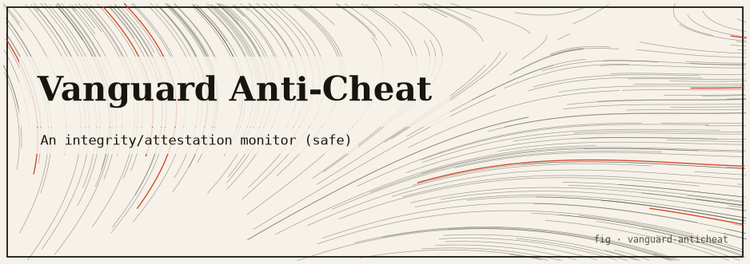

# Vanguard Anti-Cheat — a *safe, userspace* integrity monitor

> A deliberately honest, zero-kernel parody/reimagining of a game anti-cheat: it demonstrates the
> *defensible* techniques a system like Riot's **Vanguard** uses — signed integrity manifests,
> process attestation, and anti-replay heartbeats — **entirely in safe userspace, over a sandbox
> the tool creates and owns.** No kernel driver. No ring-0. No foreign-process snooping.

---

## TL;DR

`vanguard` is a small, **zero-dependency** Rust program (one binary + one library) that shows the
"honest subset" of anti-cheat engineering without any of the invasive machinery the name evokes.
When you run it, it:

1. Copies this repo's `assets/` into a fresh temp **sandbox it owns**, then builds an
   **HMAC-signed SHA-256 manifest** of those files.
2. Re-scans the sandbox and reports it **clean**.
3. **Tampers** with the sandbox (modify + add + remove one file each) and detects all three changes.
4. Verifies the manifest's **own signature** survives, and rejects a silently-edited manifest.
5. Spawns **its own child process** and **attests** it (alive + binary hash matches), then confirms
   it reports *exited* after termination.
6. Runs a **challenge/response heartbeat** with a rolling HMAC and rejects both a **replayed** and a
   **forged (wrong-key)** message.

Everything is pure, safe Rust: SHA-256 (FIPS 180-4) and HMAC-SHA256 (RFC 2104) are implemented from
scratch so the whole thing builds and runs fully offline. `#![forbid(unsafe_code)]` is enforced at
the crate root.

```bash
cargo run --manifest-path /path/to/vanguard-anticheat/Cargo.toml   # runs the full demo
```

---

## ⚠️ SAFETY — READ THIS FIRST

**This is NOT a kernel anti-cheat. Despite the name, it installs nothing, loads nothing, and touches
nothing you did not hand it.** The name is a knowing reference to Riot Vanguard; the code is the
*opposite* of that model — it is a transparent, consent-based, userspace demonstration.

Confirmed against the actual source, this program **does NOT**:

| ❌ It does **not**… | Evidence in source |
| --- | --- |
| Install a **kernel driver** or run at **ring-0** | Pure userspace binary; `#![forbid(unsafe_code)]` in `src/lib.rs`; no FFI, no OS driver APIs anywhere |
| Load any **kernel module** or system extension | No such calls exist; the crate has **zero dependencies** (`Cargo.toml`) |
| **Read, write, or scan another process's memory** | `src/process.rs` only calls `Child::try_wait` / `Child::kill` on a handle it owns |
| Attach to, debug, or anti-debug **arbitrary PIDs** | It never looks up a PID; it retains the `std::process::Child` it spawned itself |
| Touch **files it did not create** | `src/manifest.rs` only walks a sandbox directory passed to it; the demo seeds that from a temp copy of `assets/` |
| Perform **stealth, evasion, rootkit, or telemetry** behavior | No network code, no hiding, no persistence — the whole run is printed to stdout |

Everything it does is confined to **two things it exclusively owns**:

- ✅ a **sandbox directory the tool itself creates** in your temp dir (seeded by copying this repo's
  `assets/`), which it deletes on exit; and
- ✅ a **child process the tool itself spawns** — a subcommand of this very binary — tracked through
  a process handle it holds the entire time.

The demo signing keys in `src/main.rs` are clearly labeled throwaway values
(`b"vanguard-demo-signing-key-not-a-real-secret"`) and must never be treated as real secrets. Do not
use this code as a base for surveilling users or processes you do not own — that is explicitly what
it refuses to do.

---

## The idea

**Riot Vanguard** (the real one, shipped with *Valorant* and *League of Legends*) is a
**kernel-level** anti-cheat: it installs a signed **ring-0 driver** that loads at boot and runs
continuously, giving it deep, privileged visibility into the operating system so it can detect
cheats that hide in kernel space. That power is exactly why it is controversial — an always-on
kernel driver raises real **privacy, security, and trust** concerns (broad system access, boot-time
persistence, and the attack surface of privileged code).

This project is a **deliberately safe reimagining** of that concept. It asks: *which anti-cheat
techniques are legitimate, transparent, and safe enough to implement in plain userspace — and can we
demonstrate them without any of the invasive parts?* The answer it builds out is a trio of
well-understood, defensible primitives:

- **Content attestation** — cryptographically fingerprint the files you care about and detect
  tampering later.
- **Process attestation** — verify that a process you launched is still the one you launched, backed
  by the binary you trusted.
- **Anti-replay challenge/response** — prove liveness over a channel where old or forged messages are
  rejected.

None of those require a kernel driver. This repo implements all three in safe Rust, over a sandbox it
owns, and narrates each step so you can see exactly what it does.

---

## The honest core — what really happens

When you run the demo, the program executes a fixed, scripted end-to-end scenario (`run_demo()` in
`src/main.rs`). Here is what is **real**, what is **simulated**, and what is **theatrical**:

| Aspect | Status | Detail |
| --- | --- | --- |
| SHA-256 hashing of files | **Real** | Genuine FIPS 180-4 implementation (`src/sha256.rs`), verified against known test vectors |
| HMAC-SHA256 signing/verification | **Real** | Genuine RFC 2104 construction (`src/hmac.rs`), verified against RFC 4231 vectors |
| Tamper detection (modified/added/removed) | **Real** | Actual filesystem diff against the signed manifest (`src/manifest.rs`) |
| Manifest self-signature check | **Real** | Recomputes the HMAC over a canonical body and compares in constant time |
| Process liveness/attestation | **Real** | Uses the real `Child` handle from `std::process` and re-hashes the on-disk binary |
| Anti-replay counter + rolling HMAC chain | **Real** | Server enforces a strictly-increasing counter and folds each accepted tag into the next |
| The "game" being protected | **Simulated** | `assets/` holds a tiny fake `config.cfg`, `textures.pak`, and `init.lua`; the "game" child is just an idle sleep loop (`game-loop`) |
| The "attacker" | **Theatrical** | The tamper step, the replayed heartbeat, and the wrong-key forgery are all staged by the demo itself to show the checks firing |
| Nonce randomness | **Simulated** | Nonces come from a **SplitMix64** PRNG (`src/heartbeat.rs`) seeded from the clock — fine for a local demo, **not** cryptographically strong |

**Contrast with the real kernel-driver anti-cheat:** the genuine Vanguard sees the *whole system*
from ring-0 and runs whether you asked it to or not. This tool sees *only a temp folder and a child
it spawned*, runs *only while you invoke it*, and prints *everything it does*. The cryptographic
building blocks are real and correct; the "game", the "cheater", and the adversarial events are a
staged demonstration so you can watch each defense succeed.

---

## How it works

### Module / crate map

The crate ships **both** a library (`vanguard`) and a binary (`vanguard`). The library holds the
reusable primitives; the binary is a thin demo driver plus the internal `game-loop` child.

| File | Role | Key items |
| --- | --- | --- |
| `src/lib.rs` | Crate root; declares modules and `#![forbid(unsafe_code)]` | re-exports `heartbeat`, `hmac`, `manifest`, `process`, `report`, `sha256` |
| `src/main.rs` | Demo driver + internal child process | `main()`, `run_demo()`, `run_game_loop()`, `make_sandbox()`, `tamper()` |
| `src/sha256.rs` | Pure-Rust streaming SHA-256 (FIPS 180-4) | `Sha256` (streaming), `hash()`, `to_hex()` |
| `src/hmac.rs` | HMAC-SHA256 (RFC 2104) + timing-safe compare | `hmac_sha256()`, `constant_time_eq()` |
| `src/manifest.rs` | Signed integrity manifest: build / serialize / scan / verify | `Manifest`, `Entry`, `hash_file()` |
| `src/process.rs` | Attestation of the tool's OWN spawned child | `GameProcess`, `AttestOutcome` |
| `src/heartbeat.rs` | Rolling-HMAC challenge/response, anti-replay | `Server`, `Client`, `Challenge`, `Heartbeat`, `Outcome` |
| `src/report.rs` | Change kinds + human-readable tamper log | `ScanReport`, `Change`, `ChangeKind` |

### Key types & algorithms

**Integrity manifest (`manifest.rs`).** `Manifest::build` recursively walks the sandbox root
(symlinks and special files are skipped), streams each file through SHA-256 in **8 KiB chunks** (so
large files are never loaded fully into memory), and records `(rel_path, size, sha256_hex)` entries
**sorted by path**. It then serializes a **canonical body** (fixed field order, sorted entries) and
signs it with **HMAC-SHA256**. This canonical form is the crux of reproducibility: verification
recomputes the exact same bytes, so the MAC is deterministic. `Manifest::scan` re-walks the root and
diffs it against the trusted entries using `BTreeMap`s, producing `Modified` / `Added` / `Removed`
findings. `verify_signature` defends the manifest file itself — a silently edited hash changes the
canonical body, so the recomputed HMAC no longer matches (compared via `constant_time_eq`).

**Process attestation (`process.rs`).** `GameProcess::launch` records the trusted binary hash at
launch time and keeps the `std::process::Child` handle. `attest()` re-hashes the on-disk binary
(catching a `BinaryTampered` mismatch) and uses the **non-blocking** `Child::try_wait` to distinguish
`Ok { pid }` (alive) from `Exited`. Crucially, it never resolves a PID from the OS — it only ever
consults the handle it owns, which is the structural guarantee that it "cannot touch processes it did
not create."

**Heartbeat anti-replay (`heartbeat.rs`).** A `Server` issues a `Challenge` (monotonic `counter` +
16-byte nonce from a **SplitMix64** PRNG). A `Client` answers with
`tag = HMAC(key, counter || nonce || prev_tag)`, folding the previous accepted tag into a **rolling
chain**. `Server::verify` rejects on three grounds: `RejectedStaleCounter` (counter not strictly
increasing — this is what kills a replay), `RejectedBadNonce` (nonce doesn't match the issued
challenge), and `RejectedBadMac` (tag fails the constant-time MAC check — this is what kills a
wrong-key forgery).

**Cryptographic primitives (`sha256.rs`, `hmac.rs`).** SHA-256 is a full streaming implementation
with the standard message schedule and compression rounds, exposed as an incremental `Sha256` hasher
plus a one-shot `hash()`. HMAC-SHA256 follows RFC 2104 (key normalization, ipad/opad). MAC and hash
comparisons use `constant_time_eq` to avoid trivial timing side channels.

**Safety posture.** `#![forbid(unsafe_code)]` at the crate root (`src/lib.rs`) makes any `unsafe`
block a compile error, and the crate has **zero external dependencies** (`Cargo.toml`), so the entire
trust surface is the code in this repo.

---

## Install & run

**Requirements:** Rust + Cargo (developed and tested with Cargo 1.94). No network access required.

The binary exposes two commands via positional args (there is intentionally no arg-parsing crate):

| Command | Purpose |
| --- | --- |
| `vanguard` / `vanguard demo` | Run the full end-to-end demo (default when no argument is given) |
| `vanguard game-loop <ms>` | **Internal** — the tool's own idle "game" child, launched by the attestation step; you normally won't call it directly. `<ms>` defaults to `1500` |

> Note: there is no `--help` flag. Any unrecognized argument prints a short usage line and exits with
> code `2` (see the captured output below).

### Build

```bash
cargo build --manifest-path /path/to/vanguard-anticheat/Cargo.toml
```

```text
   Compiling vanguard-anticheat v0.1.0 (/Users/you/vanguard-anticheat)
    Finished `dev` profile [unoptimized + debuginfo] target(s) in 1.07s
```

### Run the full demo

```bash
cargo run --manifest-path /path/to/vanguard-anticheat/Cargo.toml
```

Captured output from a real run:

```text
Vanguard-style Integrity Monitor — DEFENSIVE / USERSPACE / EDUCATIONAL
This tool only inspects a sandbox it creates and a child it spawns.
No kernel driver. No foreign-process memory scanning. No anti-debugging.

Sandbox (tool-owned): /var/folders/9y/.../T/vanguard_sandbox_1787085759093848000/assets

=== 1. Build signed integrity manifest (trusted snapshot) ===
Hashed 3 asset file(s) with SHA-256:
  config.cfg           113 bytes  483df8b375882db4…
  scripts/init.lua     152 bytes  092f3ace300cd97b…
  textures.pak         305 bytes  c1658edce81ac4b1…
Manifest signed (HMAC-SHA256): 3fd76e86dde5c2a0…
Manifest written to: /var/folders/9y/.../T/vanguard_sandbox_1787085759093848000/vanguard.manifest

=== 2. Re-scan an untampered sandbox ===
Integrity scan: 3 file(s) checked, 0 change(s) detected
  OK: all assets match the trusted manifest.

=== 3. Tamper with the sandbox, then re-scan ===
Applied tampering: modified config.cfg, added cheat.dll, removed textures.pak
Integrity scan: 2 file(s) checked, 3 change(s) detected
  [ADDED] cheat.dll — unexpected file not in trusted manifest
  [MODIFIED] config.cfg — hash 483df8b37588… -> fba34f03df81…
  [REMOVED] textures.pak — file present in manifest is missing on disk

=== 4. Verify the manifest's own signature (defends the manifest) ===
Loaded manifest signature valid with correct key : true
Loaded manifest signature valid with wrong key   : false
Tampered manifest (edited hash) signature valid  : false  <- rejected

=== 5. Process attestation (own child only, never arbitrary PIDs) ===
Launched tool-owned child pid=71969 backed by /Users/you/vanguard-anticheat/target/debug/vanguard
Trusted binary hash: e825d6b79d53ee3e…
  attest #1: OK — pid 71969 alive, binary hash matches
  attest #2: OK — pid 71969 alive, binary hash matches
  attest after terminate: process exited (expected)

=== 6. Heartbeat challenge/response (rolling HMAC anti-replay) ===
  round 1: counter=1 -> Accepted
  round 2: counter=2 -> Accepted
  round 3: counter=3 -> Accepted
  replay of round 1 heartbeat -> RejectedStaleCounter  <- rejected
  forged heartbeat (wrong key) -> RejectedBadMac  <- rejected

=== Summary ===
Integrity: 3 tamper finding(s) detected against the signed manifest.
Manifest signature protects the manifest from silent edits.
Process attestation verified only the child this tool spawned.
Heartbeat rejected both a replayed and a forged message.

Reminder: this is a defensive, educational userspace prototype only.
```

The sandbox path, MAC values, and child PID vary from run to run; everything else is stable.

### Unknown arguments

```bash
cargo run --manifest-path /path/to/vanguard-anticheat/Cargo.toml -- --help
```

```text
unknown command: --help
usage: vanguard [demo | game-loop <ms>]
```

(Exit code `2`.)

### Test

```bash
cargo test --manifest-path /path/to/vanguard-anticheat/Cargo.toml
```

```text
running 16 tests
test heartbeat::tests::tampered_nonce_is_rejected ... ok
test heartbeat::tests::forged_heartbeat_wrong_key_is_rejected ... ok
test hmac::tests::rfc4231_case1 ... ok
test hmac::tests::rfc4231_case2 ... ok
test heartbeat::tests::honest_client_is_accepted ... ok
test hmac::tests::constant_time_eq_works ... ok
test heartbeat::tests::replayed_heartbeat_is_rejected ... ok
test sha256::tests::abc ... ok
test sha256::tests::empty_string ... ok
test sha256::tests::longer_multiblock ... ok
test sha256::tests::streaming_matches_oneshot ... ok
test manifest::tests::clean_scan_has_no_changes ... ok
test manifest::tests::tampered_manifest_fails_signature ... ok
test manifest::tests::manifest_roundtrip_and_signature ... ok
test manifest::tests::detects_modified_added_removed ... ok
test process::tests::attests_own_child_then_sees_exit ... ok

test result: ok. 16 passed; 0 failed; 0 ignored; 0 measured; 0 filtered out; finished in 0.62s
```

---

## Testing

There are **16 unit tests**, all colocated with the code they exercise (`#[cfg(test)]` modules). They
verify the primitives against known-answer vectors and the security properties against staged
attacks:

| Test module | What it verifies |
| --- | --- |
| `sha256::tests` | Empty-string, `"abc"`, and multi-block digests match the published SHA-256 vectors; streaming updates produce the same digest as a one-shot hash |
| `hmac::tests` | HMAC-SHA256 matches **RFC 4231** test cases 1 and 2; `constant_time_eq` returns correct results for equal, differing, and length-mismatched inputs |
| `manifest::tests` | A clean re-scan reports no changes; a modify+add+remove tamper produces exactly the three expected `ChangeKind`s; a manifest round-trips through serialize/deserialize and validates with the right key but not the wrong key; a silently edited hash fails the signature check |
| `process::tests` | A spawned child (`/bin/sleep` on Unix, skipped gracefully if absent) attests as `Ok` while alive and as `Exited` after it finishes — exercising only the owned `Child` handle |
| `heartbeat::tests` | An honest client is accepted across rounds; a replayed heartbeat is rejected (`RejectedStaleCounter`); a wrong-key forgery is rejected (`RejectedBadMac`); a flipped nonce is rejected (`RejectedBadNonce`) |

The `main.rs` demo binary and doctests contribute 0 tests (the demo is validated by running it, and
by an in-demo `assert_eq!` that the forged heartbeat yields `RejectedBadMac`).

---

## Limitations & honest caveats

- **It protects nothing real.** The "game" is three tiny placeholder files and an idle child process.
  This is a teaching artifact, not a shippable anti-cheat.
- **The nonce PRNG is not cryptographically secure.** `SplitMix64` seeded from the wall clock is fine
  for a local demo, but a real protocol needs a CSPRNG.
- **Shared-secret MAC, not a signature.** HMAC proves knowledge of a shared key; it is not a
  public-key signature and provides no non-repudiation. There is no key management, rotation, or
  provisioning — the demo keys are hardcoded and clearly labeled as throwaway.
- **No confidentiality and no network layer.** The heartbeat is an in-process anti-replay
  demonstration, not a wire protocol; nothing is encrypted or actually sent over a socket.
- **Attestation is coarse.** It confirms a child you launched is alive and its on-disk binary is
  unchanged. It does **not** (and by design will not) inspect the child's memory or behavior.
- **Self-implemented crypto.** SHA-256/HMAC are hand-rolled to stay dependency-free and pass their
  test vectors; for anything real, use an audited crate (e.g. `sha2`, `hmac`, `ring`).
- **Timing-safety is best-effort.** `constant_time_eq` avoids the most trivial timing leaks but is
  not a formally constant-time primitive.
- **Filesystem coverage is deliberately narrow.** Symlinks and special files are skipped; only
  regular files under the given root are hashed.

---

## References / attribution

- **Riot Vanguard** — Riot Games' kernel-level anti-cheat, the (controversial) real-world system this
  project references and deliberately *does not* replicate. This repo is an independent, educational
  parody/reimagining; it is not affiliated with, endorsed by, or derived from Riot Games.
- **FIPS 180-4** — Secure Hash Standard (SHA-256), the specification implemented in `src/sha256.rs`.
- **RFC 2104** — HMAC: Keyed-Hashing for Message Authentication, implemented in `src/hmac.rs`.
- **RFC 4231** — HMAC-SHA test vectors, used to validate the HMAC implementation in the test suite.
- **SplitMix64** — the small, fast PRNG used only as a local nonce source in `src/heartbeat.rs`.

## License

MIT (educational sample). See `Cargo.toml`.
