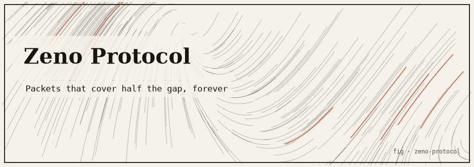

# Zeno's Paradox Transport Protocol

**A toy transport that delivers a message by covering half of the remaining distance on every tick — motion built directly on Zeno of Elea's dichotomy paradox, made to actually complete via an epsilon "close enough" threshold.**

Concept & reference: [Zeno's dichotomy paradox](https://en.wikipedia.org/wiki/Zeno%27s_paradoxes#Dichotomy_paradox). To reach a destination you must first cover half the distance, then half of what remains, then half of *that*, forever — so (Zeno argued) motion is impossible. This project takes the paradox literally as a delivery schedule and is honest about the one place mathematics rescues it. It is a **self-contained, in-process toy** — no network, no sockets, no permissions.

---

## TL;DR

- Position is a normalized value in `[0, 1)`. On tick `k` the sender covers **half the remaining gap**, i.e. `(1/2)^k` of the whole journey.
- Cumulative progress after `k` ticks is a geometric partial sum: `progress(k) = 1 − (1/2)^k`. The residual gap is `residual(k) = (1/2)^k`.
- In exact arithmetic the message **never fully arrives**: for every finite `k`, `progress(k) < 1`.
- To make real payloads land, an **epsilon threshold** accepts delivery once `residual(k) ≤ eps`. The closed form is `k = ceil(log2(1/eps))` — cost grows only *logarithmically* in the precision demanded.
- **Pure-paradox mode** (`eps = 0`) never delivers; the run is capped at `MaxTicks` and reports the residual that always remains.
- Transport is in-process: a sender goroutine emits one packet per tick over a Go channel to the receiver. No dependencies.

---

## The idea

Every reliable transport eventually says "delivered." Zeno's dichotomy says you can get arbitrarily close to a destination while never, in a finite number of steps, actually arriving. Those two statements are in direct tension, and this project puts them in the same program: a delivery schedule that literally halves the remaining gap each tick (pure Zeno) plus the single engineering decision — an epsilon threshold — that converts "arbitrarily close" into "close enough to hand over the bytes."

The interesting part is not networking (the channel is a lossless loopback with no ACKs or retransmission); it is the convergence schedule and the exact relationship between the precision you demand and the number of ticks it costs.

---

## The honest core

### The mathematics that is genuinely used

Model the journey as a position in `[0, 1)`. On tick `k` the sender covers half of the remaining gap, which is `(1/2)^k` of the whole journey. Cumulative progress is the partial sum of a geometric series:

```
progress(k) = 1/2 + 1/4 + 1/8 + ... + (1/2)^k
            = Σ_{i=1..k} (1/2)^i
            = 1 − (1/2)^k
```

The remaining gap ("residual") after `k` ticks is exactly:

```
residual(k) = (1/2)^k
```

Honest facts, each reflected in the code (`zeno/math.go`):

- The series **converges to 1** as `k → ∞`.
- For **every finite `k`, `progress(k) < 1`** — there is always a residual `(1/2)^k > 0`. In exact arithmetic the message never fully arrives; it only gets arbitrarily close.
- Doubling `k` squares how close you are: the residual halves every tick.
- `Progress`, `Residual`, and `StepFraction` compute `2^-k` with `math.Ldexp(1, -k)` — an exact power-of-two scaling, avoiding the rounding of repeated multiplication.

### The epsilon threshold (how real payloads complete)

A real transport must deliver bytes eventually. Introduce an epsilon "close enough to deliver" threshold: once `residual(k) ≤ eps`, the receiver accepts the payload. Solving for the tick count:

```
(1/2)^k ≤ eps
2^-k     ≤ eps
-k       ≤ log2(eps)
k        ≥ log2(1/eps)

  =>  k = ceil( log2(1/eps) )          // TicksForEpsilon(eps)
```

This is the load-bearing relationship. Reference points (the first five are asserted by the tests):

| epsilon | 1/epsilon | k = ceil(log2(1/eps)) | residual at k = (1/2)^k |
|---------|-----------|-----------------------|-------------------------|
| 0.5 | 2 | 1 | 0.5 |
| 0.25 | 4 | 2 | 0.25 |
| 0.1 | 10 | 4 | 0.0625 |
| 1e-3 | 1 000 | 10 | ~9.77e-04 |
| 1e-6 | 1 000 000 | 20 | ~9.54e-07 |
| 1e-9 | 1e9 | 30 | ~9.31e-10 |

Because the residual halves each tick, the tick cost grows only **logarithmically** in the precision demanded — convergence is fast even though it is never exact.

### Pure-paradox mode (`eps = 0`)

With `eps = 0` the threshold can never be met, so delivery never completes. The run is capped at `MaxTicks` and reports the residual gap `(1/2)^MaxTicks` that always remains — a direct, runnable illustration of the paradox. In code, `TicksForEpsilon(eps ≤ 0)` returns `math.MaxInt` to signal "infinite," and `Send` never sets `Delivered`.

### What is real vs. simulated

| Aspect | Status |
|--------|--------|
| Geometric series, `1 − (1/2)^k`, `k = ceil(log2(1/eps))` | **Real** mathematics, computed exactly with `math.Ldexp` |
| "Never arrives" | **Real** in exact arithmetic; in float64 it becomes practically indistinguishable from 1.0 near `k ≈ 53` (mantissa underflow) — a machine limit, not a limit of the argument |
| The "transport" | **In-process only**: one goroutine emits packets over a Go channel to the receiving goroutine; lossless, no ACK/retransmit/congestion |
| Delivery | Modeled — the payload string is attached only on the packet that crosses the threshold |

---

## How it works

### File / package map

```
zeno-protocol/
├── go.mod                 # module zeno-protocol, Go 1.24, no deps
├── main.go                # demo: convergence trace + pure-paradox mode
└── zeno/
    ├── math.go            # Progress, Residual, StepFraction, TicksForEpsilon
    ├── transport.go       # Packet, Config, Result, Transport, Send, KForEpsilonExplained
    └── zeno_test.go       # unit tests for the math and the transport
```

### Key algorithms

- **`Progress(k)` / `Residual(k)` / `StepFraction(k)`** — closed forms via `math.Ldexp(1, -k)`. `Progress(k) = 1 − 2^-k`; `Residual(k) = StepFraction(k) = 2^-k`.
- **`TicksForEpsilon(eps)`** — `ceil(log2(1/eps))`, clamped: `eps ≥ 1 → 1`, `eps ≤ 0 → math.MaxInt`.
- **`Transport.Send(msg, onTick)`** — spawns a sender goroutine that walks `k = 1..MaxTicks`, emitting a `Packet` (tick, step fraction, progress, residual) per tick over an unbuffered channel and closing it when done. The calling goroutine is the receiver: it accumulates progress and fires the optional `onTick` callback (used to print the live trace). Delivery completes on the first tick where `Epsilon > 0 && residual ≤ Epsilon`, at which point the sender flushes the full payload and returns.
- **`Config.TheoreticalTicks()` / `KForEpsilonExplained(eps)`** — report the closed-form tick count (and the residual at that tick) without running the transport, so the demo can print the theory next to the measured run.

---

## Install & run

Requires **Go 1.24+**. No third-party dependencies.

```bash
cd zeno-protocol
go build ./...     # compile
go test ./...      # run unit tests
go run .           # run the demo
```

### Captured sample output

```
=== Zeno's Paradox Transport Protocol ===
Each tick moves the message HALF of the remaining distance.
Cumulative progress after k ticks = 1 - (1/2)^k.

--- Delivery mode (epsilon = 1e-06) ---
Closed form: k = ceil(log2(1/eps)) = ceil(log2(1e+06)) = 20
Residual gap at k=20 is (1/2)^20 = 9.5367431640625e-07 (<= eps, so we deliver)

tick  step           progress       residual
----------------------------------------------------
1     0.5000000000   0.5000000000   5.000e-01
2     0.2500000000   0.7500000000   2.500e-01
3     0.1250000000   0.8750000000   1.250e-01
4     0.0625000000   0.9375000000   6.250e-02
5     0.0312500000   0.9687500000   3.125e-02
6     0.0156250000   0.9843750000   1.562e-02
  ...
18    0.0000038147   0.9999961853   3.815e-06
19    0.0000019073   0.9999980927   1.907e-06
20    0.0000009537   0.9999990463   9.537e-07       <- close enough: DELIVERED

Converged within epsilon in 20 ticks.
Final progress = 0.999999046326 (residual gap = 9.537e-07)
Receiver holds: "Hello, Elea!" (delivered=true)

--- Pure paradox mode (epsilon = 0, capped at 20 ticks) ---
tick  progress         residual
----------------------------------------
1     0.500000000000   5.000e-01
2     0.750000000000   2.500e-01
3     0.875000000000   1.250e-01
4     0.937500000000   6.250e-02
5     0.968750000000   3.125e-02
  ...
18    0.999996185303   3.815e-06
19    0.999998092651   1.907e-06
20    0.999999046326   9.537e-07

Stopped after the 20-tick cap. Delivered = false.
Progress = 0.999999046326, but a residual gap of 9.537e-07 always remains.
In exact arithmetic the message "Hello, Elea!" never fully arrives.
```

("Hello, Elea!" — Zeno of Elea, ~490 BC.)

---

## Testing

```bash
go test ./...
go test -race ./...
go test -cover ./...
```

Only the `zeno` package has tests; `main` carries none. Coverage (from `go test -cover`): **68.8% of statements** in `zeno`. The uncovered portion is largely the `onTick`-driven trace formatting and a couple of edge branches (`KForEpsilonExplained` at `math.MaxInt`, `Config.TheoreticalTicks`).

The tests verify:

- **Progress never reaches 1** for `k ∈ {1,2,5,10,30,52}`, and `1 − progress(k)` equals `residual(k)` within `1e-15` (`TestProgressNeverReachesOne`).
- **Progress is the geometric partial sum** — accumulating `StepFraction(k)` matches `Progress(k)` within `1e-15` for `k = 1..20` (`TestProgressGeometricSeries`).
- **`TicksForEpsilon`** returns the tabulated values for `eps ∈ {0.5, 0.25, 0.1, 1e-3, 1e-6}`, and the residual at that `k` is genuinely `≤ eps` (`TestTicksForEpsilon`).
- **Delivery** completes for `eps = 1e-6` in exactly `TicksForEpsilon(1e-6) = 20` ticks and the receiver holds the original message (`TestSendDelivers`).
- **Pure-paradox mode never delivers**, runs the full `MaxTicks`, and ends with `residual = Residual(MaxTicks)` (`TestSendPureParadoxNeverDelivers`).

---

## Limitations & honest caveats

- **It is a toy, and "reliable-ish."** The in-process channel is lossless, so there is no retransmission, ACK, sequencing, or congestion control. The interesting part is the Zeno delivery schedule, not production networking.
- **Float64 vs. exact arithmetic.** The math uses `math.Ldexp(1, -k)` to compute `2^-k` exactly, but around `k ≈ 53` the residual underflows the float64 mantissa and `progress` becomes indistinguishable from `1.0`. That is a machine limit, not a limit of the exact-arithmetic argument — which is why the closed-form `k = ceil(log2(1/eps))` is reported alongside the trace.
- **Default `MaxTicks = 64`** guards against pathological epsilons; a very small positive `eps` can be clamped by `MaxTicks` (`Config.TheoreticalTicks` clamps the reported value too).
- **One-way, one-message.** There is no duplex conversation, framing, or multiplexing; `Send` transmits a single string.

---

## References

- Zeno's paradoxes (dichotomy) — https://en.wikipedia.org/wiki/Zeno%27s_paradoxes#Dichotomy_paradox
- Geometric series — https://en.wikipedia.org/wiki/Geometric_series
- `math.Ldexp` (exact power-of-two scaling) — https://pkg.go.dev/math#Ldexp
- Zeno of Elea — https://en.wikipedia.org/wiki/Zeno_of_Elea
